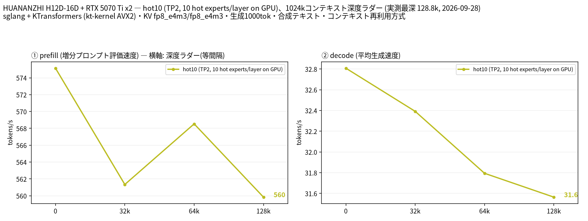

# EPYC 7452 × 2 と RTX 5070 Ti × 2 で DeepSeek V4-Flash-Vision-Exp（abliterated、MXFP4）を sglang＋KTransformers で動かす

- **作成者**: amane.yukishima
- **作成日**: 2026-09-26

## 概要

RTX 5070 Ti 2 枚（VRAM 計 32 GB、GPU 間 P2P なし）と RAM 512 GB で、147 GB の DeepSeek V4-Flash-Vision-Exp（Huihui による abliterated 版、エキスパートは MXFP4）を sglang＋KTransformers で動かしています。エキスパートの大半は CPU で計算し、使用頻度の高いものだけ GPU に置いています。
約 38K トークンの prefill が 615 t/s（62 秒）、decode が 43〜44 t/s でした。コンテキスト長は 1M に設定し、KV キャッシュは 262K トークン分を確保しています。
長いプロンプトでは、エキスパートの重みを層ごとに PCIe で GPU へ転送しながら計算し、その間に CPU も一部のエキスパートを並行して計算します。
llama.cpp ではなく sglang＋KTransformers で動かしているため、llama-split-bench ではなく自作スクリプトで、プロンプト長 2 種の prefill と 512 トークンの decode を測っています（深度ラダーは測っていません）。

## ハードウェア

| 項目 | 内容 |
|------|------|
| コンピュータ / マザーボード | HUANANZHI H12D-16D（デュアル SP3） |
| GPU | GeForce RTX 5070 Ti × 2（VRAM 16 GB / 枚） |
| GPU 接続 | 両 GPU とも PCIe Gen4 x16。GPU0 は CPU0 側、GPU1 は CPU1 側に接続されていて、`nvidia-smi topo -m` は SYS（GPU 間の P2P なし）。ピン留めしたホストメモリから GPU への転送は 1 枚あたり 25〜26 GB/s（自作ベンチ、同じ NUMA ノード）、ソケットをまたぐと 23 GB/s |
| CPU | AMD EPYC 7452 × 2（32 コア / 64 スレッド × 2、Zen 2、AVX2 まで・AVX-512 なし、NUMA 2 ノード、L3 256 MiB） |
| メモリ | 約 512 GiB（`free -h` で 499 GiB）。種類は不明。モデルは NVMe SSD に配置 |
| 電源 | 不明 |

## ソフトウェア環境

| 項目 | 内容 |
|------|------|
| OS | Ubuntu 26.04 LTS / Linux 7.0.0-34-generic |
| GPU ドライバ | NVIDIA 595.91.07（CUDA 13） |
| 推論エンジン | sglang（kvcache-ai/sglang をベースに独自パッチ）＋ KTransformers の kt-kernel（AVX2 ビルド＋独自パッチ）、CUDA バックエンド。llama.cpp は使っていません |
| 並列化 | テンソル並列 2（TP=2）。CPU 側のエキスパートは kt-kernel が 2 ソケットに分けて計算 |

## ベンチマーク

### 条件

| 項目 | 内容 |
|------|------|
| ツール | 自作スクリプト [`sglang-ladder.py`](attachment/2026-09-26_093346_running_deepseek_v4_flash_vision_exp_abliterated_mxfp4_on_2x_epyc_7452_and_2x_rtx_5070_ti_with_sglang_and_ktransformers/sglang-ladder.py)（llama-split-bench 7af72d4 の `measure_ladder.py` / `measure_pp0.py` と同じ手順を、sglang の `/generate` に移植したもの）。llama-split-bench は llama.cpp 専用のため使っていません |
| モデル | DeepSeek V4-Flash-Vision-Exp の abliterated 版。[huihui-ai/Huihui-DeepSeek-V4-Flash-Vision-Exp-abliterated-GGUF](https://huggingface.co/huihui-ai/Huihui-DeepSeek-V4-Flash-Vision-Exp-abliterated-GGUF) を sglang で読める形式に自前で変換。エキスパートは GGUF の MXFP4 をそのまま使用、エキスパート以外の重みは FP8。147 GB。43 層、ルーティングされるエキスパート 256 個中 6 個がアクティブ |
| 測定モード | `hot10`：CPU/GPU 分担（TP=2）。GPU に置くもの: エキスパート以外のすべてと、各層で使用頻度の高いエキスパート 10 個。prefill: 一定以上の長さでは、エキスパートを層ごとに GPU へ転送して計算。同時に CPU がエキスパート 3 グループ分を並行して計算 |
| ctx / stages | 1M（KV キャッシュの確保は 262K トークン） / 0,32000,64000,128000 |
| KV キャッシュ | fp8_e4m3 / fp8_e4m3 |
| 投機的デコード | なし |
| その他 | ラダーは llama-split-bench と同じ英語の合成テキストを使い、各段で前の段の文脈の続きを送ります（前の段までの KV はプレフィックスキャッシュで再利用し、増えた分だけを prefill）。各段の直後に greedy・`ignore_eos` で 1000 トークン生成。depth 0 の prefill は新規プロンプト（512 / 2048 / 8192 トークン、先頭に毎回異なる文字列を付けてキャッシュを無効化）で、表と図の depth 0 は 2048 トークンの値です。同時リクエスト 1、測定日 2026-09-28〜29。参考の実プロンプトの計測: prefill は実際に使っている日本語の執筆指示（約 38K トークン）とその先頭 11,000 文字（約 6K トークン）を max_tokens 1 で送信し、2 回目の値（1 回目は起動直後のウォームアップを含む）。プロンプトの先頭に毎回異なる文字列を付けてプレフィックスキャッシュを無効化。decode は `ignore_eos`・思考なしで 2 回。temperature 1.0 / top_p 0.95、同時リクエスト 1。測定日 2026-09-26 |

### 結果

図は llama-split-bench の `plot_bench.py` で描いています（見出しの 2 行目に llama.cpp の版の代わりに推論エンジン名を出すよう 1 行だけ変更）。depth ごとの prefill / decode（t/s）。depth 0 の prefill は新規プロンプト（2048 トークン）の値です。decode はラダーの合成テキストでの実測値です。

| depth | prefill (t/s) | decode (t/s) |
|------:|------:|------:|
| 0 | 575 | 32.8 |
| 29k | 561 | 32.4 |
| 64k | 569 | 31.8 |
| 128k | 560 | 31.6 |

実際の深さ（トークン）: 29,183 / 64,926 / 128,761。ラダー初段（11 トークン）の prefill は計測上の artifact のため載せていません。

depth 0 の新規プロンプト prefill（t/s）:

| プロンプト長 | hot10 (t/s) |
|------:|------:|
| 491 | 130 |
| 1,886 | 575 |
| 7,403 | 568 |

- 時間は sglang のサーバ側の記録（prefill の開始・終了時刻、decode のスループット）から計算しています

ラダーの decode（英語の合成テキスト、greedy）は、下の実プロンプト（日本語、temperature 1.0）の値より低めです。GPU に置いた高頻度エキスパートは日本語の執筆でのルーティングから選んでいるため、合成テキストでは GPU 側で計算される割合が下がることが主な理由だと考えていますが、確認はしていません。

#### 参考: 実際の執筆指示での計測（2026-09-26）

プロンプト長ごとの prefill（t/s）。括弧内は所要時間です。

| プロンプト長 | 高頻度エキスパート 10 個 / 層を GPU |
|------:|------:|
| 約 6K（6,053 トークン） | 627（9.6 秒） |
| 約 38K（38,073 トークン） | 615（61.9 秒） |

decode（t/s、2 回の範囲）:

| 生成 | 高頻度エキスパート 10 個 / 層を GPU |
|------:|------:|
| 512 トークン | 42.9〜43.7 |

1 回目の 38K prefill はウォームアップを含めて 558 t/s でした。

### 所感

- 深度ラダーでは、最も深い段（128k）まで decode は 31.6〜32.8 t/s、prefill は 560〜569 t/s で、深さによる低下はほとんどありませんでした。
- prefill は PCIe の帯域で頭打ちです。これ以上速くするには、転送するエキスパートのバイト数を減らすか、CPU の分担を増やす必要があり、CPU 側のカーネルの高速化を続けています。
- VRAM 16 GB × 2 枚では 147 GB のモデルの 1 割も GPU に載りませんが、decode は GPU に置いたエキスパートと CPU のメモリ帯域で 40 t/s 台に届きました。
- GPU 間 P2P のない 2 枚では、NCCL の SHM 経路が decode の all-reduce で重く、ホストメモリ経由の all-reduce に替えるだけで decode が 4〜6% 伸びました。
- 別のモデルを読み込んだ直後にサーバを起動すると、片方の NUMA ノードがページキャッシュで埋まり、CPU 側のエキスパートの一部が反対側のノードに配置されて decode が 43 → 36 t/s に落ちました。起動前にモデルファイルのページキャッシュを破棄して回避しています（root 権限は不要）。

独自の変更（全モデル共通）:

- **エキスパートの CPU/GPU 分担**: 実際のルーティング頻度から選んだ使用頻度の高いエキスパートを GPU に置き、残りを CPU で計算。GPU に置いたエキスパートの重みが別のエキスパートのものとして読み込まれるバグを見つけて修正（[kvcache-ai/sglang#97](https://github.com/kvcache-ai/sglang/pull/97)）
- **P2P なし 2 枚向けの all-reduce**: decode 時の小さな all-reduce を、両 GPU からマップしたピン留めホストメモリ経由の 1 カーネルにまとめ、NCCL（SHM 経路）の 22〜25 µs を 5 µs に短縮（[sgl-project/sglang#39605](https://github.com/sgl-project/sglang/pull/39605)）。prefill 時の大きな all-reduce は、ホストメモリを経由してコピーエンジンで転送
- **CPU の計算結果の受け渡し**: kt-kernel と GPU の間の受け渡しを、ホスト関数のコールバックから GPU のストリーム上でフラグを書いて待ち合わせる方式（`cuStreamWriteValue32` / `cuStreamWaitValue32`）に置き換え、decode の 1 トークンごとの待ち時間を削減
- **AVX2 のエキスパートカーネル**: Zen 2 向けの MXFP4 / NVFP4 カーネル。本家にも複数マージ済み（kvcache-ai/ktransformers #2175, #2176, #2205, #2209, #2210）
- **ホスト経由の all-reduce の競合を修正**: 1 MiB 以上の all-reduce で、自分の入力をホストへ送り終える前にその場で加算していたため、長いプロンプトでまれに誤った和になっていました。修正後は同じ入力に対する出力がビット単位で一致します（速度は変わりません）

独自の変更（このモデル向け）:

- **エキスパートを GPU へ転送しながらの prefill**: 1 層あたり約 2 GB のエキスパートを 78 ms で転送して GPU で計算。PCIe Gen4 x16 の帯域（実測 25.8 GB/s）をほぼ使い切っています
- **転送中の CPU 並行計算**: GPU が転送を待つ間に CPU が一部のエキスパートを計算して加算。prefill が 8% 向上
- **AVX2 の MXFP4 カーネル（グループサイズ 32）**: ループ順の入れ替えと K 方向のブロッキングで、CPU 側の prefill の行列積を 1.33 倍に（出力はビット単位で一致）
- **decode**: CPU と GPU の計算を重ねる deferred 実行をやめ、上記の受け渡しの改善と all-reduce を入れて 33.5 → 44 t/s
- **思考モードの既定値**: サーバ側で思考あり・reasoning effort max を既定にするパッチ（今回の計測は思考なし）

## 添付

- [run-info.json](attachment/2026-09-26_093346_running_deepseek_v4_flash_vision_exp_abliterated_mxfp4_on_2x_epyc_7452_and_2x_rtx_5070_ti_with_sglang_and_ktransformers/run-info.json)
- [argv-hot10.txt](attachment/2026-09-26_093346_running_deepseek_v4_flash_vision_exp_abliterated_mxfp4_on_2x_epyc_7452_and_2x_rtx_5070_ti_with_sglang_and_ktransformers/argv-hot10.txt)（sglang のサーバ設定。ホームディレクトリのパスは `~` に置き換え）
- [results-hot10.json](attachment/2026-09-26_093346_running_deepseek_v4_flash_vision_exp_abliterated_mxfp4_on_2x_epyc_7452_and_2x_rtx_5070_ti_with_sglang_and_ktransformers/results-hot10.json) / [results-hot10-pp0.json](attachment/2026-09-26_093346_running_deepseek_v4_flash_vision_exp_abliterated_mxfp4_on_2x_epyc_7452_and_2x_rtx_5070_ti_with_sglang_and_ktransformers/results-hot10-pp0.json)
- [split-bench-en.png](attachment/2026-09-26_093346_running_deepseek_v4_flash_vision_exp_abliterated_mxfp4_on_2x_epyc_7452_and_2x_rtx_5070_ti_with_sglang_and_ktransformers/split-bench-en.png)
- [sglang-ladder.py](attachment/2026-09-26_093346_running_deepseek_v4_flash_vision_exp_abliterated_mxfp4_on_2x_epyc_7452_and_2x_rtx_5070_ti_with_sglang_and_ktransformers/sglang-ladder.py)（計測スクリプト）
- [results.json](attachment/2026-09-26_093346_running_deepseek_v4_flash_vision_exp_abliterated_mxfp4_on_2x_epyc_7452_and_2x_rtx_5070_ti_with_sglang_and_ktransformers/results.json)（参考の実プロンプトの計測）
