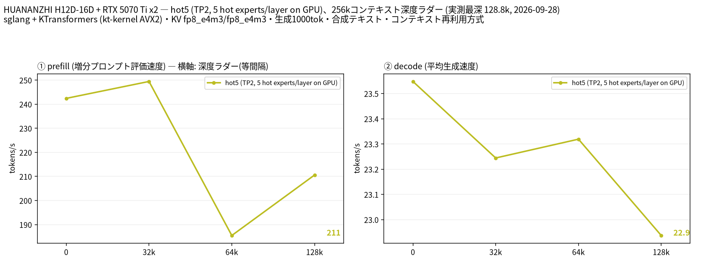

# EPYC 7452 × 2 と RTX 5070 Ti × 2 で DeepSeek V4.1-Flash（476 GB）をコンテキスト長 1M で動かす

- **作成者**: amane.yukishima
- **作成日**: 2026-09-26

## 概要

RTX 5070 Ti 2 枚（VRAM 計 32 GB、GPU 間 P2P なし）と RAM 512 GB で、engram テーブル込みで 476 GB の DeepSeek V4.1-Flash を sglang＋KTransformers で動かしています。
コンテキスト長 1M を確保したまま、約 38K トークンの prefill が 256 t/s（2 分半）、decode が 28 t/s でした。
engram テーブルは RAM に載せず NVMe から直接読み、エキスパートは CPU と GPU に振り分けています。
llama.cpp ではなく sglang＋KTransformers で動かしているため、llama-split-bench ではなく自作スクリプトで、プロンプト長 2 種の prefill と 512 トークンの decode を測っています（深度ラダーは測っていません）。

## ハードウェア

| 項目 | 内容 |
|------|------|
| コンピュータ / マザーボード | HUANANZHI H12D-16D（デュアル SP3） |
| GPU | GeForce RTX 5070 Ti × 2（VRAM 16 GB / 枚） |
| GPU 接続 | 両 GPU とも PCIe Gen4 x16。GPU0 は CPU0 側、GPU1 は CPU1 側に接続されていて、`nvidia-smi topo -m` は SYS（GPU 間の P2P なし）。ピン留めしたホストメモリから GPU への転送は 1 枚あたり 25〜26 GB/s（自作ベンチ、同じ NUMA ノード）、ソケットをまたぐと 23 GB/s |
| CPU | AMD EPYC 7452 × 2（32 コア / 64 スレッド × 2、Zen 2、AVX2 まで・AVX-512 なし、NUMA 2 ノード、L3 256 MiB） |
| メモリ | 約 512 GiB（`free -h` で 499 GiB）。種類は不明。モデルは NVMe SSD に配置 |
| 電源 | 不明 |

## ソフトウェア環境

| 項目 | 内容 |
|------|------|
| OS | Ubuntu 26.04 LTS / Linux 7.0.0-34-generic |
| GPU ドライバ | NVIDIA 595.91.07（CUDA 13） |
| 推論エンジン | sglang（kvcache-ai/sglang をベースに独自パッチ）＋ KTransformers の kt-kernel（AVX2 ビルド＋独自パッチ）、CUDA バックエンド。llama.cpp は使っていません |
| 並列化 | テンソル並列 2（TP=2）。CPU 側のエキスパートは kt-kernel が 2 ソケットに分けて計算 |

## ベンチマーク

### 条件

| 項目 | 内容 |
|------|------|
| ツール | 自作スクリプト [`sglang-ladder.py`](attachment/2026-09-26_093347_running_deepseek_v4.1_flash_with_1m_context_on_2x_epyc_7452_and_2x_rtx_5070_ti_with_sglang_and_ktransformers/sglang-ladder.py)（llama-split-bench 7af72d4 の `measure_ladder.py` / `measure_pp0.py` と同じ手順を、sglang の `/generate` に移植したもの）。llama-split-bench は llama.cpp 専用のため使っていません |
| モデル | [deepseek-ai/DeepSeek-V4.1-Flash](https://huggingface.co/deepseek-ai/DeepSeek-V4.1-Flash)（公式の重み）。本体は FP8（32×32 ブロック）、エキスパートは FP4。engram テーブル込みで 476 GB。40 層、ルーティングされるエキスパート 384 個中 6 個がアクティブ |
| 測定モード | `hot5`：CPU/GPU 分担（TP=2）。GPU に置くもの: エキスパート以外のすべてと、各層で使用頻度の高いエキスパート 5 個（Marlin カーネル）。prefill: エキスパートを層ごとに GPU へ転送して計算（ホスト側の領域は起動時にピン留めし、ゼロコピーで転送）。engram: NVMe から直接読み出し |
| ctx / stages | 1M / 0,32000,64000,128000 |
| KV キャッシュ | fp8_e4m3 / fp8_e4m3 |
| 投機的デコード | なし |
| その他 | ラダーは llama-split-bench と同じ英語の合成テキストを使い、各段で前の段の文脈の続きを送ります（前の段までの KV はプレフィックスキャッシュで再利用し、増えた分だけを prefill）。各段の直後に greedy・`ignore_eos` で 1000 トークン生成。depth 0 の prefill は新規プロンプト（512 / 2048 / 8192 トークン、先頭に毎回異なる文字列を付けてキャッシュを無効化）で、表と図の depth 0 は 2048 トークンの値です。同時リクエスト 1、測定日 2026-09-28〜29。参考の実プロンプトの計測: prefill は実際に使っている日本語の執筆指示（約 38K トークン）とその先頭 11,000 文字（約 6K トークン）を max_tokens 1 で送信し、2 回目の値（1 回目は起動直後のウォームアップを含む）。プロンプトの先頭に毎回異なる文字列を付けてプレフィックスキャッシュを無効化。decode は `ignore_eos`・思考なしで 2 回。temperature 1.0 / top_p 0.95、同時リクエスト 1。測定日 2026-09-26 |

### 結果

図は llama-split-bench の `plot_bench.py` で描いています（見出しの 2 行目に llama.cpp の版の代わりに推論エンジン名を出すよう 1 行だけ変更）。depth ごとの prefill / decode（t/s）。depth 0 の prefill は新規プロンプト（2048 トークン）の値です。decode はラダーの合成テキストでの実測値です。

| depth | prefill (t/s) | decode (t/s) |
|------:|------:|------:|
| 0 | 242 | 23.5 |
| 29k | 249 | 23.2 |
| 64k | 185 | 23.3 |
| 128k | 211 | 22.9 |

実際の深さ（トークン）: 29,183 / 64,926 / 128,761。ラダー初段（11 トークン）の prefill は計測上の artifact のため載せていません。

depth 0 の新規プロンプト prefill（t/s）:

| プロンプト長 | hot5 (t/s) |
|------:|------:|
| 493 | 91.0 |
| 1,887 | 242 |
| 7,404 | 241 |

- 時間は sglang のサーバ側の記録（prefill の開始・終了時刻、decode のスループット）から計算しています
- ラダーの計測時だけプレフィックスキャッシュを有効にし、KV キャッシュの確保を 262K トークンに下げています（普段の設定はキャッシュ無効・1M トークン確保。1M 確保のままでは 128K の段の prefill で VRAM が不足しました）

ラダーの decode（英語の合成テキスト、greedy）は、下の実プロンプト（日本語、temperature 1.0）の値より低めです。GPU に置いた高頻度エキスパートは日本語の執筆でのルーティングから選んでいるため、合成テキストでは GPU 側で計算される割合が下がることが主な理由だと考えていますが、確認はしていません。

#### 参考: 実際の執筆指示での計測（2026-09-26）

プロンプト長ごとの prefill（t/s）。括弧内は所要時間です。

| プロンプト長 | 高頻度エキスパート 5 個 / 層を GPU |
|------:|------:|
| 約 6K（6,050 トークン） | 258（23.4 秒） |
| 約 38K（38,072 トークン） | 256（148.5 秒） |

decode（t/s、2 回の範囲）:

| 生成 | 高頻度エキスパート 5 個 / 層を GPU |
|------:|------:|
| 512 トークン | 27.9〜28.4 |

1 回目の 38K prefill はウォームアップを含めて 214 t/s でした。
- サーバの起動（476 GB の読み込みとピン留め）には約 7 分かかります。

### 所感

- 深度ラダーでは、最も深い段（128k）まで decode は 22.9〜23.5 t/s、prefill は段によって 185〜249 t/s とばらつきましたが、深くなるほど遅くなる傾向はありませんでした。
- decode は CPU のメモリ帯域どおりの値でした。EPYC 7452 はソケットあたり CCD が 4 つで、メモリ帯域の上限は DIMM ではなく CCD の数で決まっていました。
- 長い prefill を続けて実行すると徐々に遅くなる現象があり、原因は熱でした。吸気温度が 47℃ を超えると CPU1 側のメモリ帯域が半分ほどに絞られます。CPU1 ソケットの直上にファンを追加して冷やし、安定させています。
- コンテキスト長 1M を確保できるので、長い思考を伴う用途や、複数の文脈を並行して扱う用途はこのモデルに寄せています。

独自の変更（全モデル共通）:

- **エキスパートの CPU/GPU 分担**: 実際のルーティング頻度から選んだ使用頻度の高いエキスパートを GPU に置き、残りを CPU で計算。GPU に置いたエキスパートの重みが別のエキスパートのものとして読み込まれるバグを見つけて修正（[kvcache-ai/sglang#97](https://github.com/kvcache-ai/sglang/pull/97)）
- **P2P なし 2 枚向けの all-reduce**: decode 時の小さな all-reduce を、両 GPU からマップしたピン留めホストメモリ経由の 1 カーネルにまとめ、NCCL（SHM 経路）の 22〜25 µs を 5 µs に短縮（[sgl-project/sglang#39605](https://github.com/sgl-project/sglang/pull/39605)）。prefill 時の大きな all-reduce は、ホストメモリを経由してコピーエンジンで転送
- **CPU の計算結果の受け渡し**: kt-kernel と GPU の間の受け渡しを、ホスト関数のコールバックから GPU のストリーム上でフラグを書いて待ち合わせる方式（`cuStreamWriteValue32` / `cuStreamWaitValue32`）に置き換え、decode の 1 トークンごとの待ち時間を削減
- **AVX2 のエキスパートカーネル**: Zen 2 向けの MXFP4 / NVFP4 カーネル。本家にも複数マージ済み（kvcache-ai/ktransformers #2175, #2176, #2205, #2209, #2210）
- **ホスト経由の all-reduce の競合を修正**: 1 MiB 以上の all-reduce で、自分の入力をホストへ送り終える前にその場で加算していたため、長いプロンプトでまれに誤った和になっていました。修正後は同じ入力に対する出力がビット単位で一致します（速度は変わりません）

独自の変更（このモデル向け）:

- **engram テーブルの NVMe 直読み**: 476 GB すべては RAM に載らないため、engram テーブルを NVMe から専用の I/O スレッドで読み出し
- **prefill の CPU カーネル**: アクティベーションの並べ替えを重みのスライスごとにやり直していた無駄を省いて 2.1 倍（出力はバイト単位で一致）
- **decode**: deferred 実行をやめ、FP8 の行列積を split-K にして 11 → 18 t/s。GPU に置くエキスパートと受け渡しの改善を足して現在の 28 t/s
- **長いプロンプトでの VRAM**: インデクサの候補選択がプロンプト長に比例して VRAM を使い、48K の prefill でメモリ不足になっていたため、512 行ずつ処理するように変更
- **起動時間**: ピン留めするホストメモリ領域が 4 KB ページに割れて起動に 60 分以上かかっていたのを、共有メモリの THP を advise にし、層ごとにページキャッシュを破棄して 2 MB ページに載せることで 11 分に短縮

## 添付

- [run-info.json](attachment/2026-09-26_093347_running_deepseek_v4.1_flash_with_1m_context_on_2x_epyc_7452_and_2x_rtx_5070_ti_with_sglang_and_ktransformers/run-info.json)
- [argv-hot5.txt](attachment/2026-09-26_093347_running_deepseek_v4.1_flash_with_1m_context_on_2x_epyc_7452_and_2x_rtx_5070_ti_with_sglang_and_ktransformers/argv-hot5.txt)（sglang のサーバ設定。ホームディレクトリのパスは `~` に置き換え）
- [results-hot5.json](attachment/2026-09-26_093347_running_deepseek_v4.1_flash_with_1m_context_on_2x_epyc_7452_and_2x_rtx_5070_ti_with_sglang_and_ktransformers/results-hot5.json) / [results-hot5-pp0.json](attachment/2026-09-26_093347_running_deepseek_v4.1_flash_with_1m_context_on_2x_epyc_7452_and_2x_rtx_5070_ti_with_sglang_and_ktransformers/results-hot5-pp0.json)
- [split-bench-en.png](attachment/2026-09-26_093347_running_deepseek_v4.1_flash_with_1m_context_on_2x_epyc_7452_and_2x_rtx_5070_ti_with_sglang_and_ktransformers/split-bench-en.png)
- [sglang-ladder.py](attachment/2026-09-26_093347_running_deepseek_v4.1_flash_with_1m_context_on_2x_epyc_7452_and_2x_rtx_5070_ti_with_sglang_and_ktransformers/sglang-ladder.py)（計測スクリプト）
- [results.json](attachment/2026-09-26_093347_running_deepseek_v4.1_flash_with_1m_context_on_2x_epyc_7452_and_2x_rtx_5070_ti_with_sglang_and_ktransformers/results.json)（参考の実プロンプトの計測）
