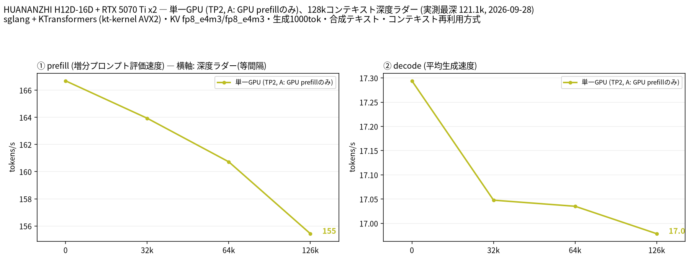

# EPYC 7452 × 2 と RTX 5070 Ti × 2 で GLM-5.3-Flash Uncensored を動かし、GPU での prefill と GPU 常駐エキスパートを比較

- **作成者**: amane.yukishima
- **作成日**: 2026-09-26

## 概要

RTX 5070 Ti 2 枚（VRAM 計 32 GB、GPU 間 P2P なし）と RAM 512 GB で、本体 FP8 で 306 GB の GLM-5.3-Flash（Uncensored）を sglang＋KTransformers で動かしています。CPU 側のエキスパートは同じ作者の NVFP4 版から読み込んでいます。
VRAM が足りないため、prefill を GPU で計算する構成（prefill 165 t/s、decode 16.5 t/s）と、使用頻度の高いエキスパートを GPU に常駐させる構成（prefill 92 t/s、decode 18.0 t/s）のどちらかを選んで使っています。
llama.cpp ではなく sglang＋KTransformers で動かしているため、llama-split-bench ではなく自作スクリプトで、プロンプト長 2 種の prefill と 512 トークンの decode を測っています（深度ラダーは測っていません）。

## ハードウェア

| 項目 | 内容 |
|------|------|
| コンピュータ / マザーボード | HUANANZHI H12D-16D（デュアル SP3） |
| GPU | GeForce RTX 5070 Ti × 2（VRAM 16 GB / 枚） |
| GPU 接続 | 両 GPU とも PCIe Gen4 x16。GPU0 は CPU0 側、GPU1 は CPU1 側に接続されていて、`nvidia-smi topo -m` は SYS（GPU 間の P2P なし）。ピン留めしたホストメモリから GPU への転送は 1 枚あたり 25〜26 GB/s（自作ベンチ、同じ NUMA ノード）、ソケットをまたぐと 23 GB/s |
| CPU | AMD EPYC 7452 × 2（32 コア / 64 スレッド × 2、Zen 2、AVX2 まで・AVX-512 なし、NUMA 2 ノード、L3 256 MiB） |
| メモリ | 約 512 GiB（`free -h` で 499 GiB）。種類は不明。モデルは NVMe SSD に配置 |
| 電源 | 不明 |

## ソフトウェア環境

| 項目 | 内容 |
|------|------|
| OS | Ubuntu 26.04 LTS / Linux 7.0.0-34-generic |
| GPU ドライバ | NVIDIA 595.91.07（CUDA 13） |
| 推論エンジン | sglang（kvcache-ai/sglang をベースに独自パッチ）＋ KTransformers の kt-kernel（AVX2 ビルド＋独自パッチ）、CUDA バックエンド。llama.cpp は使っていません |
| 並列化 | テンソル並列 2（TP=2）。CPU 側のエキスパートは kt-kernel が 2 ソケットに分けて計算 |

## ベンチマーク

### 条件

| 項目 | 内容 |
|------|------|
| ツール | 自作スクリプト [`sglang-ladder.py`](attachment/2026-09-26_093348_running_glm_5.3_flash_uncensored_on_2x_epyc_7452_and_2x_rtx_5070_ti_comparing_gpu_prefill_and_hot_experts/sglang-ladder.py)（llama-split-bench 7af72d4 の `measure_ladder.py` / `measure_pp0.py` と同じ手順を、sglang の `/generate` に移植したもの）。llama-split-bench は llama.cpp 専用のため使っていません |
| モデル | GLM-5.3-Flash の Uncensored 版。本体は [orcarouter/GLM-5.3-Flash-Uncensored-FP8](https://huggingface.co/orcarouter/GLM-5.3-Flash-Uncensored-FP8)、CPU 側のエキスパートは [orcarouter/GLM-5.3-Flash-Uncensored-NVFP4](https://huggingface.co/orcarouter/GLM-5.3-Flash-Uncensored-NVFP4)。本体 FP8 で 306 GB（GPU 側と GPU prefill で使用）。CPU 側のエキスパートは NVFP4 版（195 GB）から読み込み。45 層、ルーティングされるエキスパート 288 個中 8 個がアクティブ |
| 測定モード | CPU/GPU 分担（TP=2）の 2 構成。A（普段の設定、ラダーの系列名 `gpu-prefill`）: GPU prefill: 長いプロンプトではエキスパートを 1 層ずつ GPU へ送って計算。GPU にエキスパートは常駐させない。B: 各層で使用頻度の高いエキスパート 5 個を GPU に常駐（`--mem-fraction-static 0.85`）、prefill は CPU |
| ctx / stages | 131K / 0,32000,64000,126000 |
| KV キャッシュ | fp8_e4m3 / fp8_e4m3 |
| 投機的デコード | なし |
| その他 | ラダーは llama-split-bench と同じ英語の合成テキストを使い、各段で前の段の文脈の続きを送ります（前の段までの KV はプレフィックスキャッシュで再利用し、増えた分だけを prefill）。各段の直後に greedy・`ignore_eos` で 1000 トークン生成。depth 0 の prefill は新規プロンプト（512 / 2048 / 8192 トークン、先頭に毎回異なる文字列を付けてキャッシュを無効化）で、表と図の depth 0 は 2048 トークンの値です。同時リクエスト 1、測定日 2026-09-28〜29。参考の実プロンプトの計測: prefill は実際に使っている日本語の執筆指示（約 38K トークン）とその先頭 11,000 文字（約 6K トークン）を max_tokens 1 で送信し、2 回目の値（1 回目は起動直後のウォームアップを含む）。プロンプトの先頭に毎回異なる文字列を付けてプレフィックスキャッシュを無効化。decode は `ignore_eos`・思考なしで 2 回。temperature 1.0 / top_p 0.95、同時リクエスト 1。測定日 2026-09-26 |

### 結果

図は llama-split-bench の `plot_bench.py` で描いています（見出しの 2 行目に llama.cpp の版の代わりに推論エンジン名を出すよう 1 行だけ変更）。depth ごとの prefill / decode（t/s）。depth 0 の prefill は新規プロンプト（2048 トークン）の値です。decode はラダーの合成テキストでの実測値です。

| depth | prefill (t/s) | decode (t/s) |
|------:|------:|------:|
| 0 | 167 | 17.3 |
| 30k | 164 | 17.0 |
| 64k | 161 | 17.0 |
| 121k | 155 | 17.0 |

実際の深さ（トークン）: 29,911 / 64,850 / 121,093。ラダー初段（11 トークン）の prefill は計測上の artifact のため載せていません。

depth 0 の新規プロンプト prefill（t/s）:

| プロンプト長 | gpu-prefill (t/s) |
|------:|------:|
| 497 | 76.9 |
| 1,890 | 167 |
| 7,547 | 162 |

- ラダーは構成 A（普段の設定）のみです
- ラダーの計測（2026-09-28）の時点では、本体の FP8 版からルーティングされるエキスパートを除いた 16.6 GB の版を読み込んでいます（エキスパートは CPU 側・GPU prefill とも NVFP4 版から読むため、計算に使う重みは参考の計測と同じです）
- このモデルの sglang（GLM 用の古い版）では前の段の文脈が再利用されず、各段で文脈全体を先頭から prefill しています。そのため prefill の値は、その深さまでを埋める平均の速度です
- 最後の段は、context 長（131,072）に 1000 トークンの生成が収まるよう 126,000 を指定し、GLM のトークナイザでは 121,093 トークンになりました
- この版の sglang はサーバ側で prefill の時刻を記録しないため、prefill は最初のトークンが返るまでの時間、decode はサーバが返す全体の所要時間から prefill の時間を引いたものから計算しています

#### 参考: 実際の執筆指示での計測（2026-09-26）

プロンプト長ごとの prefill（t/s）。括弧内は所要時間です。

| プロンプト長 | A: GPU prefill | B: 高頻度エキスパート 5 個 / 層を GPU |
|------:|------:|------:|
| 約 6K（6,422 トークン） | 161（39.8 秒） | 92（69.6 秒） |
| 約 38K（40,464 トークン） | 165（244.8 秒） | 91（446.8 秒） |

decode（t/s、2 回の範囲）:

| 生成 | A: GPU prefill | B: 高頻度エキスパート 5 個 / 層を GPU |
|------:|------:|------:|
| 512 トークン | 16.3〜16.6 | 18.0 |

1 回目の 38K prefill はウォームアップを含めて A: GPU prefill 162、B: 高頻度エキスパート 5 個 / 層を GPU 90 t/s でした。GLM のトークナイザでは、同じプロンプトが 40.5K / 6.4K トークンになります。

### 所感

- 深度ラダーでは、最も深い段（121k）まで decode は 17.0〜17.3 t/s、prefill は 155〜164 t/s で、深さによる低下はほとんどありませんでした。
- GPU prefill と GPU 常駐のエキスパートは VRAM を取り合うため、同時には使えません。長いプロンプトを送る用途は A、思考が長く生成側の時間が支配的な用途は B の方が早く終わります。
- reasoning effort max では、書き始める前に 5 万トークン以上考えることがあります。この長さになると、decode の 1〜2 t/s の差が prefill の差より効きます。
- decode では 1 トークンあたり約 6.3 GB のエキスパートを読み出していて、CPU のメモリ帯域が上限になっています。

独自の変更（全モデル共通）:

- **エキスパートの CPU/GPU 分担**: 実際のルーティング頻度から選んだ使用頻度の高いエキスパートを GPU に置き、残りを CPU で計算。GPU に置いたエキスパートの重みが別のエキスパートのものとして読み込まれるバグを見つけて修正（[kvcache-ai/sglang#97](https://github.com/kvcache-ai/sglang/pull/97)）
- **P2P なし 2 枚向けの all-reduce**: decode 時の小さな all-reduce を、両 GPU からマップしたピン留めホストメモリ経由の 1 カーネルにまとめ、NCCL（SHM 経路）の 22〜25 µs を 5 µs に短縮（[sgl-project/sglang#39605](https://github.com/sgl-project/sglang/pull/39605)）。prefill 時の大きな all-reduce は、ホストメモリを経由してコピーエンジンで転送
- **CPU の計算結果の受け渡し**: kt-kernel と GPU の間の受け渡しを、ホスト関数のコールバックから GPU のストリーム上でフラグを書いて待ち合わせる方式（`cuStreamWriteValue32` / `cuStreamWaitValue32`）に置き換え、decode の 1 トークンごとの待ち時間を削減
- **AVX2 のエキスパートカーネル**: Zen 2 向けの MXFP4 / NVFP4 カーネル。本家にも複数マージ済み（kvcache-ai/ktransformers #2175, #2176, #2205, #2209, #2210）
- **ホスト経由の all-reduce の競合を修正**: 1 MiB 以上の all-reduce で、自分の入力をホストへ送り終える前にその場で加算していたため、長いプロンプトでまれに誤った和になっていました。修正後は同じ入力に対する出力がビット単位で一致します（速度は変わりません）

独自の変更（このモデル向け）:

- **mHC の Sinkhorn を 1 カーネルに**: decode のオーバーヘッドになっていた 1 トークンあたり約 6,300 回のカーネル起動を、出力がビット単位で一致する CUDA カーネル 1 本に置き換え
- **NVFP4 エキスパートでの GPU prefill**: MoE の出力が全層で 0 になるバグ（kt-kernel がスケールを bf16 で書き出す）を見つけて修正し、20K トークンの prefill を 238 → 113 秒に
- **GPU prefill 用の領域の事前確保**: GPU prefill に使う 1 層分の領域を KV キャッシュより先に確保（[kvcache-ai/sglang#98](https://github.com/kvcache-ai/sglang/pull/98)）
- **GPU に置くエキスパートの配置**: [kvcache-ai/sglang#97](https://github.com/kvcache-ai/sglang/pull/97) の修正。直す前は GPU にエキスパートを置くとパープレキシティが 28 → 159 に悪化していました
- **AVX2 のエキスパート行列積**: ループ順の入れ替えで CPU での prefill を 2.19 倍に（出力はビット単位で一致）
- MTP（NextN）による投機的デコードも実装し、出力の一致まで確認しましたが、受理率 1.35〜1.60 が損益分岐の 1.79 に届かず採用していません

## 添付

- [run-info.json](attachment/2026-09-26_093348_running_glm_5.3_flash_uncensored_on_2x_epyc_7452_and_2x_rtx_5070_ti_comparing_gpu_prefill_and_hot_experts/run-info.json)
- [argv-gpu-prefill.txt](attachment/2026-09-26_093348_running_glm_5.3_flash_uncensored_on_2x_epyc_7452_and_2x_rtx_5070_ti_comparing_gpu_prefill_and_hot_experts/argv-gpu-prefill.txt)（sglang のサーバ設定。ホームディレクトリのパスは `~` に置き換え）
- [results-gpu-prefill.json](attachment/2026-09-26_093348_running_glm_5.3_flash_uncensored_on_2x_epyc_7452_and_2x_rtx_5070_ti_comparing_gpu_prefill_and_hot_experts/results-gpu-prefill.json) / [results-gpu-prefill-pp0.json](attachment/2026-09-26_093348_running_glm_5.3_flash_uncensored_on_2x_epyc_7452_and_2x_rtx_5070_ti_comparing_gpu_prefill_and_hot_experts/results-gpu-prefill-pp0.json)
- [split-bench-en.png](attachment/2026-09-26_093348_running_glm_5.3_flash_uncensored_on_2x_epyc_7452_and_2x_rtx_5070_ti_comparing_gpu_prefill_and_hot_experts/split-bench-en.png)
- [sglang-ladder.py](attachment/2026-09-26_093348_running_glm_5.3_flash_uncensored_on_2x_epyc_7452_and_2x_rtx_5070_ti_comparing_gpu_prefill_and_hot_experts/sglang-ladder.py)（計測スクリプト）
- [results.json](attachment/2026-09-26_093348_running_glm_5.3_flash_uncensored_on_2x_epyc_7452_and_2x_rtx_5070_ti_comparing_gpu_prefill_and_hot_experts/results.json)（参考の実プロンプトの計測）
