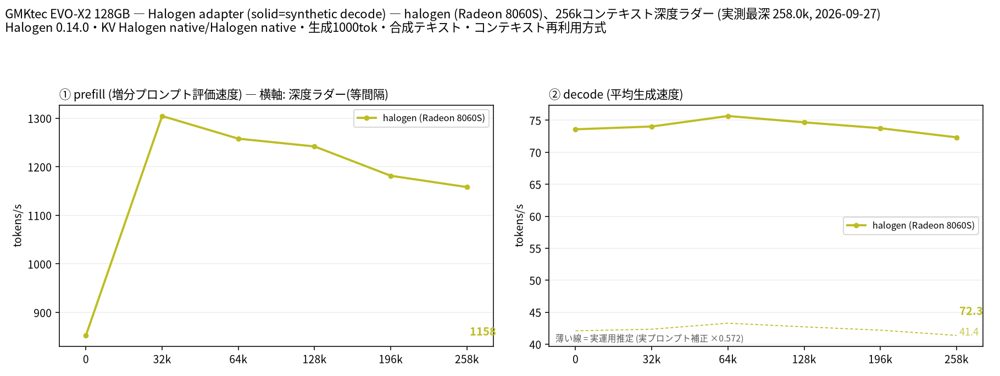

# EVO-X2 128GBでQwen3.8-Flash-NextをHalogenで実行

- **作成者**: A-Uta
- **作成日**: 2026-09-26

## 概要

GMKtec NucBox EVO-X2（AMD Ryzen AI Max+ 395 / Radeon 8060S / 128GB unified memory）で、Qwen3.8-Flash-Next（Halogen形式 W4B）を推論エンジン Halogen 0.14.0 で 262k コンテキストまで測定しました。
Halogen は llama.cpp / llama-server ベースではないため **llama-split-bench 自体は実行していません**。Halogen API 用の独自アダプタで、llama-split-bench と同じ stage・生成長・PP0 の手順を再現し、図は llama-split-bench の `plot_bench.py` で描画しています（違いは「条件」に記載）。
prefill は 32k の 1,304 t/s から 258k の 1,158 t/s へ約 11% 低下しました。decode は合成テキストでは 72〜76 t/s ですが、これは MTP に有利な条件の値で、実プロンプト 3 種による補正後の実運用推定は **約 41〜43 t/s** です。

## ハードウェア

| 項目 | 内容 |
|------|------|
| コンピュータ / マザーボード | GMKtec NucBox EVO-X2 |
| GPU | AMD Radeon 8060S Graphics × 1（CPU 内蔵、gfx1151。専用 VRAM ではなく unified memory を使用、GTT 上限 約 124 GiB） |
| GPU 接続 | SoC 内蔵（unified memory） |
| CPU | AMD Ryzen AI Max+ 395（16 コア / 32 スレッド） |
| メモリ | 128 GB unified memory（Linux 認識 124 GiB） |
| 電源 | 不明。BIOS Power Mode は Balance Mode |

## ソフトウェア環境

| 項目 | 内容 |
|------|------|
| OS | Ubuntu 24.04.4 LTS / Linux 7.0.0-34-generic |
| GPU ドライバ | amdgpu（カーネル内蔵）。ホスト側は `amdrocm-core7.14-gfx1151 7.14.0~pre3-29052710811`（ROCm 7.14.0 pre3 系）。`rocminfo` Runtime Version 1.21、ROCM-SMI-LIB 7.8.0（いずれもコンポーネント側の版情報）。Halogen コンテナ内の ROCm build 番号は今回別途記録していません |
| 推論エンジン | Halogen 0.14.0（`ghcr.io/peonist-ai/halogen-flash-server:0.14.0`、image digest `sha256:ec7ec0c6f955f48329bb444efa97286dc8216e9ab1b130bc40d7d8c3babdf6b2`）。Podman + crun で実行。llama.cpp は使用していません |
| Kernel cmdline（関連部分） | `amd_iommu=off amdgpu.gttsize=126976 ttm.pages_limit=32505856 ttm.page_pool_size=32505856` |

## ベンチマーク

### 条件

| 項目 | 内容 |
|------|------|
| ツール | Halogen API 用の独自アダプタ（llama-split-bench の runner は未使用）。図は llama-split-bench `plot_bench.py`（commit `7af72d4085aa5073677d41389144112dd94fcb74`）をエンジン表記のみ修正して生成（diff を添付）。Halogen の起動条件・測定プロトコルは `halogen-adapter-protocol.txt` に記録 |
| モデル | Qwen3.8-Flash-Next W4B HGN（[peonist-ai/halogen-qwen3.8-flash-next](https://huggingface.co/peonist-ai/halogen-qwen3.8-flash-next)）+ quality sidecar。MTP ドラフトヘッドは Halogen 付属のもの |
| 測定モード | 単一構成（Radeon 8060S × 1）。llama-split-bench の `--profile` 相当 |
| ctx / stages | 262144 / 0,32000,64000,128000,196000,258000 |
| KV キャッシュ | Halogen native（形式の指定なし） |
| 投機的デコード | MTP（Halogen の default drafter） |
| その他 | `/v1/completions`（raw completion、chat template なし）、temperature 0（ladder / PP0）、prompt cache ON、`HALOGEN_KV_POOL_POSITIONS=262144`、`HALOGEN_MAX_TOK=16384`、生成 1000 トークン / 段。Linux power profile balanced、CPU EPP balance_performance、CPU boost 1。図の `MACHINE` ラベルは `GMKtec EVO-X2 128GB — Halogen adapter (solid=synthetic decode)` |

**llama-split-bench との違い**

- **prompt の作り方が異なります。** stock の moving-TAIL 方式（本文の後ろに固定の指示文を付けて伸ばす）では、Halogen の prefix cache が途中位置から再開されませんでした（共通 prefix 4,068 tokens を認識しても `cache_n=0`）。そのため、前段の prompt 全体を次段の literal prefix とする方式を使っています。各段の `cache_n` が前段の depth と一致することを確認しています（下の表）。
- **prefill 値**は Halogen の `prompt_per_second` で、新規に処理した `prompt_n` のみが対象です（`prompt_n / prompt_ms` と一致することを確認）。
- **depth 0 の decode** は、32k 以降と同じ合成テキストの継続を促す 447 トークンの prompt で測定しました。stock の初段 prompt（11 トークン）とは異なります（理由は「結果」の補正係数の段落）。
- **MTP 受理率**は、Halogen のカウンタ（`draft_n` / `draft_n_accepted`）の定義が llama-split-bench と同じか確認できないため表示していません。受理数が提案数を上回る段もあります。
- 生成出力には thinking block（`<think>`）が含まれる場合があります。

### 結果

depth ごとの prefill / decode（t/s）。depth 0 の prefill は新規プロンプト（pp2048）の値です。ラダー初段の prefill は表に載せていません。

| depth | prefill | decode（合成テキスト実測） | decode（実運用推定） |
|---|---:|---:|---:|
| 0 | 852.7 | 73.6 | 42.1 |
| 32k | 1,304.5 | 74.0 | 42.3 |
| 64k | 1,257.8 | 75.7 | 43.3 |
| 128k | 1,241.8 | 74.7 | 42.7 |
| 196k | 1,181.5 | 73.8 | 42.2 |
| 258k | 1,158.2 | 72.3 | 41.4 |

コンテキスト再利用の確認（各段の新規処理分と再利用分）:

| depth（実 token 数） | 新規 `prompt_n` | 再利用 `cache_n` |
|---|---:|---:|
| 32,021 | 32,021 | 0 |
| 64,025 | 32,004 | 32,021 |
| 128,005 | 63,980 | 64,025 |
| 196,010 | 68,005 | 128,005 |
| 258,030 | 62,020 | 196,010 |

全段で `disk_restore_n=0`、生成 1000 トークンを完走しました。32k 段は初段（447 トークン）からの再利用がなく、32k 全体の新規 prefill です。

depth 0 の新規プロンプト prefill（t/s、全 run で `cache_n=0`）:

| プロンプト長 | prefill |
|---|---:|
| 529 | 417.6 |
| 2048 | 852.7 |
| 8198 | 1,175.7 |

実プロンプト（stock `measure_real.py` と同じ 3 種、temp 0.7 / top_p 0.9、1200 トークン生成、各 1 回）の decode:

| prompt | decode (t/s) |
|---|---:|
| design | 45.48 |
| review | 39.23 |
| qa | 41.57 |
| **平均** | **42.09** |

depth 0 の合成テキスト decode 73.59 t/s に対する補正係数は **0.572** でした（図の薄い破線）。

stock の llama-split-bench は補正係数の分母に短い depth 0 prompt からの decode を使います。本測定でも当初 stock に近い短い prompt で depth 0 を測った際は 40.44 t/s でした（別 run）。ただし 32k 以降の synthetic ladder（約 72〜76 t/s）と生成特性が揃わないため、final run では depth 0 も同系統の synthetic continuation に統一しました。本レポートの補正係数 0.572 は、この final run の条件で得られた値として扱います。

**decode の読み方**: 実線（72〜76 t/s）は規則的な合成テキストに対する実測値で、一般的なプロンプトでの decode 速度ではありません。本測定で実プロンプト 3 種から求めた目安は、破線（約 41〜43 t/s）です。

### 参考測定（主結果とは定義・条件が異なります）

- **full-context cold prefill（各点独立、3 回中央値）**: 各 depth を prompt cache 再利用なし（全 18 run で `cache_n=0`）で測定。`/v1/chat/completions`、Thinking OFF。prefill は 0〜N tokens 全体の平均速度で、上の incremental prefill とは定義が異なります。8k 1,210.4 / 32k 1,297.1 / 65k 1,269.3 / 131k 1,218.5 / 196k 1,185.4 / 258k 1,152.8 t/s、decode 42.0〜44.3 t/s。
- **32,768 トークン新規 prefill（`max_tokens=1`、3 回）**: 中央値 1,351.2 t/s。電力は sysfs `/sys/class/drm/card1/device/hwmon/hwmon4/power1_average` を 0.25 秒間隔で取得し、GPU busy 80%以上の区間を集計。各 run の電力中央値は 85.01 / 85.04 / 85.04 W、3-run 中央値は **85.04 W**（GPU package power、wall 電力ではない）。
- **32k serial vs MTP（3 組、Balance Mode 設定前の旧条件）**: `/v1/chat/completions`、temperature 0、Thinking OFF。decode 中央値 serial 33.56 / MTP 43.23 t/s（pair ごとに +22〜29%）、3 組とも出力の SHA-256 が一致。

### 所感

- **prefill は 258k まで約 1,160 t/s を維持**しました。32k の 1,304 t/s から約 11% の低下です。
- **decode は合成テキストで 72〜76 t/s ですが、実運用推定は約 41〜43 t/s** です。今回の合成テキストでは、実プロンプト 3 種より decode が大きく出ました。depth による decode の低下は、どちらの値でも 258k までほとんど見られませんでした。
- 同条件の別 run（depth 0 のみ旧 prompt）と比べ、32k〜258k の prefill は 0.4% 以内、decode は 0.7% 以内で一致しました。
- Ubuntu 24.04 の Podman は当初 `runc` を使っており、`--group-add keep-groups` で `/dev/kfd` の補助グループ権限がコンテナに渡らず、Halogen が `no ROCm-capable device is detected` で終了しました。`crun` を導入し `podman --runtime=crun` で起動すると正常に動作しました。
- 異常終了後に GTT 使用量が約 7.6 GiB 残り、`fuser -v /dev/kfd` で保持プロセスが見えない状態を 1 回確認しました。原因は未確認で、ホスト再起動で解消しました。

## 添付

- [run-info.json](attachment/2026-09-26_171511_running_qwen3.8_flash_next_with_halogen_on_evo_x2_128gb/run-info.json)
- [results-halogen.json](attachment/2026-09-26_171511_running_qwen3.8_flash_next_with_halogen_on_evo_x2_128gb/results-halogen.json) / [results-halogen-pp0.json](attachment/2026-09-26_171511_running_qwen3.8_flash_next_with_halogen_on_evo_x2_128gb/results-halogen-pp0.json)
- [results-real.json](attachment/2026-09-26_171511_running_qwen3.8_flash_next_with_halogen_on_evo_x2_128gb/results-real.json)（生成本文は含まず、SHA-256 のみ）
- [plot_bench-halogen.diff](attachment/2026-09-26_171511_running_qwen3.8_flash_next_with_halogen_on_evo_x2_128gb/plot_bench-halogen.diff)（エンジン表記のみの修正）
- [plotter-source.txt](attachment/2026-09-26_171511_running_qwen3.8_flash_next_with_halogen_on_evo_x2_128gb/plotter-source.txt)（使用した llama-split-bench commit の記録）
- [halogen-adapter-protocol.txt](attachment/2026-09-26_171511_running_qwen3.8_flash_next_with_halogen_on_evo_x2_128gb/halogen-adapter-protocol.txt)（Halogen 起動条件・ladder / PP0 / real-prompt 補正の測定手順）
- [split-bench-en.png](attachment/2026-09-26_171511_running_qwen3.8_flash_next_with_halogen_on_evo_x2_128gb/split-bench-en.png)
- 参考測定: [long-context-3runs.csv](attachment/2026-09-26_171511_running_qwen3.8_flash_next_with_halogen_on_evo_x2_128gb/long-context-3runs.csv) / [long-context-3runs-metrics.json](attachment/2026-09-26_171511_running_qwen3.8_flash_next_with_halogen_on_evo_x2_128gb/long-context-3runs-metrics.json) / [mtp-vs-serial-metrics.json](attachment/2026-09-26_171511_running_qwen3.8_flash_next_with_halogen_on_evo_x2_128gb/mtp-vs-serial-metrics.json)
