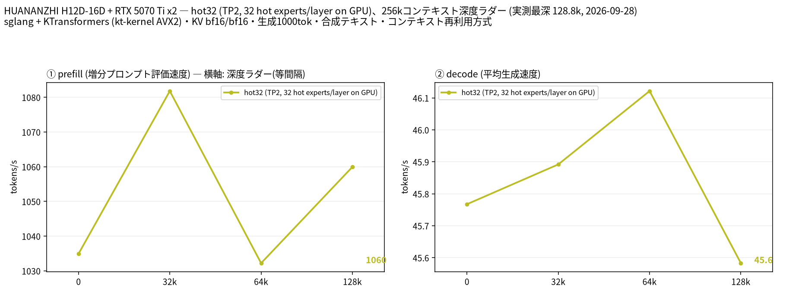

# EPYC 7452 × 2 と RTX 5070 Ti × 2 で Qwen3.8-Flash-Next Uncensored（自前 NVFP4）を sglang＋KTransformers で動かす

- **作成者**: amane.yukishima
- **作成日**: 2026-09-26

## 概要

RTX 5070 Ti 2 枚（VRAM 計 32 GB、GPU 間 P2P なし）と RAM 512 GB で、orcarouter の Qwen3.8-Flash-Next Uncensored（BF16）を自分で NVFP4 に量子化した 174 GB のモデルを、sglang＋KTransformers で動かしています。
約 38K トークン相当のプロンプト（35K トークン）の prefill が 990 t/s（35 秒）、decode が 51〜53 t/s でした。コンテキスト長は 262K に設定し、KV キャッシュは 232K トークン分を確保しています。
llama.cpp ではなく sglang＋KTransformers で動かしているため、llama-split-bench ではなく自作スクリプトで、プロンプト長 2 種の prefill と 512 トークンの decode を測っています（深度ラダーは測っていません）。

## ハードウェア

| 項目 | 内容 |
|------|------|
| コンピュータ / マザーボード | HUANANZHI H12D-16D（デュアル SP3） |
| GPU | GeForce RTX 5070 Ti × 2（VRAM 16 GB / 枚） |
| GPU 接続 | 両 GPU とも PCIe Gen4 x16。GPU0 は CPU0 側、GPU1 は CPU1 側に接続されていて、`nvidia-smi topo -m` は SYS（GPU 間の P2P なし）。ピン留めしたホストメモリから GPU への転送は 1 枚あたり 25〜26 GB/s（自作ベンチ、同じ NUMA ノード）、ソケットをまたぐと 23 GB/s |
| CPU | AMD EPYC 7452 × 2（32 コア / 64 スレッド × 2、Zen 2、AVX2 まで・AVX-512 なし、NUMA 2 ノード、L3 256 MiB） |
| メモリ | 約 512 GiB（`free -h` で 499 GiB）。種類は不明。モデルは NVMe SSD に配置 |
| 電源 | 不明 |

## ソフトウェア環境

| 項目 | 内容 |
|------|------|
| OS | Ubuntu 26.04 LTS / Linux 7.0.0-34-generic |
| GPU ドライバ | NVIDIA 595.91.07（CUDA 13） |
| 推論エンジン | sglang（kvcache-ai/sglang をベースに独自パッチ）＋ KTransformers の kt-kernel（AVX2 ビルド＋独自パッチ）、CUDA バックエンド。llama.cpp は使っていません |
| 並列化 | テンソル並列 2（TP=2）。CPU 側のエキスパートは kt-kernel が 2 ソケットに分けて計算 |

## ベンチマーク

### 条件

| 項目 | 内容 |
|------|------|
| ツール | 自作スクリプト [`sglang-ladder.py`](attachment/2026-09-26_204056_running_qwen3.8_flash_next_uncensored_nvfp4_on_2x_epyc_7452_and_2x_rtx_5070_ti_with_sglang_and_ktransformers/sglang-ladder.py)（llama-split-bench 7af72d4 の `measure_ladder.py` / `measure_pp0.py` と同じ手順を、sglang の `/generate` に移植したもの）。llama-split-bench は llama.cpp 専用のため使っていません |
| モデル | [orcarouter/Qwen3.8-Flash-Next-Uncensored](https://huggingface.co/orcarouter/Qwen3.8-Flash-Next-Uncensored)（BF16）を元に、ルーティングされるエキスパートだけ ModelOpt で NVFP4 に量子化（キャリブレーションは自前の日本語の散文 512 本。同じ作者の NVFP4 版は使っていません）。エキスパートは NVFP4（グループサイズ 16）、それ以外は BF16。174 GB（うち PLE の n-gram テーブルが BF16 で 96 GB）。48 層（線形アテンション 36 ＋ スパースアテンション 12）、ルーティングされるエキスパート 512 個中 10 個がアクティブ、hyper-connection 4 本 |
| 測定モード | `hot32`：CPU/GPU 分担（TP=2）。GPU に置くもの: エキスパート以外のすべてと、各層で使用頻度の高いエキスパート 32 個（日本語の散文の生成で集計、ルーティングの 64% をカバー）。prefill: 256 トークン以上では、エキスパートを層ごとに NVFP4 のまま GPU へ転送して計算（kt-kernel のホストメモリからゼロコピー） |
| ctx / stages | 262K（KV キャッシュの確保は 232K トークン） / 0,32000,64000,128000 |
| KV キャッシュ | bf16 / bf16 |
| 投機的デコード | なし |
| その他 | ラダーは llama-split-bench と同じ英語の合成テキストを使い、各段で前の段の文脈の続きを送ります（前の段までの KV はプレフィックスキャッシュで再利用し、増えた分だけを prefill）。各段の直後に greedy・`ignore_eos` で 1000 トークン生成。depth 0 の prefill は新規プロンプト（512 / 2048 / 8192 トークン、先頭に毎回異なる文字列を付けてキャッシュを無効化）で、表と図の depth 0 は 2048 トークンの値です。同時リクエスト 1、測定日 2026-09-28〜29。参考の実プロンプトの計測: prefill は実際に使っている日本語の執筆指示（約 38K トークン）とその先頭 11,000 文字（約 6K トークン）を max_tokens 1 で送信し、2 回目の値（1 回目は起動直後のウォームアップを含む）。プロンプトの先頭に毎回異なる文字列を付けてプレフィックスキャッシュを無効化。decode は `ignore_eos`・思考なしで 2 回。temperature 1.0 / top_p 0.95、同時リクエスト 1。測定日 2026-09-26 |

### 結果

図は llama-split-bench の `plot_bench.py` で描いています（見出しの 2 行目に llama.cpp の版の代わりに推論エンジン名を出すよう 1 行だけ変更）。depth ごとの prefill / decode（t/s）。depth 0 の prefill は新規プロンプト（2048 トークン）の値です。decode はラダーの合成テキストでの実測値です。

| depth | prefill (t/s) | decode (t/s) |
|------:|------:|------:|
| 0 | 1,035 | 45.8 |
| 32k | 1,082 | 45.9 |
| 64k | 1,032 | 46.1 |
| 128k | 1,060 | 45.6 |

実際の深さ（トークン）: 32,093 / 64,864 / 128,843。ラダー初段（11 トークン）の prefill は計測上の artifact のため載せていません。

depth 0 の新規プロンプト prefill（t/s）:

| プロンプト長 | hot32 (t/s) |
|------:|------:|
| 519 | 298 |
| 1,984 | 1,035 |
| 8,083 | 1,083 |

- この版の sglang は chunk に分けた prefill のサーバ側の記録が最後の chunk の分しか残らないため、prefill は最初のトークンが返るまでの時間（クライアント側）と、前の段とのプロンプト長の差から計算しています。decode はサーバ側のスループットです

ラダーの decode（英語の合成テキスト、greedy）は、下の実プロンプト（日本語、temperature 1.0）の値より低めです。GPU に置いた高頻度エキスパートは日本語の執筆でのルーティングから選んでいるため、合成テキストでは GPU 側で計算される割合が下がることが主な理由だと考えていますが、確認はしていません。

#### 参考: 実際の執筆指示での計測（2026-09-26）

プロンプト長ごとの prefill（t/s）。括弧内は所要時間です。

| プロンプト長 | 高頻度エキスパート 32 個 / 層を GPU |
|------:|------:|
| 約 6K（5,515 トークン） | 932（5.9 秒） |
| 約 38K（35,081 トークン） | 990（35.4 秒） |

decode（t/s、2 回の範囲）:

| 生成 | 高頻度エキスパート 32 個 / 層を GPU |
|------:|------:|
| 512 トークン | 51.1〜53.2 |

1 回目の 38K prefill はウォームアップを含めて 836 t/s でした。Qwen のトークナイザでは、同じプロンプトが 35.1K / 5.5K トークンになります。
- 計測時の吸気温度は 47℃ で、CPU1 側のメモリ帯域が絞られ始める温度でした。室温の低い昼の別計測では、decode 58.1〜59.4 t/s、prefill 1,050〜1,080 t/s（38K / 105K / 210K トークン）でした。
- 同じ構成で、105K トークンの prefill は 97 秒、210K トークンは 196 秒でした。

### 所感

- 深度ラダーでは、最も深い段（128k）まで decode は 45.6〜46.1 t/s、prefill は 1,032〜1,082 t/s で、深さによる低下はほとんどありませんでした。
- アクティブなエキスパートが小さい（512 個中 10 個、中間次元 640）ため CPU 側の計算が軽く、decode は他の 150〜480 GB 級のモデルより速く出ます。その分 all-reduce や受け渡しのオーバーヘッドの比重が大きく、そこを削った効果がそのまま出ました。
- `--mem-fraction-static 0.90` では 38K の prefill の途中でメモリ不足になりました。prefill の一時領域がコンテキスト長に比例して増えるためで、0.85 にして KV キャッシュを 232K トークンに抑えています。
- この sglang では、16 トークン以下の hyper-connection の計算を atomic 加算のカーネルで行うため、decode の各ステップと短いプロンプトは、同じ入力でも丸め誤差の分だけ毎回わずかに結果が変わります（sglang の設計どおりで、deterministic モードで無効にできます）。

独自の変更（全モデル共通）:

- **エキスパートの CPU/GPU 分担**: 実際のルーティング頻度から選んだ使用頻度の高いエキスパートを GPU に置き、残りを CPU で計算。GPU に置いたエキスパートの重みが別のエキスパートのものとして読み込まれるバグを見つけて修正（[kvcache-ai/sglang#97](https://github.com/kvcache-ai/sglang/pull/97)）
- **P2P なし 2 枚向けの all-reduce**: decode 時の小さな all-reduce を、両 GPU からマップしたピン留めホストメモリ経由の 1 カーネルにまとめ、NCCL（SHM 経路）の 22〜25 µs を 5 µs に短縮（[sgl-project/sglang#39605](https://github.com/sgl-project/sglang/pull/39605)）。prefill 時の大きな all-reduce は、ホストメモリを経由してコピーエンジンで転送
- **CPU の計算結果の受け渡し**: kt-kernel と GPU の間の受け渡しを、ホスト関数のコールバックから GPU のストリーム上でフラグを書いて待ち合わせる方式（`cuStreamWriteValue32` / `cuStreamWaitValue32`）に置き換え、decode の 1 トークンごとの待ち時間を削減
- **AVX2 のエキスパートカーネル**: Zen 2 向けの MXFP4 / NVFP4 カーネル。本家にも複数マージ済み（kvcache-ai/ktransformers #2175, #2176, #2205, #2209, #2210）
- **ホスト経由の all-reduce の競合を修正**: 1 MiB 以上の all-reduce で、自分の入力をホストへ送り終える前にその場で加算していたため、長いプロンプトでまれに誤った和になっていました。修正後は同じ入力に対する出力がビット単位で一致します（速度は変わりません）

独自の変更（このモデル向け）:

- **NVFP4 のままエキスパートを GPU へ転送しながらの prefill**: 1 層分の CPU 側エキスパート（1 ランクあたり約 0.9 GB）を PCIe で GPU へ転送し、FlashInfer の cutlass MoE で計算。3,308 トークンの prefill が 23 秒 → 3.9 秒。FlashInfer に渡す fc1 の重みは up と gate の順に並べる必要がありました
- **転送元のホストメモリを起動時にピン留め**: 最初の要求でピン留めしていたため、最初の長いプロンプトが 15 分半止まっていました（4 KB ページのピン留めが遅い）。起動時にピン留めし、各層のエキスパートを読む前にモデルファイルのページキャッシュを破棄して 2 MB ページに載せる形にして、最初の 38K プロンプトが 40 秒に
- **起動前のページキャッシュ破棄**: 別のモデルを読み込んだ直後に起動すると、片方の NUMA ノードがページキャッシュで埋まり、CPU 側のエキスパートが反対側のノードに配置されて decode が落ちるため、起動前にモデルファイルのページキャッシュを破棄（root 権限は不要）
- **AVX2 の NVFP4 カーネルのループ順**: 出力列を外側に回してアクティベーションを読み直していたのを入れ替え（出力はビット単位で一致）。CPU での 6K の prefill が 301 → 363 t/s
- **decode**: 受け渡しの改善とホストメモリ経由の all-reduce で 47 → 58 t/s（室温の低い時間帯の計測）
- MTP による投機的デコードは、temperature 1.0 の散文では受理が 1.2〜1.4 トークンで、2 ステップでは逆に遅くなるため採用していません

## 添付

- [run-info.json](attachment/2026-09-26_204056_running_qwen3.8_flash_next_uncensored_nvfp4_on_2x_epyc_7452_and_2x_rtx_5070_ti_with_sglang_and_ktransformers/run-info.json)
- [argv-hot32.txt](attachment/2026-09-26_204056_running_qwen3.8_flash_next_uncensored_nvfp4_on_2x_epyc_7452_and_2x_rtx_5070_ti_with_sglang_and_ktransformers/argv-hot32.txt)（sglang のサーバ設定。ホームディレクトリのパスは `~` に置き換え）
- [results-hot32.json](attachment/2026-09-26_204056_running_qwen3.8_flash_next_uncensored_nvfp4_on_2x_epyc_7452_and_2x_rtx_5070_ti_with_sglang_and_ktransformers/results-hot32.json) / [results-hot32-pp0.json](attachment/2026-09-26_204056_running_qwen3.8_flash_next_uncensored_nvfp4_on_2x_epyc_7452_and_2x_rtx_5070_ti_with_sglang_and_ktransformers/results-hot32-pp0.json)
- [split-bench-en.png](attachment/2026-09-26_204056_running_qwen3.8_flash_next_uncensored_nvfp4_on_2x_epyc_7452_and_2x_rtx_5070_ti_with_sglang_and_ktransformers/split-bench-en.png)
- [sglang-ladder.py](attachment/2026-09-26_204056_running_qwen3.8_flash_next_uncensored_nvfp4_on_2x_epyc_7452_and_2x_rtx_5070_ti_with_sglang_and_ktransformers/sglang-ladder.py)（計測スクリプト）
- [results.json](attachment/2026-09-26_204056_running_qwen3.8_flash_next_uncensored_nvfp4_on_2x_epyc_7452_and_2x_rtx_5070_ti_with_sglang_and_ktransformers/results.json)（参考の実プロンプトの計測）
