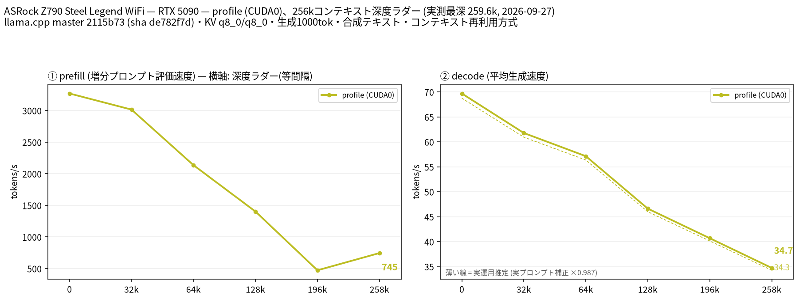

# RTX 5090 1 枚で Qwen3.8 27B UD-Q5_K_XL を 262k コンテキストまで計測

- **作成者**: unco3
- **作成日**: 2026-09-27

## 概要

ASRock Z790 Steel Legend WiFi + RTX 5090（32 GB）× 1 の WSL2 環境で、Qwen3.8 27B UD-Q5_K_XL を `--profile`（単一 GPU）で 262k コンテキストまで計測しました。投機的デコードはなしです。
decode は depth 0 の 69.7 t/s から 258k の 34.7 t/s へ、prefill は 3,270 t/s から 745 t/s へ低下します。
196k 段の prefill だけが 472 t/s と前後より遅く、2 回の計測で再現しました（詳細は所感）。

## ハードウェア

| 項目 | 内容 |
|------|------|
| コンピュータ / マザーボード | ASRock Z790 Steel Legend WiFi（自作 PC） |
| GPU | NVIDIA GeForce RTX 5090 × 1（VRAM 32 GB / 枚） |
| GPU 接続 | PCIe Gen5 x16 |
| CPU | Intel Core i9-14900KF（8P + 16E / 32 スレッド） |
| メモリ | DDR5-4800 64 GB（32 GB × 2）。WSL2 への割り当ては 50 GB |
| 電源 | 不明 |

## ソフトウェア環境

| 項目 | 内容 |
|------|------|
| OS | Windows 11 Home（10.0.26200）上の WSL2、Ubuntu 24.04.1 LTS / カーネル 6.18.33.2-microsoft-standard-WSL2 |
| GPU ドライバ | 610.47（Windows 側）、CUDA 13.3 |
| llama.cpp | b10581（`2115b73`）、CUDA バックエンド（`CMAKE_CUDA_ARCHITECTURES=120`） |

## ベンチマーク

### 条件

| 項目 | 内容 |
|------|------|
| ツール | llama-split-bench `7af72d4`（ローカル変更なし） |
| モデル | Qwen3.8-27B-UD-Q5_K_XL.gguf（20,876,938,144 バイト） |
| 測定モード | `profile`（CUDA0 のみ、単一構成） |
| ctx / stages | 262144 / 0,32000,64000,128000,196000,258000 |
| KV キャッシュ | q8_0 / q8_0 |
| 投機的デコード | なし（`SPEC_ARGS=""`） |
| その他 | `-fa on`、`-ngl all`、`-t 8`、`--jinja`、`--cache-ram 8192 --cache-idle-slots --cache-reuse 256`、生成 1000 トークン / 段（全引数は argv-profile.txt）。計測中の VRAM 使用量は約 30 GB |

### 結果

depth ごとの prefill / decode（t/s）。depth 0 の prefill は新規プロンプト（pp2048）の値です。ラダー初段（11 トークン）の prefill は表に載せていません。2 回計測したうちの 2 回目を載せています。

| depth | prefill (t/s) | decode (t/s) |
|------:|------:|------:|
| 0 | 3269.6 | 69.7 |
| 32k | 3014.8 | 61.8 |
| 64k | 2135.9 | 57.1 |
| 128k | 1402.4 | 46.6 |
| 196k | 472.5 | 40.7 |
| 258k | 745.1 | 34.7 |

depth 0 の新規プロンプト prefill（t/s）:

| プロンプト長 | profile (t/s) |
|------:|------:|
| 512 | 2628.1 |
| 1978 | 3269.6 |
| 8077 | 3427.0 |

実プロンプト（3 種、temp 0.7 / top_p 0.9、1200 トークン生成）の decode は次のとおりで、補正係数は **0.987** です（図の薄い破線）。投機的デコードを使っていないため、合成テキストとの差はほぼありません。

| プロンプト | decode (t/s) |
|------|------:|
| design | 69.0 |
| review | 69.1 |
| qa | 68.2 |

1 回目の計測値（参考）: prefill 3335.9 / 3226.1 / 2191.6 / 1411.0 / 445.1 / 748.7、decode 68.7 / 62.2 / 56.3 / 46.8 / 40.8 / 34.7（depth 0〜258k の順）。

### 所感

- 20.9 GB の Q5_K_XL と q8_0 の KV キャッシュを合わせても、RTX 5090 1 枚（32 GB）で 262k コンテキストまで GPU に収まりました。
- decode は 0k の約 70 t/s から 258k の約 35 t/s へ、深さに応じてほぼ直線的に下がります。2 回の計測の差は 1 t/s 以内です。
- **196k 段の prefill が 258k 段より遅い**という逆転が 2 回とも起きました。サーバログを見ると、196k 段は 2,048 トークンずつ約 2.4 秒の一定ペースで進んでいます。ところが、プロンプト末尾の 57 トークン（絶対位置で約 195.9k 付近）の処理で 1 回目は約 92 秒、2 回目は約 83 秒止まっています。停止中は GPU サンプラ（nvidia-smi）の記録も途切れていました。原因は未確認です（WSL2 / ドライバ側の挙動の可能性があります）。停止時間を除いて単純計算すると、196k 段の prefill は約 1,100 t/s 相当です。
- 既存レポートの多くは UD-Q4_K_XL なので、量子化の違い（Q5 は約 3.3 GB 大きい）に注意して比較してください。

## 添付

- [run-info.json](attachment/2026-09-27_060846_profiling_qwen3.8_27b_ud_q5_k_xl_up_to_262k_context_on_rtx5090/run-info.json)
- [argv-profile.txt](attachment/2026-09-27_060846_profiling_qwen3.8_27b_ud_q5_k_xl_up_to_262k_context_on_rtx5090/argv-profile.txt)
- [results-profile.json](attachment/2026-09-27_060846_profiling_qwen3.8_27b_ud_q5_k_xl_up_to_262k_context_on_rtx5090/results-profile.json)
- [results-profile-pp0.json](attachment/2026-09-27_060846_profiling_qwen3.8_27b_ud_q5_k_xl_up_to_262k_context_on_rtx5090/results-profile-pp0.json)
- [results-real.json](attachment/2026-09-27_060846_profiling_qwen3.8_27b_ud_q5_k_xl_up_to_262k_context_on_rtx5090/results-real.json)
- [split-bench-en.png](attachment/2026-09-27_060846_profiling_qwen3.8_27b_ud_q5_k_xl_up_to_262k_context_on_rtx5090/split-bench-en.png)
