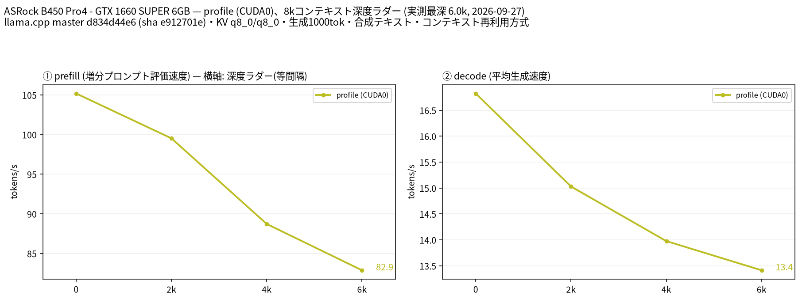

# GTX 1660 SUPER 6GBで Qwen2.5-Coder 7B のGPU/CPUオフロードを計測

- **作成者**: antarashi
- **作成日**: 2026-09-27

## 概要

GTX 1660 SUPER 6GB × 1とRyzen 7 5700Xで、既存のQwen2.5-Coder-7B-Instruct Q4_K_MをWSL2上のCUDA版llama.cppで測定しました。
context枠8,192、29層中22層をGPUに固定配置したCPU/RAM併用構成です。
実入力6,027トークンまでのdecodeは13.41〜16.82 tokens/sでした。
合成文・単一スロット・各条件1回の速度測定であり、コード生成の正確性や実用性の判定は行っていません。

## ハードウェア

| 項目 | 内容 |
|------|------|
| コンピュータ / マザーボード | ASRock B450 Pro4（Windows CIMで再取得） |
| GPU | NVIDIA GeForce GTX 1660 SUPER × 1（VRAM 6GB、nvidia-smi: 6,144 MiB） |
| GPU 接続 | PCIe 3.0 x16。current/maxともGen3・x16、単一GPU |
| CPU | AMD Ryzen 7 5700X 8-Core Processor（8コア / 16スレッド） |
| メモリ | 48 GiB（16 GiB × 2＋8 GiB × 2）、DDR4、設定速度2,400 MT/s（CIM） |
| WSL側メモリ | MemTotal約23,991 MiB、swap 6,144 MiB。ホストの48 GiB全量をゲストに割り当てた測定ではない |

GPUはWindowsの画面表示にも使用しています。本測定のサーバー起動前のGPU全体使用量は1,524 MiBでした。
電力上限・クロック・WSLメモリ割当は測定のために変更していません。

## ソフトウェア環境

| 項目 | 内容 |
|------|------|
| OS | Windows 10 Home 22H2、10.0.19045.7725（CIMとレジストリで再確認） |
| 測定OS | WSL2 2.7.14.0、Ubuntu 26.04.1 LTS、Linux 6.18.33.2-microsoft-standard-WSL2 |
| GPU ドライバ | Windows 617.14。nvidia-smiのCUDA UMD表示は13.4 |
| llama.cpp | 0.5.0-dev、build 11195、commit `d834d44e6`、公式Linux x86_64 CUDA 13.4版、GNU 13.3.0ビルド |
| CUDA環境 | 同リリースのCUDA 13.4ランタイム配布物を使用。WSL上の`nvcc`はPATHに見つからず、ローカルコンパイルはしていない |
| Python / 作図 | Python 3.14.4 / matplotlib 3.11.2 / Noto Sans CJK JP |

使用バイナリは[llama.cpp b11195](https://github.com/ggml-org/llama.cpp/releases/tag/b11195)の
`llama-b11195-bin-ubuntu-cuda-13.4-x64.tar.gz`と`cudart-llama-b11195-bin-ubuntu-cuda-13.4-x64.tar.gz`です。
不足していたlibgomp1はUbuntuの`16-20260322-1ubuntu1`を作業ディレクトリに展開しました。
バイナリ本体のSHA-256はrun-info.jsonに記録されています。

過去の個人メモにはWindows 11との記載がありましたが、今回の実機取得値はWindows 10でした。本レポートは現在の取得値を採用しています。

## ベンチマーク

### 条件

| 項目 | 内容 |
|------|------|
| ツール | llama-split-bench `7af72d4085aa5073677d41389144112dd94fcb74`。計測・作図コードの内容は未変更（シェルファイルの改行のみLF化） |
| モデル | Qwen2.5-Coder-7B-Instruct、7.62B、GGUF v3、Q4_K_M、4,683,074,048 bytes（約4.36 GiB） |
| 入手済みモデル | Ollamaの`qwen2.5-coder:7b`に含まれるモデルblob。GGUFヘッダー・メタデータ・全ファイルSHA-256を確認し、変換せずllama-serverから直接読み込んだ |
| 測定モード | `--profile`、CUDA0 × 1 |
| ctx / stages | 8192 / 0,2000,4000,6000 |
| 生成長 | 各段1,000トークン、temperature 0、ignore_eos有効 |
| 新規入力prefill | 目標512 / 2048トークン、cache_prompt=false、各64トークン生成。ツール既定の8トークンwarmupあり |
| KV キャッシュ | K=q8_0 / V=q8_0 |
| GPU offload | `-ngl 22`、`--fit off`。実ログは22/29層（繰り返し層21＋出力層）をGPU配置 |
| CPU/RAM併用 | あり。CPU_Mappedモデルバッファ1,236.36 MiB、GPUモデルバッファ3,224.09 MiB |
| KVの配置 | CPU 59.50 MiB、GPU 178.50 MiB |
| 計算バッファ | GPU 79.94 MiB、CUDA_Host 5.58 MiB（起動ログ値） |
| batch / ubatch / threads | 512 / 128 / 8、batch threadsも8（ログ確認） |
| Flash Attention | on、ログでもenabled |
| 投機的デコード | なし（SPEC_ARGSは空） |
| その他 | mmapロード、parallel=1、seed=42、Jinja有効、mmprojなし、CACHE_ARGS空、`--no-real`。本測定は配置確認用に`--log-verbosity 4` |
| 実施回数 | smoke test 1回成功後、本測定1回。各条件の反復平均ではない |

モデル配布情報: [Ollama qwen2.5-coder:7b](https://ollama.com/library/qwen2.5-coder:7b)。モデルSHA-256:
`60e05f2100071479f596b964f89f510f057ce397ea22f2833a0cfe029bfc2463`。

既存ファイル調査ではQwen2.5-Coder 14B Q4_K_M、Qwen3-Coder-30B-A3B-Instruct Q3_K_M、4B/35B MoEのGGUFも確認しました。
今回は7Bモデルを選び、モデルの追加ダウンロード・再量子化は行っていません。他モデルの性能は今回測定していません。

22層は画面表示用VRAMの余裕を確保するため、smoke test前に固定しました。速度を見て層数を選び直していません。
全層GPU配置の可否・最速の層数・最大context長を探索した測定ではありません。
入力は上流ツールの固定英文と連番付き合成文で、個人の文書・コード・会話は送信していません。
Ollamaのシステムプロンプトやチャットテンプレートを使った測定でもありません。

### 結果



単位はtokens/s。depthはツールの目標値です。8Kは確保枠であり、8K全文入力の測定ではありません。

| depth | prefill profile | decode profile |
|------:|------:|------:|
| 0 | 105.19 | 16.82 |
| 2,000 | 99.53 | 15.03 |
| 4,000 | 88.72 | 13.98 |
| 6,000 | 82.88 | 13.41 |


depth 0のprefillには新規入力試験の`pp2048`（実入力1,978トークン）を使っています。
depth 0のdecodeは11トークン入力からの1,000トークン生成で、prefillとは別リクエストです。
ラダー初段11トークンのprefill値は計測上のartifactとなるため、表・図のprefillに使っていません。

| 目標depth | 実入力長（effective_depth） | cache_n | 新規評価prompt_n | 生成数 |
|------:|------:|------:|------:|------:|
| 0 | 11 | 0 | 11 | 1,000 |
| 2,000 | 1,934 | 0 | 1,934 | 1,000 |
| 4,000 | 4,051 | 1,905 | 2,146 | 1,000 |
| 6,000 | 6,027 | 4,023 | 2,004 | 1,000 |


ラダーはcache_prompt=trueです。cache_nは上表のとおりで、後段のprefillはキャッシュ済み部分を除いた新規評価部分の速度です。入力縮小リトライはなく、全段で指定の1,000トークンを生成しました。

新規入力prefill（キャッシュ再利用なし）:

| 目標入力長 | 実入力prompt_n | cache_n | prefill（tokens/s） |
|------:|------:|------:|------:|
| 512 | 512 | 0 | 111.98 |
| 2048 | 1,978 | 0 | 105.19 |


GPU全体の使用量を本測定の起動前から終了まで約2秒間隔で211回記録しました。起動前1,524 MiB、サンプル中の最大値は5,268 MiBでした。
これはWindowsの画面表示等も含むGPU全体の値です。モデル単独のVRAM量ではなく、2秒間の間に発生したピークも保証しません。
サンプル中のGPU温度は49〜63℃でした。測定中のWSLメモリ観測ではswap使用量は0 MiBでしたが、RAMやswapの連続監視はしていません。

### smoke test・失敗と制約

smoke testはctx=8192、stages=0,4000、各100トークン生成、新規入力512/2048で1回実施し、`BENCH-DONE`を確認しました。
smokeのdecodeは実入力11で8.58、3,917で14.74 tokens/sでした。本測定の値とは混ぜず、短い生成長・初回起動の影響を分離できない動作確認値として扱います。
最初の短い入力のprompt処理に約19.1秒を要しましたが、原因を計測で特定していないため、特定のコンパイルやキャッシュ効果とは断定しません。

smoke・本測定ともOOM、外部GPU計算プロセスによる中断、context不足による縮小リトライはありませんでした。
ただし全層GPU配置や8,192を超えるcontextは試していません。CPUオフロードがこのモデルで絶対に必要か、最大何層まで載るかは本測定だけでは確定できません。

準備中にはLinuxランタイムのlibgomp不足と、WSL起動用クライアントが終了して測定開始前に処理が終わる問題がありました。
依存ライブラリの配置とWSL監視セッションの保持で解消しています。モデルのOOMによる失敗とは区別します。

### 再現手順

上記コミットのllama-split-benchと公式llama.cpp配布物を用意します。モデルは既存GGUFの上記ハッシュを確認してください。
`bench.local.conf`に以下を設定します。配置先と共有ライブラリ検索パスは環境に合わせてください。

```bash
BIN=/opt/llama-b11195/llama-server
MODEL=/models/sha256-60e05f2100071479f596b964f89f510f057ce397ea22f2833a0cfe029bfc2463
MACHINE="ASRock B450 Pro4 - GTX 1660 SUPER 6GB"
DEVICES=CUDA0
NGL=22
CTX=8192
STAGES=0,2000,4000,6000
N_PREDICT=1000
PP0_SIZES=512,2048
THREADS=8
FA=on
KV_K=q8_0
KV_V=q8_0
SPEC_ARGS=""
CACHE_ARGS=""
LOAD_MODE=""
MMPROJ=""
FAN_HWMON=none
EXTRA_ARGS="--fit off --batch-size 512 --ubatch-size 128 --seed 42 --log-verbosity 4"
VENV_PY=/opt/bench-plot/bin/python3
```

HOSTとPORTはツール既定のローカルループバック限定で実行しました。空きポートを確認してから起動します。
日本語図にはNoto Sans CJK JPが必要です。今回は作図Pythonの`sitecustomize.py`からフォントを登録し、上流の作図コードをそのまま実行しました。

```bash
# smoke testではログレベル指定を省略（既定3）。測定条件は本文のとおり。
bash run-bench.sh smoke-7b --profile --ctx 8192 --stages 0,4000 \
  --n-predict 100 --pp0-sizes 512,2048 --no-real

# 本測定（毎回新しいタグを使用）
mkdir -p runs
setsid nohup timeout --signal=TERM --kill-after=15s 1800 \
  bash run-bench.sh profile-7b --profile --ctx 8192 \
  --stages 0,2000,4000,6000 --n-predict 1000 --pp0-sizes 512,2048 --no-real \
  > runs/profile-7b.log 2>&1 &
```

WSLの監視用セッションを維持し、ログの`BENCH-DONE`まで確認しました。本測定の起動から作図完了までは約6分59秒でした。

### 所感と限界

本結果は6GBの単一GPUとCPU/RAMを併用した一構成の観測値です。GPU単体の性能値ではありません。
各条件1回のため、平均・分散や統計的な有意差は示せません。ラダーは順番に実行するため、深度の差と実行順・温度・キャッシュ状態の影響も分離できません。
Windowsの画面表示を維持した環境であり、デスクトップ負荷を完全には統制していません。
速度はllama-serverのtimingsに基づき、モデル読込・全リクエスト時間を含むend-to-end性能とは異なります。
品質、実コードでの正答率、複数同時リクエスト、より長いcontext、異なるKV型・offload層数は未評価です。

過去の個人ノートには別モデル・別ランタイム構成の速度記録がありましたが、条件が一致しないため、今回の値との直接比較や改善率の算出には使用していません。

## 添付

- [run-info.json](attachment/2026-09-27_124604_measuring_gpu_cpu_offload_of_qwen2_5_coder_7b_on_gtx1660super_6gb/run-info.json)
- [results-profile.json](attachment/2026-09-27_124604_measuring_gpu_cpu_offload_of_qwen2_5_coder_7b_on_gtx1660super_6gb/results-profile.json)
- [results-profile-pp0.json](attachment/2026-09-27_124604_measuring_gpu_cpu_offload_of_qwen2_5_coder_7b_on_gtx1660super_6gb/results-profile-pp0.json)
- [argv-profile.txt](attachment/2026-09-27_124604_measuring_gpu_cpu_offload_of_qwen2_5_coder_7b_on_gtx1660super_6gb/argv-profile.txt)
- [split-bench-en.png](attachment/2026-09-27_124604_measuring_gpu_cpu_offload_of_qwen2_5_coder_7b_on_gtx1660super_6gb/split-bench-en.png)
- [measurement-details.json](attachment/2026-09-27_124604_measuring_gpu_cpu_offload_of_qwen2_5_coder_7b_on_gtx1660super_6gb/measurement-details.json)（配置量、VRAMサンプル集計、再取得したハードウェア情報）
- [smoke testの実測JSON](attachment/2026-09-27_124604_measuring_gpu_cpu_offload_of_qwen2_5_coder_7b_on_gtx1660super_6gb/smoke/results-profile.json) / [新規入力JSON](attachment/2026-09-27_124604_measuring_gpu_cpu_offload_of_qwen2_5_coder_7b_on_gtx1660super_6gb/smoke/results-profile-pp0.json)
- [smoke testのrun-info](attachment/2026-09-27_124604_measuring_gpu_cpu_offload_of_qwen2_5_coder_7b_on_gtx1660super_6gb/smoke/run-info.json) / [起動引数](attachment/2026-09-27_124604_measuring_gpu_cpu_offload_of_qwen2_5_coder_7b_on_gtx1660super_6gb/smoke/argv-profile.txt)
- [smoke testの図（日本語）](attachment/2026-09-27_124604_measuring_gpu_cpu_offload_of_qwen2_5_coder_7b_on_gtx1660super_6gb/smoke/split-bench-ja.png) / [英語](attachment/2026-09-27_124604_measuring_gpu_cpu_offload_of_qwen2_5_coder_7b_on_gtx1660super_6gb/smoke/split-bench-en.png)

公開用コピーではバイナリ・モデルの配置先を中立なパスに置換し、起動引数のループバックアドレスを`<loopback-address>`と表記しました。
再実行時にはこのプレースホルダーをループバックに戻す必要があります。数値結果・モデルハッシュ・バイナリハッシュは変更していません。
原本はローカルに保存し、サーバーログ・生成本文・サンプラログ・モデル本体は添付していません。
