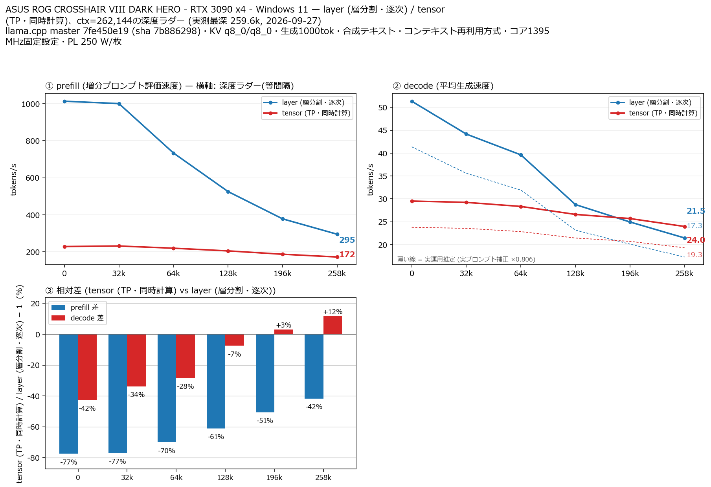

# RTX 3090 4 枚で Qwen3.8 27B の split-mode を比較（Windows・コア1395 MHz固定設定）

- **作成者**: 錦幸佳
- **作成日**: 2026-09-27

## 概要

Windows 11 Pro 上の RTX 3090 24 GB × 4 で、Qwen3.8 27B UD-Q4_K_XL の layer 分割と tensor 分割を比較しました。
両モードとも全4枚のGPUコアクロックを1395 MHzに固定設定し、電力上限を250 W／枚としました。メモリクロックは固定していません。
prefillは全測定点でlayerが速く、最深259,601トークンでのdecodeはtensorがlayerを約11.7%上回りました。
マザーボードは ASUS ROG CROSSHAIR VIII DARK HERO、CPU は AMD Ryzen 9 5950X、メモリは128 GiB DDR4です。

## ハードウェア

| 項目 | 内容 |
|------|------|
| コンピュータ / マザーボード | ASUS ROG CROSSHAIR VIII DARK HERO |
| GPU | NVIDIA GeForce RTX 3090 × 4（VRAM 24 GB / 枚）。HP OEM × 1、DELL OEM × 1、MSI Gaming X Trio × 2 |
| GPU 接続 | PCIe Gen3 x4 / GPU、NVLink なし。PCIEX16_1・PCIEX16_3 とも Gen3 設定。接続経路は下表参照 |
| CPU | AMD Ryzen 9 5950X（16 コア / 32 スレッド） |
| メモリ | 128 GiB DDR4（32 GiB × 4、Corsair CMK64GX4M2E3200C16） |
| 電源 | Cooler Master V1200 Platinum 1200 W（中古）＋ ENERMAX Platimax EPM750AWT 750 W。ADD2PSU で同期し、別分岐回路から給電 |

以下の GPU 番号は構成図の呼称です。

| GPU | 接続経路 |
|-----|----------|
| GPU0（HP OEM） | PCIEX16_3 → 20 cm ライザー |
| GPU_1（DELL OEM） | PCIEX16_1 → ChenYang PCIe to SFF-8654 8i dual port の Port_1 → SFF-8654 ケーブル → Ahvqevn SFF-8654 to PCIe dual slot の slot_1 → 5 cm ライザー |
| GPU_2（MSI Gaming X Trio） | 同 Port_1 → 同ケーブル・Ahvqevn 変換基板の slot_2 |
| GPU_3（MSI Gaming X Trio） | 同 ChenYang 変換カードの Port_2 → SFF-8654 ケーブル → SFF-8654 to PCIe single 変換基板 |

DELL OEM カードの接続経路は Gen4 設定で不安定だったため、Gen3 で使用しています。

## ソフトウェア環境

| 項目 | 内容 |
|------|------|
| OS | Windows 11 Pro / build 26200 |
| GPU ドライバ | NVIDIA 610.88 |
| llama.cpp | b11146（0.5.0-dev、commit 7fe450e19）、公式 Windows x64 CUDA 12.4 バイナリ |

## ベンチマーク

### 条件

| 項目 | 内容 |
|------|------|
| ツール | llama-split-bench 7af72d4 |
| モデル | Qwen3.8-27B UD-Q4_K_XL（unsloth、17,559,178,144 バイト） |
| 測定モード | layer / tensor（いずれも RTX 3090 × 4、本測定は各1回） |
| GPU動作条件 | 両モードとも全4枚のコアクロックを1395 MHzに固定設定。電力上限250 W／枚。メモリクロックは固定なし |
| ctx / stages | 262144 / 0,32000,64000,128000,196000,258000 |
| KV キャッシュ | q8_0 / q8_0 |
| 生成 | 各深度で1,000トークン、合成テキスト |
| 投機的デコード | MTP 有効（`--spec-type draft-mtp --spec-draft-n-max 2`） |

1395 MHzは固定の設定値です。100 ms周期の監視では一時的なクロック低下も記録され、観測値は945～1395 MHzでした。以下はこの動作条件での測定結果です。

### 結果

速度の単位はtok/sです。表は実測値を示しています。depth欄は目標深度と、両モード共通の実測深度（括弧内）です。

| depth | prefill layer | prefill tensor | decode layer | decode tensor |
|---:|---:|---:|---:|---:|
| 0（実測 11） | 1012.95 | 228.60 | 51.34 | 29.52 |
| 32,000（実測 32,093） | 1000.17 | 231.41 | 44.16 | 29.23 |
| 64,000（実測 64,806） | 733.35 | 219.46 | 39.62 | 28.35 |
| 128,000（実測 128,788） | 525.44 | 204.97 | 28.76 | 26.60 |
| 196,000（実測 196,429） | 377.99 | 186.91 | 24.95 | 25.70 |
| 258,000（実測 259,601） | 294.97 | 172.04 | 21.47 | 23.97 |

実測深度は`cache_n + prompt_n`です。目標深度0のprefillには別途測定した`pp2048`（実入力1,978トークン）の値を使い、11トークンの初期プロンプトによるprefill値は使っていません。同じ行のdecodeは11トークン入力から1,000トークンを生成した値です。

深度を増やした段のprefillは、その段で追加評価された入力の速度です。図の破線はツールの実プロンプト補正（×0.806）による推定値で、表の実測値とは区別しています。

### 所感

prefillは全測定点でlayerが速く、最深部ではlayerが294.97 tok/s、tensorが172.04 tok/sでした。
decodeは128K段までlayerが速く、196K段ではlayer 24.95 tok/s・tensor 25.70 tok/sと近い値になりました。最深259,601トークンではlayer 21.47 tok/sに対してtensor 23.97 tok/sで、tensorが約11.7%速い結果でした。

この構成では、短いコンテキストの速度だけでは最深部での優劣を判断できませんでした。合成テキストとMTPを使った各モード1回の比較であり、通常の対話での速度とは異なります。

## 添付

- [日本語の図](attachment/2026-09-27_130914_comparing_qwen3.8_27b_split_modes_on_4x_rtx3090_at_1395mhz_on_windows/split-bench-ja.png)
- [英語の図](attachment/2026-09-27_130914_comparing_qwen3.8_27b_split_modes_on_4x_rtx3090_at_1395mhz_on_windows/split-bench-en.png)
- [run-info.json](attachment/2026-09-27_130914_comparing_qwen3.8_27b_split_modes_on_4x_rtx3090_at_1395mhz_on_windows/run-info.json)
- [layerの深度別結果](attachment/2026-09-27_130914_comparing_qwen3.8_27b_split_modes_on_4x_rtx3090_at_1395mhz_on_windows/results-layer.json)
- [tensorの深度別結果](attachment/2026-09-27_130914_comparing_qwen3.8_27b_split_modes_on_4x_rtx3090_at_1395mhz_on_windows/results-tensor.json)
- [layerのdepth 0 prefill](attachment/2026-09-27_130914_comparing_qwen3.8_27b_split_modes_on_4x_rtx3090_at_1395mhz_on_windows/results-layer-pp0.json)
- [tensorのdepth 0 prefill](attachment/2026-09-27_130914_comparing_qwen3.8_27b_split_modes_on_4x_rtx3090_at_1395mhz_on_windows/results-tensor-pp0.json)
- [実プロンプト補正用の測定結果](attachment/2026-09-27_130914_comparing_qwen3.8_27b_split_modes_on_4x_rtx3090_at_1395mhz_on_windows/results-real.json)
- [layerの起動引数](attachment/2026-09-27_130914_comparing_qwen3.8_27b_split_modes_on_4x_rtx3090_at_1395mhz_on_windows/argv-layer.txt)
- [tensorの起動引数](attachment/2026-09-27_130914_comparing_qwen3.8_27b_split_modes_on_4x_rtx3090_at_1395mhz_on_windows/argv-tensor.txt)
