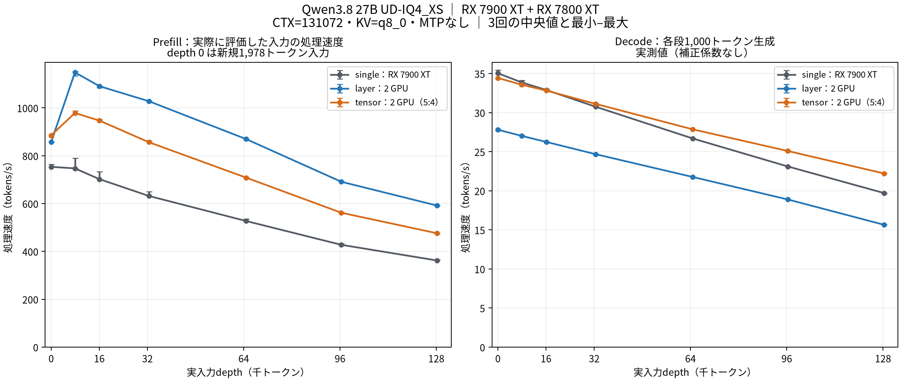

# RX 7900 XT + RX 7800 XTでQwen3.8 27B IQ4 XSのsplit-modeを比較

- **作成者**: ogawara
- **作成日**: 2026-09-28

## 概要

Radeon RX 7900 XT 20GBとRX 7800 XT 16GBで、Qwen3.8 27B UD-IQ4_XSのsingle / layer / tensorを、投機的デコードなし・128Kコンテキストで各3回測定した。
decodeは16K段までsingle、32K段以降はtensorが最速だった。最深段の実入力128,266トークンでは、tensorが22.23 t/sでsingleの19.72 t/sに対して12.7%高速だった。8K〜128K段のprefillはlayerが最速だった。

## ハードウェア

| 項目 | 内容 |
|------|------|
| コンピュータ / マザーボード | ASUS ProArt X870E-CREATOR WIFI |
| GPU | Radeon RX 7900 XT 20GB（ROCm0、gfx1100）+ RX 7800 XT 16GB（ROCm1、gfx1101） |
| GPU接続 | PCIe 4.0、CPUへの経路はx8 / x8 |
| CPU | AMD Ryzen 7 7800X3D、8コア / 16スレッド |
| メモリ | OS認識91.68 GiB、DIMM容量・種類は不明 |

## ソフトウェア環境

| 項目 | 内容 |
|------|------|
| OS | Ubuntu 26.04.1 LTS / Linux 7.0.0-34-generic |
| GPUドライバ | amdgpu 7.1.3.31500000 |
| ROCm / HIP | core 10.0.0 / HIP 7.15.26333-0000000 |
| llama.cpp | 0.5.0-dev、build 257、commit 9adc7f420、ROCm/HIPバックエンド、gfx1100・gfx1101対象 |
| GPU間通信 | tensorでRCCL 2.30.4を使用 |

## ベンチマーク

### 条件

| 項目 | 内容 |
|------|------|
| ツール | llama-split-bench 7af72d4 |
| モデル | Huihui-Qwen3.8-27B-abliterated-UD-IQ4_XS.gguf、14,403,496,864 bytes（約13.414 GiB） |
| 測定モード | single：RX 7900 XTのみ / layer：2 GPU、自動層配分 / tensor：2 GPU、7900 XT : 7800 XT = 5:4 |
| ctx / stages | 131072 / 0,8000,16000,32000,64000,96000,128000 |
| KVキャッシュ | K=q8_0、V=q8_0 |
| 投機的デコード | なし（MTPなし） |
| 推論設定 | Flash Attention on、GPU offload=all、parallel=1、CPU threads=8 |
| ラダー生成 | 各段1,000トークン、temperature=0、ignore_eos、cache_prompt=true |
| キャッシュ・上限 | cache-ram=0、fit=off、context shift無効 |
| 反復 | 各構成3回。single→layer→tensor / layer→tensor→single / tensor→single→layerの順 |

全9試行で、最深段の実入力128,266トークンから1,000トークンの生成を完了した。全63段で生成不足・入力縮小・コンテキスト切捨てはなく、OOM・デバイスエラー・RCCLフォールバックも検出しなかった。

### 結果：深度別prefill / decode

単位はt/s、表は3回の中央値。図の誤差棒は最小〜最大を示し、信頼区間ではない。

| 実入力depth | prefill single | prefill layer | prefill tensor | decode single | decode layer | decode tensor |
|---|---|---|---|---|---|---|
| 0 ※ | 753.7 | 857.5 | 885.6 | 35.04 | 27.81 | 34.44 |
| 7,887 | 747.3 | 1,148.5 | 978.8 | 33.87 | 27.03 | 33.57 |
| 16,050 | 702.2 | 1,090.8 | 946.9 | 32.90 | 26.26 | 32.83 |
| 32,460 | 632.0 | 1,028.1 | 856.7 | 30.76 | 24.69 | 31.13 |
| 64,787 | 527.2 | 869.7 | 708.5 | 26.69 | 21.77 | 27.86 |
| 96,393 | 427.8 | 691.4 | 561.9 | 23.11 | 18.89 | 25.09 |
| 128,266 | 362.2 | 591.6 | 475.9 | 19.72 | 15.66 | 22.23 |

※ depth 0のprefillは、新規1,978トークン入力（pp2048）の測定値。decodeはラダー先頭の11トークン入力の値。微小入力のprefillは採用していない。

目標8K / 16K / 32K / 64K / 96K / 128Kに対する実入力長を表に示した。実入力長と再利用トークン数は全構成・全反復で一致した。16K段以降は前段の一部をキャッシュから再利用しており、prefillは再計算したprompt_nの処理速度である。全入力を毎回新規評価した速度とは区別する。

最深段（実入力128,266トークン）の中央値 [最小–最大]：

| 構成 | prefill（t/s） | decode（t/s） |
|---|---|---|
| single | 362.19 [362.03–364.74] | 19.72 [19.66–19.76] |
| layer | 591.63 [591.61–591.69] | 15.66 [15.65–15.66] |
| tensor | 475.92 [475.15–476.73] | 22.23 [22.22–22.23] |

### 結果：新規入力のprefill

各入力はcache_prompt=falseで送信し、cache_n=0を確認した。値は3回の中央値、単位はt/s。

| 目標入力長 | 実入力長 | single | layer | tensor |
|---|---|---|---|---|
| 512 | 512 | 746.9 | 641.6 | 777.8 |
| 2048 | 1978 | 753.7 | 857.5 | 885.6 |
| 8192 | 8077 | 768.0 | 1,154.7 | 987.6 |

### 結果：実用プロンプトのdecode

設計整理・技術文書レビュー・技術QAの3種類を、各構成で3回測定した。temperature=0.7、top_p=0.9、最大生成長1,200トークンで、全27件が1,200トークンを生成した。以下はdecodeの中央値（t/s）。

| プロンプト | 実入力長 | single | layer | tensor |
|---|---|---|---|---|
| 設計整理 | 73 | 34.96 | 27.77 | 34.27 |
| 技術文書レビュー | 58 | 35.01 | 27.79 | 34.31 |
| 技術QA | 61 | 35.00 | 27.79 | 34.30 |

これは短い入力での生成速度であり、128K入力時の実用タスク性能や回答品質の評価ではない。合成ラダーへの補正係数は適用していない。

### 結果：VRAM・温度・電力

AMD sysfsを1秒間隔で取得し、各構成3試行を通じたサンプル最大値を示す。

| 構成 | GPU | VRAM（GiB） | Junction（℃） | Memory（℃） | PPT（W） |
|---|---|---|---|---|---|
| single | RX 7900 XT | 19.14 | 110 | 107 | 271 |
| single | RX 7800 XT | 0.23 | 65 | 82 | 13 |
| layer | RX 7900 XT | 11.52 | 110 | 102 | 267 |
| layer | RX 7800 XT | 9.79 | 90 | 88 | 215 |
| tensor | RX 7900 XT | 12.14 | 110 | 108 | 266 |
| tensor | RX 7800 XT | 8.93 | 91 | 90 | 212 |

ロード・測定・作図待ちを含む実行全体のGPU値で、デスクトップ等の使用も含む。瞬間的な厳密な最大値ではない。PPTはGPUの報告電力で、システム全体の消費電力ではない。single時の7800 XTにはモデルを配置していない。

### 所感

- **短い入力のdecodeはsingleが最速だった。** ラダーの16K段まではsingleがtensorをわずかに上回り、実用プロンプト3種類もsingleが約35 t/s、tensorが約34.3 t/sだった。
- **長い入力のdecodeはtensorが有利だった。** 32K段以降でsingleを上回り、128K段では22.23対19.72 t/s、差は12.7%だった。
- **長い入力のprefillはlayerが最速だった。** 128K段では591.63 t/sで、singleの362.19 t/sを63.3%上回った。一方、layerのdecodeは全段で3構成中最も遅かった。
- **メモリ使用量にも差があった。** singleの7900 XT使用量は最大19.14 GiB、layerは11.52 / 9.79 GiB、tensorは12.14 / 8.93 GiBだった。
- **温度条件を含む実測結果である。** RX 7900 XTのJunctionは最大110℃に達した。温度や電力制限が速度に与えた影響は分離していないため、分割方式だけの効果とは断定しない。

## 添付

- [集約結果：中央値・最小最大・実入力長・GPU統計](attachment/2026-09-28_040646_qwen3_8_27b_iq4xs_128k_benchmark_on_rx7900xt_and_rx7800xt/production-analysis.json)
- [比較図（英語）](attachment/2026-09-28_040646_qwen3_8_27b_iq4xs_128k_benchmark_on_rx7900xt_and_rx7800xt/iq4-production-prefill-decode.png)

各反復の測定条件・結果JSON・起動引数：

| 反復 | single | layer | tensor |
|---|---|---|---|
| 1 | [条件](attachment/2026-09-28_040646_qwen3_8_27b_iq4xs_128k_benchmark_on_rx7900xt_and_rx7800xt/r1-single/run-info.json) / [引数](attachment/2026-09-28_040646_qwen3_8_27b_iq4xs_128k_benchmark_on_rx7900xt_and_rx7800xt/r1-single/argv-single.txt) / [ラダー](attachment/2026-09-28_040646_qwen3_8_27b_iq4xs_128k_benchmark_on_rx7900xt_and_rx7800xt/r1-single/results-single.json) / [新規入力](attachment/2026-09-28_040646_qwen3_8_27b_iq4xs_128k_benchmark_on_rx7900xt_and_rx7800xt/r1-single/results-single-pp0.json) / [実用入力](attachment/2026-09-28_040646_qwen3_8_27b_iq4xs_128k_benchmark_on_rx7900xt_and_rx7800xt/r1-single/results-real.json) | [条件](attachment/2026-09-28_040646_qwen3_8_27b_iq4xs_128k_benchmark_on_rx7900xt_and_rx7800xt/r1-layer/run-info.json) / [引数](attachment/2026-09-28_040646_qwen3_8_27b_iq4xs_128k_benchmark_on_rx7900xt_and_rx7800xt/r1-layer/argv-layer.txt) / [ラダー](attachment/2026-09-28_040646_qwen3_8_27b_iq4xs_128k_benchmark_on_rx7900xt_and_rx7800xt/r1-layer/results-layer.json) / [新規入力](attachment/2026-09-28_040646_qwen3_8_27b_iq4xs_128k_benchmark_on_rx7900xt_and_rx7800xt/r1-layer/results-layer-pp0.json) / [実用入力](attachment/2026-09-28_040646_qwen3_8_27b_iq4xs_128k_benchmark_on_rx7900xt_and_rx7800xt/r1-layer/results-real.json) | [条件](attachment/2026-09-28_040646_qwen3_8_27b_iq4xs_128k_benchmark_on_rx7900xt_and_rx7800xt/r1-tensor/run-info.json) / [引数](attachment/2026-09-28_040646_qwen3_8_27b_iq4xs_128k_benchmark_on_rx7900xt_and_rx7800xt/r1-tensor/argv-tensor.txt) / [ラダー](attachment/2026-09-28_040646_qwen3_8_27b_iq4xs_128k_benchmark_on_rx7900xt_and_rx7800xt/r1-tensor/results-tensor.json) / [新規入力](attachment/2026-09-28_040646_qwen3_8_27b_iq4xs_128k_benchmark_on_rx7900xt_and_rx7800xt/r1-tensor/results-tensor-pp0.json) / [実用入力](attachment/2026-09-28_040646_qwen3_8_27b_iq4xs_128k_benchmark_on_rx7900xt_and_rx7800xt/r1-tensor/results-real.json) |
| 2 | [条件](attachment/2026-09-28_040646_qwen3_8_27b_iq4xs_128k_benchmark_on_rx7900xt_and_rx7800xt/r2-single/run-info.json) / [引数](attachment/2026-09-28_040646_qwen3_8_27b_iq4xs_128k_benchmark_on_rx7900xt_and_rx7800xt/r2-single/argv-single.txt) / [ラダー](attachment/2026-09-28_040646_qwen3_8_27b_iq4xs_128k_benchmark_on_rx7900xt_and_rx7800xt/r2-single/results-single.json) / [新規入力](attachment/2026-09-28_040646_qwen3_8_27b_iq4xs_128k_benchmark_on_rx7900xt_and_rx7800xt/r2-single/results-single-pp0.json) / [実用入力](attachment/2026-09-28_040646_qwen3_8_27b_iq4xs_128k_benchmark_on_rx7900xt_and_rx7800xt/r2-single/results-real.json) | [条件](attachment/2026-09-28_040646_qwen3_8_27b_iq4xs_128k_benchmark_on_rx7900xt_and_rx7800xt/r2-layer/run-info.json) / [引数](attachment/2026-09-28_040646_qwen3_8_27b_iq4xs_128k_benchmark_on_rx7900xt_and_rx7800xt/r2-layer/argv-layer.txt) / [ラダー](attachment/2026-09-28_040646_qwen3_8_27b_iq4xs_128k_benchmark_on_rx7900xt_and_rx7800xt/r2-layer/results-layer.json) / [新規入力](attachment/2026-09-28_040646_qwen3_8_27b_iq4xs_128k_benchmark_on_rx7900xt_and_rx7800xt/r2-layer/results-layer-pp0.json) / [実用入力](attachment/2026-09-28_040646_qwen3_8_27b_iq4xs_128k_benchmark_on_rx7900xt_and_rx7800xt/r2-layer/results-real.json) | [条件](attachment/2026-09-28_040646_qwen3_8_27b_iq4xs_128k_benchmark_on_rx7900xt_and_rx7800xt/r2-tensor/run-info.json) / [引数](attachment/2026-09-28_040646_qwen3_8_27b_iq4xs_128k_benchmark_on_rx7900xt_and_rx7800xt/r2-tensor/argv-tensor.txt) / [ラダー](attachment/2026-09-28_040646_qwen3_8_27b_iq4xs_128k_benchmark_on_rx7900xt_and_rx7800xt/r2-tensor/results-tensor.json) / [新規入力](attachment/2026-09-28_040646_qwen3_8_27b_iq4xs_128k_benchmark_on_rx7900xt_and_rx7800xt/r2-tensor/results-tensor-pp0.json) / [実用入力](attachment/2026-09-28_040646_qwen3_8_27b_iq4xs_128k_benchmark_on_rx7900xt_and_rx7800xt/r2-tensor/results-real.json) |
| 3 | [条件](attachment/2026-09-28_040646_qwen3_8_27b_iq4xs_128k_benchmark_on_rx7900xt_and_rx7800xt/r3-single/run-info.json) / [引数](attachment/2026-09-28_040646_qwen3_8_27b_iq4xs_128k_benchmark_on_rx7900xt_and_rx7800xt/r3-single/argv-single.txt) / [ラダー](attachment/2026-09-28_040646_qwen3_8_27b_iq4xs_128k_benchmark_on_rx7900xt_and_rx7800xt/r3-single/results-single.json) / [新規入力](attachment/2026-09-28_040646_qwen3_8_27b_iq4xs_128k_benchmark_on_rx7900xt_and_rx7800xt/r3-single/results-single-pp0.json) / [実用入力](attachment/2026-09-28_040646_qwen3_8_27b_iq4xs_128k_benchmark_on_rx7900xt_and_rx7800xt/r3-single/results-real.json) | [条件](attachment/2026-09-28_040646_qwen3_8_27b_iq4xs_128k_benchmark_on_rx7900xt_and_rx7800xt/r3-layer/run-info.json) / [引数](attachment/2026-09-28_040646_qwen3_8_27b_iq4xs_128k_benchmark_on_rx7900xt_and_rx7800xt/r3-layer/argv-layer.txt) / [ラダー](attachment/2026-09-28_040646_qwen3_8_27b_iq4xs_128k_benchmark_on_rx7900xt_and_rx7800xt/r3-layer/results-layer.json) / [新規入力](attachment/2026-09-28_040646_qwen3_8_27b_iq4xs_128k_benchmark_on_rx7900xt_and_rx7800xt/r3-layer/results-layer-pp0.json) / [実用入力](attachment/2026-09-28_040646_qwen3_8_27b_iq4xs_128k_benchmark_on_rx7900xt_and_rx7800xt/r3-layer/results-real.json) | [条件](attachment/2026-09-28_040646_qwen3_8_27b_iq4xs_128k_benchmark_on_rx7900xt_and_rx7800xt/r3-tensor/run-info.json) / [引数](attachment/2026-09-28_040646_qwen3_8_27b_iq4xs_128k_benchmark_on_rx7900xt_and_rx7800xt/r3-tensor/argv-tensor.txt) / [ラダー](attachment/2026-09-28_040646_qwen3_8_27b_iq4xs_128k_benchmark_on_rx7900xt_and_rx7800xt/r3-tensor/results-tensor.json) / [新規入力](attachment/2026-09-28_040646_qwen3_8_27b_iq4xs_128k_benchmark_on_rx7900xt_and_rx7800xt/r3-tensor/results-tensor-pp0.json) / [実用入力](attachment/2026-09-28_040646_qwen3_8_27b_iq4xs_128k_benchmark_on_rx7900xt_and_rx7800xt/r3-tensor/results-real.json) |

添付のrun-infoと起動引数では、ホームパスと待受アドレスを匿名化している。サーバログ・プロンプト・生成文は含めていない。
