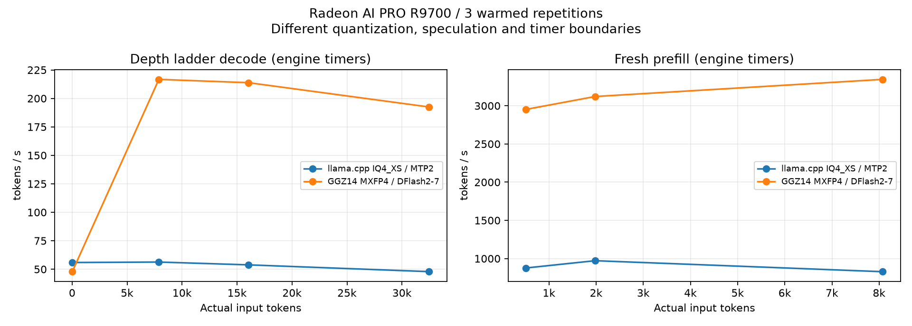
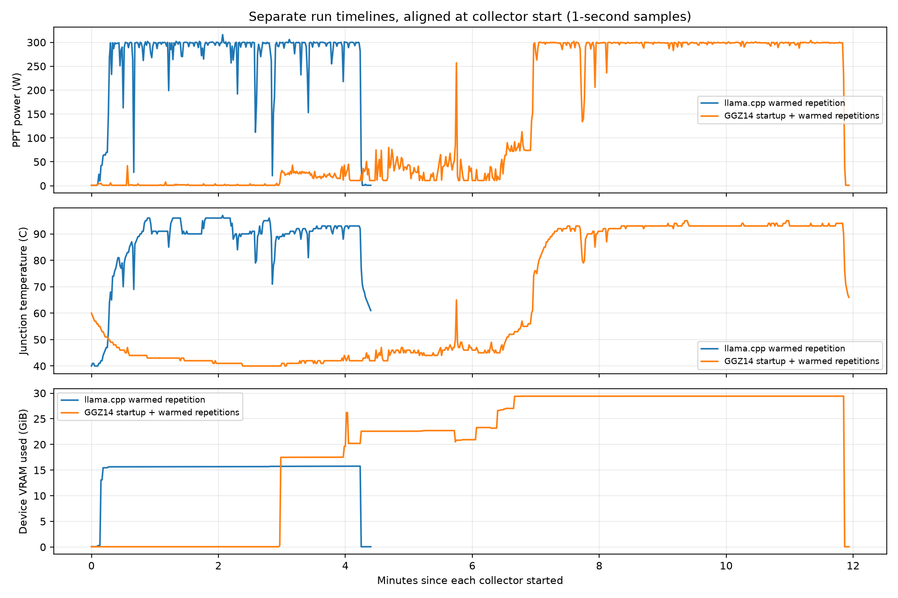

# Radeon AI PRO R9700でQwen3.8 27BのIQ4_XSとMXFP4を比較

- **作成者**: jyohukuchan
- **作成日**: 2026-09-28

## 概要

R9700 32GB ×1で、llama.cppのUD-IQ4_XS＋MTP2と、GGZ14/RadianceのQuark AWQ MXFP4＋DFlash2-7を測定した。
warmupを明示的に実行した3反復の中央値。実入力32,460 tokenのdecodeは前者 **47.89 tok/s**、後者 **192.48 tok/s**。
重み・activation・KV・投機方式・timer境界が異なる**実用構成の比較**であり、engine単体や同一品質の比較ではない。
KLD/top-1と設定探索は未実施。NVFP4からのロード時再量子化は使用していない。

## ハードウェア

| 項目 | 内容 |
|---|---|
| マザーボード | ASRock WRX80 Creator |
| GPU | Radeon AI PRO R9700 × 1（VRAM 32GB、gfx1201） |
| 同居GPU | Radeon Pro V620 32GB ×2。今回の推論には未使用 |
| CPU | Threadripper PRO 3995WX、64コア128スレッド |
| RAM | OS認識 約109GiB |
| OS | Ubuntu 24.04.5 LTS |
| GPU環境 | KMD 6.16.13、HIP 7.14.60850。ユーザー空間とKMDの版を区別 |
| 電力・clock | PPT上限の表示は300W。既存のclock/power設定は変更せず、動的clockを記録 |

## ソフトウェア環境

| 条件 | llama.cpp | GGZ14 / Radiance |
|---|---|---|
| engine | 0.1.0-dev、build64、commit 4df29be、HIP | vLLM 0.27.1、GGZ14 commit 31b9a94a、Radiance image 0.9.3 |
| model | unsloth/Qwen3.8-27B-GGUF、UD-IQ4_XS | amd/Qwen3.8-27B-Quark-AWQ-MXFP4 |
| artifact | 14,252,845,984 bytes（13.274GiB） | 既存target-mtpfp8、19,373,796,656 bytes（18.043GiB） |
| recipe | llama-split-bench 7af72d4のbench.conf | serve-mxfp4.shの単体GPU用既定recipe |
| 実行形式 | IQ4_XS等のUD混合GGUF | 304/304対象linearでRadiance MXFP4 W4A8 kernel |
| KV | K/V q8_0 | FP8 E4M3 |
| GDN state | engine既定 | conv BF16 / SSM FP16 |
| 投機decode | 内蔵MTP、最大draft2 | DFlash2、draft7、greedy draft |
| context | 40,960 | 40,960 |
| server同時枠 | 1 | recipe既定3。client同時要求数は両方1 |
| prefill chunk | llama-server既定（実引数を添付） | 単体recipe既定2560 |
| offload | 全層GPU | CPU weight offloadなし |

GGZ14のtargetは上流手順でMTP headをFP8化した既存artifactを利用した。本体は元からMXFP4であり、NVFP4→MXFP4変換ではない。
serverの認識はR9700 ×1を確認。GGZ14のhost inventory表示にはV620との番号ずれがあったが、実device selectorを固定し、
誤ったhardware signatureに基づくKV pinは使われず、vLLM自身がmemory profilingした。

## ベンチマーク

### 条件

| 項目 | 内容 |
|---|---|
| ツール | llama-split-bench 7af72d4 / 添付のvLLM測定client |
| モデル | Qwen3.8 27B UD-IQ4_XS / Quark AWQ MXFP4 |
| 測定モード | R9700単体profile / 同入力をvLLMへreplay |
| ctx / stages | 40960 / 0,8000,16000,32000 |
| KVキャッシュ | llama K/V q8_0、vLLM FP8 E4M3 |
| 投機的デコード | llama MTP2、GGZ14 DFlash2-7 |

llama.cppは標準llama-split-benchの単一GPU `--profile` を使用した。
stagesは0/8K/16K/32Kの短縮profile、各段1000生成、ignore_eos。pp0は512/2048/8192を指定し、cacheなしで64生成。
実用promptは標準のdesign/review/qa、temperature0.7・top_p0.9・最大1200生成で、全反復が1200生成した。
全体262K測定ではなく、今回の到達点は実入力32,460 token。

各反復の前に512/8192相当入力＋各128生成をwarmupし、本集計から除外した。
llama warmupには専用prefixを付け、実入力は521/8086 token。本測定最初の8K段のcache_n=0を検証した。
GGZ14はwarmup用cache saltとskip_reading_prefix_cacheで分離し、同じく8K段は新規7887 tokenを処理した。
clock固定はせず、memory/core clockを1秒間隔で記録した。

GGZ14は標準ツールに直接接続できないため専用clientを使用した。llamaが保存した**同一のラダー入力文**を再利用し、
全段の入力token数11/7887/16050/32460の一致を検証した。pp0/実用promptも上流の生成関数・本文を使った。
GGZ14のfresh pp0は処理token数と入力token数が一致した。SSE token IDsとusage、固定生成数を全要求で照合した。

- llamaの速度はserverのtimings。depth0の11token由来prefillは表に使用しない。
- vLLMは要求ごとのPrometheus histogram差分（count増分1を検証）。prefillはfirst scheduled→first new token、decodeはfirst→last new token。
- vLLMのAPI TTFT/E2E/出力token eventからの速度も別に保存。TTFTをprefill時間へ置き換えていない。
- prefix再利用の粒度が違い、16K段の新規処理数はllama 8679に対しvLLM 9890、32K段は16926に対し17500。
  増分prefill速度だけから同一の演算量を仮定しない。
- 反復は同じengineをまとめて実行した。温度や順序の影響を完全に分離した実験ではない。

### 結果

#### 深度別の速度（サイト表示用）

単位tok/s、3反復中央値。prefillの計時境界と新規処理token数の違いは上記の測定方法に従う。

| depth | prefill llama.cpp | prefill GGZ14 | decode llama.cpp | decode GGZ14 |
|---|---:|---:|---:|---:|
| 0 | 972.09 | 3121.09 | 55.88 | 47.82 |
| 7887 | 963.49 | 3362.74 | 56.30 | 216.72 |
| 16050 | 762.84 | 3167.65 | 53.81 | 213.81 |
| 32460 | 573.96 | 2894.89 | 47.89 | 192.48 |

depth 0のprefillは新規1,978 token（pp2048）、decodeは11 token入力の値。微小入力のprefill値は使っていない。

#### 生成速度のばらつきと採択率

単位tok/s。中央値 [最小–最大]。採択率は各engineのdraft counterから計算した中央値。

| 実入力token | IQ4_XS + MTP2 | MXFP4 + DFlash2-7 | MTP採択率 | DFlash2採択率 |
|---|---:|---:|---:|---:|
| 11 | 55.88 [55.86–56.01] | 47.82 [47.81–47.82] | 0.956 | 0.097 |
| 7,887 | 56.30 [56.18–56.40] | 216.72 [216.64–216.72] | 0.997 | 0.997 |
| 16,050 | 53.81 [53.71–54.82] | 213.81 [213.80–213.87] | 0.997 | 0.997 |
| 32,460 | 47.89 [47.82–48.70] | 192.48 [174.61–192.49] | 0.987 | 0.909 |

極短入力ではllama.cppが速く、8K以降の合成ラダーではGGZ14構成が速かった。
GGZ14の8K/16K採択率は約0.997で、合成文による楽観的な速度である。実用promptでは別の値になる。
GGZ14の32Kは初回174.61、2/3回目約192.49 tok/s。入力・生成token列hash・採択数・処理数・preemptionなしは一致。
初回コストの可能性はあるが原因は分離しておらず、初回を除外せず全3回を集計した。

#### 新規入力のprefill

単位tok/s、3反復中央値。engine内部timerの境界差を含む。

| 実入力token | llama.cpp | GGZ14 |
|---|---:|---:|
| 512 | 876.76 | 2,952.72 |
| 1,978 | 972.09 | 3,121.09 |
| 8,077 | 828.19 | 3,345.33 |

#### 実用promptのdecode

単位tok/s、3反復中央値。各1200生成。raw completionのreasoning等も生成tokenに含む。

| prompt | 入力token | llama.cpp 中央値 [最小–最大] | GGZ14 中央値 [最小–最大] |
|---|---:|---:|---:|
| 設計整理 | 73 | 47.15 [45.78–49.56] | 115.45 [113.10–140.28] |
| 技術文書レビュー | 58 | 41.02 [40.70–44.81] | 68.04 [66.05–68.19] |
| 技術QA | 61 | 45.57 [44.91–46.26] | 89.37 [88.64–94.30] |

これは短い入力からの生成速度であり、32Kでのタスク成功率や回答品質を測るものではない。
samplingで生成内容と採択率が変わる。合成ラダーから一律の補正係数を掛けた値にはしていない。

#### 温度・電力・VRAM

AMD sysfsを1秒間隔で取得。対象区間はラダー4段＋実用3prompt（各反復7600生成）で、load/warmup/pp0/idleを除いた。
平均電力とenergyは各反復の値の中央値、最大値は全3反復のsample最大。

| 構成 | 平均PPT W | 最大PPT表示 W | 最大VRAM GiB | edge/junction/memory最大 ℃ | GPU energy kJ |
|---|---:|---:|---:|---|---:|
| llama.cpp IQ4_XS + MTP2 | 290.7 | 316 | 15.76 | 73 / 97 / 90 | 59.9 |
| GGZ14 MXFP4 + DFlash2-7 | 298.3 | 304 | 29.42 | 73 / 95 / 93 | 26.5 |

PPTはGPU側のセンサー値で、PC全体のコンセント電力ではない。300Wのcap表示とsensor最大値は同じ意味ではない。
VRAMはKV予約pool等を含むdevice全体の使用量で、重みサイズだけではない。
energyはPPTを時間積分した推定値。llamaの要求区間はstdout時刻と丸め済みwall_sから再構成し、vLLMはclient実時刻を使う。
約0.1秒単位の境界差と1秒samplingを含むため、精密な電力計との同等性は主張しない。

#### MXFP4のVRAM使用量が大きい理由

29.42GiBは重みだけのサイズでも、この要求に必要な最小VRAMでもない。GGZ14の既定recipeは
`gpu_memory_utilization=0.98`でVRAMを広く使う設定で、server側の最大同時枠は3、prefix cacheも有効だった。
40,960は1要求のcontext上限であり、確保されるcache pool全体のtoken数ではない。

| 起動ログで確認した項目 | 値 | 意味 |
|---|---:|---|
| model loading | 19.13 GiB | targetとdraftをloadする区間のdevice memory増分 |
| KV cache pool | 5.50 GiB | 108,081 token分を事前確保。今回のclientは同時要求1 |
| graph capture | 1.08 GiB | target/draft graph capture時の報告値 |
| peak activation | 2.21 GiB | 起動時profilingのpeak。一時領域を含む |
| weights + non-torch | 23.52 GiB | 起動時の広い集計範囲。上のmodel loadingと重複する |
| 実測device VRAM最大 | 29.42 GiB | 実際の測定区間にsysfsで観測した値 |

これらは計測時点や集計範囲が異なるため、足して29.42GiBを厳密に再現する内訳ではない。
別途、target artifact自体も18.04GiBでIQ4_XSの13.27GiBより大きく、DFlash2 draftも追加される。
対象MXFP4 artifactのembeddingとlm_headはどちらもBF16（各248320×5120）で、各約2.37GiB、合計約4.74GiBある。
「MXFP4」という名前でも全tensorが4bitではない。
hybrid attention/GDNのpage整列・padding、補助head、workspace、allocator予約も影響する。
ログのmodel-loading増分はdraftも含むため、そこへdraft容量を再加算しない。

従って「MXFP4形式だから必ず29GiB必要」とは結論しない。利用率やKV pool上限を下げる省メモリ測定は
次の設定比較で扱えるが、今回の数値は既定recipeのまま残した。起動時memory profilingの集計は
[memory-breakdown.json](attachment/2026-09-28_152428_comparing_iq4_xs_and_mxfp4_on_r9700/memory-breakdown.json)に保存した。

## 所感

単体R9700では、今回のGGZ14構成は長い合成入力と3種の実用promptで生成が速かった。一方でGPU全体の予約量は大きい。
重み・KV・投機方式・実装精度が違うため、速度とVRAMのトレードオフとして読む。回答品質は今後のKLD等で別に確認する。

## 除外した予備測定と検証

初期llama r1/r2は明示的なworkload warmup追加前、r3/r4/r5はwarmupと同じfiller prefixがRAM cacheへ残ったため除外した。
warmupに別prefixを付けたr6/r7/r8を採用し、8K段のcache_n=0・GGZ14へ渡した入力文とのbyte一致を検査した。
これは速度による取捨選択ではなく、測定条件の不具合修正である。予備データはローカルに保管した。
GGZ14はr1/r2/r3を全採用。両engineの測定は正常終了し、今回のserverは停止した。
collectorの単位/欠損処理、SSE grouped token数/metric差分、区間energy積分をテストした。

## 添付と再現

両engineとも各反復でラダー4点・新規prefill 3点・実用prompt 3本（計10要求）を測り、3反復している。
llamaは3種類のresults JSONに分かれ、GGZ14はresults-api.jsonのkind（ladder / pp0 / real）で1ファイルにまとまっている。
明示的なwarmupは各反復2本の別JSON。GGZ14の起動設定・環境変数は共通のggz14-run-info.jsonを参照する。

| 反復 | llama.cppの図 | GGZ14の図 | GGZ14の測定条件 |
|---|---|---|---|
| 1 | [日本語](attachment/2026-09-28_152428_comparing_iq4_xs_and_mxfp4_on_r9700/llama-r1/split-bench-ja.png) / [English](attachment/2026-09-28_152428_comparing_iq4_xs_and_mxfp4_on_r9700/llama-r1/split-bench-en.png) | [日本語](attachment/2026-09-28_152428_comparing_iq4_xs_and_mxfp4_on_r9700/ggz14-r1/profile-ja.png) / [English](attachment/2026-09-28_152428_comparing_iq4_xs_and_mxfp4_on_r9700/ggz14-r1/profile-en.png) | [run-info.json](attachment/2026-09-28_152428_comparing_iq4_xs_and_mxfp4_on_r9700/ggz14-r1/run-info.json) |
| 2 | [日本語](attachment/2026-09-28_152428_comparing_iq4_xs_and_mxfp4_on_r9700/llama-r2/split-bench-ja.png) / [English](attachment/2026-09-28_152428_comparing_iq4_xs_and_mxfp4_on_r9700/llama-r2/split-bench-en.png) | [日本語](attachment/2026-09-28_152428_comparing_iq4_xs_and_mxfp4_on_r9700/ggz14-r2/profile-ja.png) / [English](attachment/2026-09-28_152428_comparing_iq4_xs_and_mxfp4_on_r9700/ggz14-r2/profile-en.png) | [run-info.json](attachment/2026-09-28_152428_comparing_iq4_xs_and_mxfp4_on_r9700/ggz14-r2/run-info.json) |
| 3 | [日本語](attachment/2026-09-28_152428_comparing_iq4_xs_and_mxfp4_on_r9700/llama-r3/split-bench-ja.png) / [English](attachment/2026-09-28_152428_comparing_iq4_xs_and_mxfp4_on_r9700/llama-r3/split-bench-en.png) | [日本語](attachment/2026-09-28_152428_comparing_iq4_xs_and_mxfp4_on_r9700/ggz14-r3/profile-ja.png) / [English](attachment/2026-09-28_152428_comparing_iq4_xs_and_mxfp4_on_r9700/ggz14-r3/profile-en.png) | [run-info.json](attachment/2026-09-28_152428_comparing_iq4_xs_and_mxfp4_on_r9700/ggz14-r3/run-info.json) |

GGZ14の各図は既存JSONから再描画したもので、llama.cppと異なる内部タイマーを使う点を図にも明記した。
output-fingerprints.jsonは保存済みSSEから算出した出力token列・textのhashで、生の生成内容は含まない。

- [集計JSON](attachment/2026-09-28_152428_comparing_iq4_xs_and_mxfp4_on_r9700/summary.json) / [CSV形式テキスト](attachment/2026-09-28_152428_comparing_iq4_xs_and_mxfp4_on_r9700/summary-table.txt)
- [測定identity](attachment/2026-09-28_152428_comparing_iq4_xs_and_mxfp4_on_r9700/measurement-identity.json)
- [GGZ14設定・runtime](attachment/2026-09-28_152428_comparing_iq4_xs_and_mxfp4_on_r9700/ggz14-run-info.json)
- llama反復 [1](attachment/2026-09-28_152428_comparing_iq4_xs_and_mxfp4_on_r9700/llama-r1/run-info.json) / [2](attachment/2026-09-28_152428_comparing_iq4_xs_and_mxfp4_on_r9700/llama-r2/run-info.json) / [3](attachment/2026-09-28_152428_comparing_iq4_xs_and_mxfp4_on_r9700/llama-r3/run-info.json)
- GGZ14反復 [1](attachment/2026-09-28_152428_comparing_iq4_xs_and_mxfp4_on_r9700/ggz14-r1/results-api.json) / [2](attachment/2026-09-28_152428_comparing_iq4_xs_and_mxfp4_on_r9700/ggz14-r2/results-api.json) / [3](attachment/2026-09-28_152428_comparing_iq4_xs_and_mxfp4_on_r9700/ggz14-r3/results-api.json)

各llama反復directoryには標準results、argv、warmup、日英図も含む。公開用添付は個人path/device selectorを匿名化した。
server log、raw生成文、GPU時系列の生ログ、model重みは添付しない。
再現に必要な独自client・collector・warmup launcherと実行例は、添付の[再現手順](attachment/2026-09-28_152428_comparing_iq4_xs_and_mxfp4_on_r9700/reproduce.txt)を参照。
通常のllama測定は標準ツールを用い、vLLM拡張は測定方法の差分を明示している。
