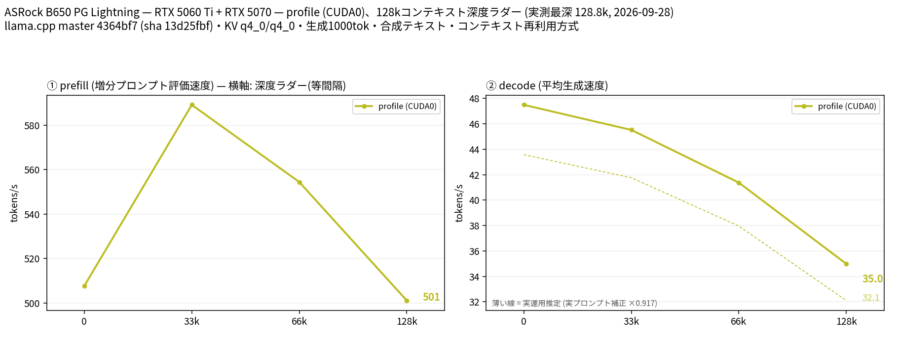

# RTX 5060 TiでGemma 4 26B A4B QAT-MTPを131Kコンテキストまで計測

- **作成者**: RockinWool
- **作成日**: 2026-09-28

## 概要

Gemma 4 26B A4B の QAT Q4_K_M GGUF と外部 MTP ドラフトヘッドを、RTX 5060 Ti 16GB 1枚、CPU MoE 30層、131,072 context で測定した。モデル本体と MTP ヘッドは GPU に置き、MoE は RAM から実行する構成である。

新規 8,078 token 入力は prefill 579.3 t/s、実入力 128,753 token 深度では増分 prefill 501.1 t/s、decode 35.0 t/s だった。長いコンテキストで decode は低下するが、128K まで完走した。

## ハードウェア

| 項目 | 内容 |
|------|------|
| コンピュータ / マザーボード | ASRock B650 PG Lightning |
| GPU | NVIDIA GeForce RTX 5060 Ti × 1（16,311 MiB、CUDA0、測定対象）+ NVIDIA GeForce RTX 5070 × 1（12,227 MiB、測定には不使用） |
| GPU接続 | NVLink なし。測定対象の 5060 Ti は idle 時の nvidia-smi 表示で PCIe Gen1 x8 |
| CPU | AMD Ryzen 7 7700X、8コア / 16スレッド |
| メモリ | OS認識 60 GiB |

## ソフトウェア環境

| 項目 | 内容 |
|------|------|
| OS | Ubuntu 26.04.1 LTS / Linux 7.0.0-34-generic |
| GPUドライバ | NVIDIA 595.91.07 |
| llama.cpp | 0.5.0-dev、build 1、commit 4364bf7、CUDA 13.0 バックエンド（コンテナ内ビルド） |

## ベンチマーク

### 条件

| 項目 | 内容 |
|------|------|
| ツール | llama-split-bench（2026-09-28取得） |
| モデル | Gemma4-26B-A4B-QAT-Uncensored-HauhauCS-Balanced-Q4_K_M.gguf、16,780,192,888 bytes |
| MTP | mtp-gemma-4-26B-A4B-it.gguf、`--spec-type draft-mtp --spec-draft-n-max 2` |
| 測定モード | profile：CUDA0 単一GPU、`--split-mode` 既定 |
| ctx / stages | 131072 / 0,32768,65536,128000 |
| KVキャッシュ | K=q4_0、V=q4_0 |
| 推論設定 | GPU offload=99、CPU MoE=30、Flash Attention on、parallel=1、CPU threads=8、`--fit off` |
| ラダー生成 | 各段1,000 token、temperature=0、ignore_eos |
| 回数 | 各段1回。再現確認の追加反復は未実施 |

サーバーは Docker コンテナ内で起動した。llama-split-bench の GPU 外部プロセス検知は Docker のホスト PID と CUDA プロセス PID を対応付けられないため、この計測では無効化した。開始前に CUDA0 上に他の推論プロセスがないことを確認した。

### 結果：深度別 prefill / decode

単位は t/s。prefill は当該段で新規評価した token のスループット、decode は各段 1,000 token の定常生成である。

| 実入力 depth | 増分 prefill | decode | MTP 採択率 |
|---:|---:|---:|---:|
| 12 | ※ | 47.50 | 88.9% |
| 32,883 | 589.16 | 45.52 | 100.0% |
| 66,342 | 554.44 | 41.38 | 99.7% |
| 128,753 | 501.09 | 34.99 | 99.1% |

※ 最初の 12 token 入力の prefill は微小入力による測定アーティファクトのため表に載せない。

### 結果：新規入力の prefill

すべて `cache_prompt=false`、`cache_n=0` で実行した。単位は t/s。

| 目標入力長 | 実入力長 | prefill | decode（64 token） |
|---:|---:|---:|---:|
| 512 | 513 | 448.27 | 47.85 |
| 2048 | 1,979 | 507.66 | 47.78 |
| 8192 | 8,078 | 579.29 | 49.64 |

### 結果：実用プロンプトの decode

設計整理・技術文書レビュー・技術 QA を各1回、temperature=0.7、top_p=0.9、最大1,200 tokenで測定した。単位は t/s。

| プロンプト | 実入力長 | decode | MTP 採択率 |
|---|---:|---:|---:|
| 設計整理 | 76 | 41.12 | 58.8% |
| 技術文書レビュー | 61 | 50.07 | 93.6% |
| 技術 QA | 64 | 39.53 | 52.8% |

### 所感

- 131K の長い context でもメモリ不足にならず、実入力 128,753 token から 1,000 token を生成できた。
- 新規入力の prefill は 8K で約579 t/s、長い深度での増分 prefill は約501 t/sだった。
- decode は context 深度に応じて 47.5 t/s から 35.0 t/s へ低下した。実用プロンプトでは MTP 採択率の差により 39.5〜50.1 t/s と変動した。
- このレポートは単一GPU・CPU MoE構成のプロファイルであり、TP / PP 比較はしていない。

## 添付

- [結果図（英語）](attachment/2026-09-28_210656_profiling_gemma4_26b_a4b_qat_mtp_on_rtx5060ti/split-bench-en.png)
- [実行情報](attachment/2026-09-28_210656_profiling_gemma4_26b_a4b_qat_mtp_on_rtx5060ti/run-info.json)
- [起動引数](attachment/2026-09-28_210656_profiling_gemma4_26b_a4b_qat_mtp_on_rtx5060ti/argv-profile.txt)
- [深度別結果](attachment/2026-09-28_210656_profiling_gemma4_26b_a4b_qat_mtp_on_rtx5060ti/results-profile.json)
- [新規入力結果](attachment/2026-09-28_210656_profiling_gemma4_26b_a4b_qat_mtp_on_rtx5060ti/results-profile-pp0.json)
- [実用プロンプト結果](attachment/2026-09-28_210656_profiling_gemma4_26b_a4b_qat_mtp_on_rtx5060ti/results-real.json)

サーバーログおよび生成文は含めていない。添付内のローカルモデルパスは `~/models/` に匿名化した。
