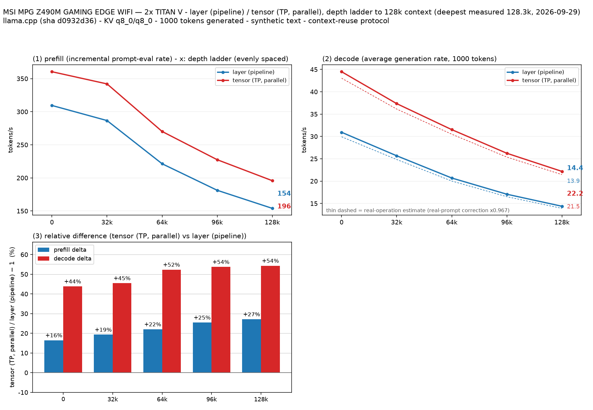

# TITAN V 2枚でSwift版Qwen3.8 27B IQ4_XSを160Kコンテキストまで測定

- **作成者**: tomo_9180
- **作成日**: 2026-09-29

## 概要

ukisai/Swift-Qwen3.8-27B-GGUF の IQ4_XS をTITAN V 12 GiB 2枚で測定した。layer / tensor分割の比較は128K設定で完走し、さらにlayer分割で160K設定の収容を確認した。
160K試験では実効163,711トークンを処理できた。長文測定のMTPはGPUメモリ不足で使えず、主計測はMTPなしで行った。

## ハードウェア

| 項目 | 内容 |
|------|------|
| コンピュータ / マザーボード | MSI MPG Z490M GAMING EDGE WIFI (MS-7C76) |
| GPU | NVIDIA TITAN V 12 GiB × 2 |
| GPU接続 | PCIe 3.0、現在のリンク幅 x8 / GPU（最大 x16）。GPU間はPHB経由、NVLinkなし |
| CPU | Intel Core i9-10850K、10コア / 20スレッド |
| メモリ | OS認識 61 GiB、種類は不明 |

## ソフトウェア環境

| 項目 | 内容 |
|------|------|
| OS | Ubuntu 26.04.1 LTS / Linux 7.0.0-30-generic |
| GPUドライバ | NVIDIA 580.178.04 |
| llama.cpp | llama-prism 0.2.0-dev、build 1、commit 1a07bfa、CUDAバックエンド |

## ベンチマーク

### 条件

| 項目 | 内容 |
|------|------|
| ツール | llama-split-bench 7af72d4 |
| モデル | ukisai/Swift-Qwen3.8-27B-GGUF:IQ4_XS、Swift-Qwen3.8-27B-IQ4_XS.gguf、15,688,288,352 bytes（約14.61 GiB） |
| 測定モード | layer / tensor（CUDA0, CUDA1）。単一GPUはモデルが12 GiBに収まらず測定対象外 |
| ctx / stages（比較） | 131,072 / 0, 32,000, 64,000, 96,000, 128,000 |
| KVキャッシュ | K=q8_0、V=q8_0 |
| 投機的デコード | なし（MTP無効） |
| 推論設定 | Flash Attention有効、GPU offload=all、parallel=1、CPU threads=8、batch=512、microbatch=128 |
| 反復 | 各モード1回 |

### 深度別のprefill / decode

単位はtok/s。各条件1回の測定値。

| 実入力depth | prefill layer | prefill tensor | decode layer | decode tensor |
|---:|---:|---:|---:|---:|
| 0 ※ | 309.5 | 360.4 | 30.93 | 44.49 |
| 32,093 | 286.6 | 342.0 | 25.67 | 37.34 |
| 64,806 | 221.3 | 270.2 | 20.69 | 31.52 |
| 96,391 | 181.3 | 227.5 | 17.06 | 26.23 |
| 128,267 | 153.9 | 195.8 | 14.37 | 22.17 |

※ depth 0のprefillは新規1,978トークン入力（pp2048）、decodeはラダー初段の11トークン入力による参考値。ラダー初段のprefillは計測上のartifactのため表に載せていない。

### 160Kコンテキストの収容確認

128K比較の完了後、ctx=163,840、layer分割、MTPなしで160K段を追加測定した。実効163,711トークンを処理し、prefill 182.9 tok/s、100トークン生成時のdecode 12.33 tok/sだった。これは容量確認用の1回測定で、layer/tensor比較や128K結果との速度比較には使わない。

| 目標入力長 | 実入力長 | prefill | decode |
|---:|---:|---:|---:|
| 160,000 | 163,711 | 182.9 tok/s | 12.33 tok/s |

### 新規入力のprefill

各入力はキャッシュなしで計測した。単位はtok/s。

| 目標入力長 | 実入力長 | layer | tensor |
|---:|---:|---:|---:|
| 512 | 512 | 287.8 | 320.4 |
| 2,048 | 1,978 | 309.5 | 360.4 |
| 8,192 | 8,077 | 308.9 | 362.7 |

### 所感

- 128Kまでの全測定深度でtensor分割がlayer分割より速かった。128,267トークン時はprefillが約27%、decodeが約54%速かった。
- 深度が増えるほどprefill / decodeともに速度は下がった。160K設定では163,711トークンまで処理できたが、decodeは12.33 tok/sまで低下した。
- MTP有効の長文試験はGPU 1のメモリ不足で失敗したため、比較計測ではMTPを無効にした。MTP有効のスモークテストは通過している。
- 160K測定の完了時に記録されたGPUメモリ使用量は約10.8 GiB / 11.4 GiBだった。単一GPUはVRAM容量の制約で比較していない。測定は各条件1回で、繰り返しによるばらつきは評価していない。

## 添付

- [128K比較 run-info.json](attachment/2026-09-29_155502_benchmarking_swift_qwen3_8_27b_iq4_xs_up_to_160k_context_on_2x_titan_v/run-info.json)
- [layer起動引数](attachment/2026-09-29_155502_benchmarking_swift_qwen3_8_27b_iq4_xs_up_to_160k_context_on_2x_titan_v/argv-layer.txt)、[tensor起動引数](attachment/2026-09-29_155502_benchmarking_swift_qwen3_8_27b_iq4_xs_up_to_160k_context_on_2x_titan_v/argv-tensor.txt)
- [layer結果](attachment/2026-09-29_155502_benchmarking_swift_qwen3_8_27b_iq4_xs_up_to_160k_context_on_2x_titan_v/results-layer.json)、[layer新規入力](attachment/2026-09-29_155502_benchmarking_swift_qwen3_8_27b_iq4_xs_up_to_160k_context_on_2x_titan_v/results-layer-pp0.json)
- [tensor結果](attachment/2026-09-29_155502_benchmarking_swift_qwen3_8_27b_iq4_xs_up_to_160k_context_on_2x_titan_v/results-tensor.json)、[tensor新規入力](attachment/2026-09-29_155502_benchmarking_swift_qwen3_8_27b_iq4_xs_up_to_160k_context_on_2x_titan_v/results-tensor-pp0.json)
- [実用プロンプト結果](attachment/2026-09-29_155502_benchmarking_swift_qwen3_8_27b_iq4_xs_up_to_160k_context_on_2x_titan_v/results-real.json)
- [160K容量確認の図](attachment/2026-09-29_155502_benchmarking_swift_qwen3_8_27b_iq4_xs_up_to_160k_context_on_2x_titan_v/160k-capacity/split-bench-en.png)、[run-info.json](attachment/2026-09-29_155502_benchmarking_swift_qwen3_8_27b_iq4_xs_up_to_160k_context_on_2x_titan_v/160k-capacity/run-info.json)、[結果](attachment/2026-09-29_155502_benchmarking_swift_qwen3_8_27b_iq4_xs_up_to_160k_context_on_2x_titan_v/160k-capacity/results-layer.json)、[起動引数](attachment/2026-09-29_155502_benchmarking_swift_qwen3_8_27b_iq4_xs_up_to_160k_context_on_2x_titan_v/160k-capacity/argv-layer.txt)
