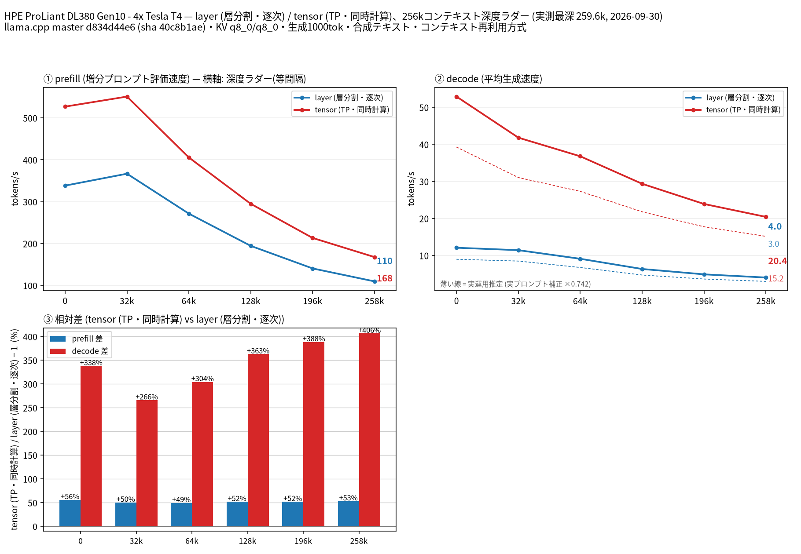

# Tesla T4 4 枚で Gemma 4 31B QAT の split-mode を比較

- **作成者**: MG8853
- **作成日**: 2026-09-30

## 概要

HPE ProLiant DL380 Gen10 に Tesla T4 × 4（15 GB / 枚）を載せた構成で、Gemma 4 31B（QAT、Unsloth UD-Q4_K_XL、31.3B パラメータの dense モデル）の `--split-mode layer` と `tensor`（TP=4）を 262k コンテキストまで比較しました。投機的デコードは同リポジトリの MTP ヘッドを使っています。
tensor は全深度で prefill / decode とも上回り、258k では decode が layer 4.03 t/s に対して tensor 20.41 t/s（約 5.1 倍）、prefill は layer 109.6 t/s に対して tensor 167.7 t/s（約 1.5 倍）でした。
Gemma 4 は 60 層のうち 50 層が sliding attention（window 1024）で、llama.cpp が KV キャッシュを層間で共有するため、262k でも layer 構成で最大 12.8 GiB（13,087 MiB）/ 枚に収まりました（それでも T4 1 枚の 15 GiB には収まらないため、単一 GPU は計測していません）。

## ハードウェア

| 項目 | 内容 |
|------|------|
| コンピュータ / マザーボード | HPE ProLiant DL380 Gen10 |
| GPU | Tesla T4 × 4（VRAM 15,360 MiB / 枚、電力上限 70 W / 枚） |
| GPU 接続 | PCIe 3.0 x16（`nvidia-smi` の current はアイドル時 Gen1 x16、max は Gen3 x16）。NVLink なし。`nvidia-smi topo -m` では GPU0-GPU1 が NODE、GPU2-GPU3 が NODE、この 2 組の間は SYS（NUMA ノードをまたぐ） |
| CPU | Intel Xeon Gold 6254 × 2（18 コア / 36 スレッド × 2。この環境でオンラインなのは 36 論理 CPU） |
| メモリ | 232 GiB |
| 電源 | 不明 |

## ソフトウェア環境

| 項目 | 内容 |
|------|------|
| OS | Ubuntu 26.04.1 LTS / Linux 7.0.14-14-pve |
| GPU ドライバ | 595.91.07（CUDA 13.2） |
| llama.cpp | master d834d44e6（version 0.5.0-dev build 11195、2026-09-26）、CUDA バックエンド（CUDA 13.2、`CMAKE_CUDA_ARCHITECTURES=75`、`GGML_CUDA_FA=ON`、`GGML_CUDA_FA_ALL_QUANTS=ON`、`GGML_CUDA_NCCL=ON`、Release / Ninja / GCC 15.2.0）。NCCL 2.30.4 がリンクされています（`ldd build/bin/libggml-cuda.so` に `libnccl.so.2`） |

## ベンチマーク

### 条件

| 項目 | 内容 |
|------|------|
| ツール | llama-split-bench 7af72d4 |
| モデル | gemma-4-31B-it-qat-UD-Q4_K_XL.gguf（unsloth/gemma-4-31B-it-qat-GGUF、17,287,670,048 バイト、31.3B パラメータの dense モデル。Google の QAT 重みを Unsloth が UD-Q4_K_XL に量子化したもの） |
| 測定モード | layer / tensor（いずれも CUDA0〜CUDA3 の 4 枚）。モデルが T4 1 枚（15 GB）に収まらないため、単一 GPU の計測はしていません（図の第 4 パネルも無効化） |
| ctx / stages | 262144 / 0,32000,64000,128000,196000,258000 |
| KV キャッシュ | q8_0 / q8_0 |
| 投機的デコード | 同リポジトリの MTP ヘッド MTP/mtp-gemma-4-31B-it-Q4_0.gguf（279,955,968 バイト）を `-md` で指定し、`--spec-type draft-mtp --spec-draft-n-max 2`。合成テキストの採択率は 0.795〜0.997、実プロンプト 3 本での補正係数は 0.742 |
| その他 | `-fa on`、`-ngl all`、`-t 8`、`--parallel 1`、`--jinja`、`--cache-ram 8192 --cache-idle-slots --cache-reuse 256`（`--cache-reuse` はこのビルドでは未対応のため無効化される）、生成 1000 トークン / 段、PORT 18081、`LAUNCH_PREFIX` なし |

### 結果

単位は t/s です。depth 0 の prefill は新規プロンプト（pp2048）の値です。ラダー初段（12 トークン）の prefill は計測上のアーティファクトなので表に載せていません。

| depth | prefill layer | prefill tensor | decode layer | decode tensor |
|------:|------:|------:|------:|------:|
| 0 | 338.3 | 526.9 | 12.08 | 52.90 |
| 32k | 366.7 | 550.9 | 11.42 | 41.81 |
| 64k | 271.4 | 405.5 | 9.10 | 36.77 |
| 128k | 194.4 | 294.9 | 6.34 | 29.35 |
| 196k | 140.6 | 213.4 | 4.89 | 23.90 |
| 258k | 109.6 | 167.7 | 4.03 | 20.41 |

### 所感

- tensor が全深度で勝ちました。decode の差は深度が深いほど開き、258k で 5.1 倍（4.03 → 20.41 t/s）、128k でも 4.6 倍です。prefill の差は 1.5 倍前後でほぼ一定でした。
- layer 分割は 258k で decode 4.03 t/s まで落ちます。31B dense を 4 枚に層分割するとパイプラインが深くなり、逐次実行の待ちが効いてくるためだと考えられます。
- 実プロンプト 3 本の補正係数 0.742 を掛けた実運用推定では、tensor の 258k decode は約 15.2 t/s、layer は約 3.0 t/s です。
- 同条件の Qwen3.8 27B UD-Q4_K_XL（前回のレポート）と比べると、tensor の 258k decode は 26.4 → 20.4 t/s、prefill は 198 → 168 t/s でした。パラメータ数が 27B → 31.3B に増えた分、T4 4 枚では 262k の速度が一段落ちます。
- 起動時の VRAM は layer で最大 12.8 GiB（13,087 MiB）/ 枚、tensor で 12.5 GiB（12,765 MiB）/ 枚（いずれも 262k 確保時）で、T4 の 15 GiB に対して余裕はあまりありません。これ以上コンテキストを伸ばすには KV の更なる圧縮か枚数の追加が必要です。

## 添付

- [run-info.json](attachment/2026-09-30_035231_comparing_split_modes_of_gemma_4_31b_qat_on_4x_tesla_t4/run-info.json)
- [results-layer.json](attachment/2026-09-30_035231_comparing_split_modes_of_gemma_4_31b_qat_on_4x_tesla_t4/results-layer.json) / [results-layer-pp0.json](attachment/2026-09-30_035231_comparing_split_modes_of_gemma_4_31b_qat_on_4x_tesla_t4/results-layer-pp0.json) / [results-tensor.json](attachment/2026-09-30_035231_comparing_split_modes_of_gemma_4_31b_qat_on_4x_tesla_t4/results-tensor.json) / [results-tensor-pp0.json](attachment/2026-09-30_035231_comparing_split_modes_of_gemma_4_31b_qat_on_4x_tesla_t4/results-tensor-pp0.json) / [results-real.json](attachment/2026-09-30_035231_comparing_split_modes_of_gemma_4_31b_qat_on_4x_tesla_t4/results-real.json)
- [argv-layer.txt](attachment/2026-09-30_035231_comparing_split_modes_of_gemma_4_31b_qat_on_4x_tesla_t4/argv-layer.txt) / [argv-tensor.txt](attachment/2026-09-30_035231_comparing_split_modes_of_gemma_4_31b_qat_on_4x_tesla_t4/argv-tensor.txt)
