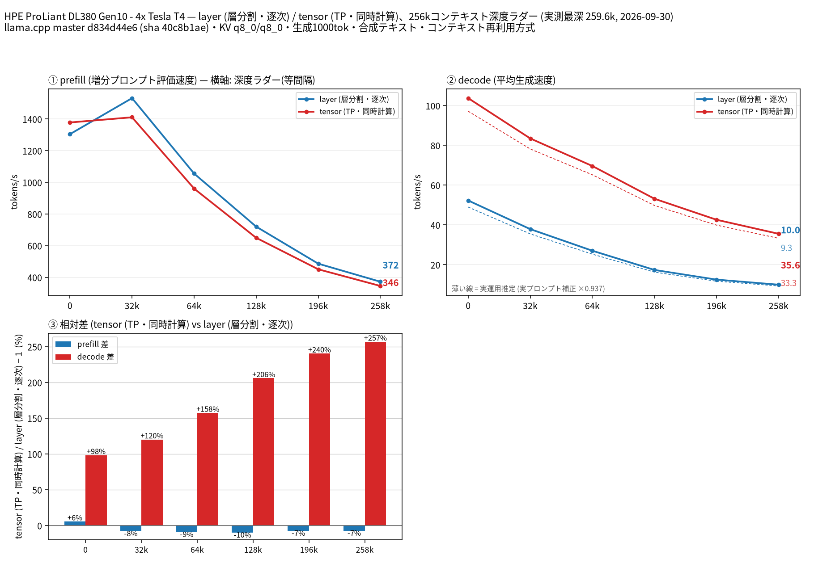

# Tesla T4 4 枚で Gemma 4 26B A4B QAT の split-mode を比較

- **作成者**: MG8853
- **作成日**: 2026-09-30

## 概要

HPE ProLiant DL380 Gen10 に Tesla T4 × 4（15 GB / 枚）を載せた構成で、Gemma 4 26B A4B（QAT、Unsloth UD-Q4_K_XL、総パラメータ 25.8B / アクティブ 4B の MoE）の `--split-mode layer` と `tensor`（TP=4）を 262k コンテキストまで比較しました。投機的デコードは同リポジトリの MTP ヘッドを使っています。
decode は tensor が全深度で勝ち、258k では layer 9.96 t/s に対して tensor 35.55 t/s（約 3.6 倍）でした。一方 prefill は 8k 以上のプロンプトでは layer が逆に 8〜11% 速く、A4B（アクティブ 4B）の MoE では tensor 分割の通信コストが prefill では割に合わないことが分かりました。
モデルは T4 1 枚（15 GB）に収まらないため、単一 GPU は計測していません。

## ハードウェア

| 項目 | 内容 |
|------|------|
| コンピュータ / マザーボード | HPE ProLiant DL380 Gen10 |
| GPU | Tesla T4 × 4（VRAM 15,360 MiB / 枚、電力上限 70 W / 枚） |
| GPU 接続 | PCIe 3.0 x16（`nvidia-smi` の current はアイドル時 Gen1 x16、max は Gen3 x16）。NVLink なし。`nvidia-smi topo -m` では GPU0-GPU1 が NODE、GPU2-GPU3 が NODE、この 2 組の間は SYS（NUMA ノードをまたぐ） |
| CPU | Intel Xeon Gold 6254 × 2（18 コア / 36 スレッド × 2。この環境でオンラインなのは 36 論理 CPU） |
| メモリ | 232 GiB |
| 電源 | 不明 |

## ソフトウェア環境

| 項目 | 内容 |
|------|------|
| OS | Ubuntu 26.04.1 LTS / Linux 7.0.14-14-pve |
| GPU ドライバ | 595.91.07（CUDA 13.2） |
| llama.cpp | master d834d44e6（version 0.5.0-dev build 11195、2026-09-26）、CUDA バックエンド（CUDA 13.2、`CMAKE_CUDA_ARCHITECTURES=75`、`GGML_CUDA_FA=ON`、`GGML_CUDA_FA_ALL_QUANTS=ON`、`GGML_CUDA_NCCL=ON`、Release / Ninja / GCC 15.2.0）。NCCL 2.30.4 がリンクされています（`ldd build/bin/libggml-cuda.so` に `libnccl.so.2`） |

## ベンチマーク

### 条件

| 項目 | 内容 |
|------|------|
| ツール | llama-split-bench 7af72d4 |
| モデル | gemma-4-26B-A4B-it-qat-UD-Q4_K_XL.gguf（unsloth/gemma-4-26B-A4B-it-qat-GGUF、14,249,047,104 バイト、総 25.8B / アクティブ 4B。30 層のうち full attention 5 層・sliding attention（window 1024）25 層、エキスパート 128） |
| 測定モード | layer / tensor（いずれも CUDA0〜CUDA3 の 4 枚）。モデルが T4 1 枚（15 GB）に収まらないため、単一 GPU の計測はしていません（図の第 4 パネルも無効化） |
| ctx / stages | 262144 / 0,32000,64000,128000,196000,258000 |
| KV キャッシュ | q8_0 / q8_0 |
| 投機的デコード | 同リポジトリの MTP ヘッド MTP/mtp-gemma-4-26B-A4B-it-Q4_0.gguf（251,939,328 バイト）を `-md` で指定し、`--spec-type draft-mtp --spec-draft-n-max 2`。合成テキストの採択率は 0.951〜0.996、実プロンプト 3 本での補正係数は 0.937 |
| その他 | `-fa on`、`-ngl all`、`-t 8`、`--parallel 1`、`--jinja`、`--cache-ram 8192 --cache-idle-slots --cache-reuse 256`（`--cache-reuse` はこのビルドでは未対応のため無効化される）、生成 1000 トークン / 段、PORT 18081、`LAUNCH_PREFIX` なし |

### 結果

単位は t/s です。depth 0 の prefill は新規プロンプト（pp2048）の値です。ラダー初段（12 トークン）の prefill は計測上のアーティファクトなので表に載せていません。

| depth | prefill layer | prefill tensor | decode layer | decode tensor |
|------:|------:|------:|------:|------:|
| 0 | 1304.7 | 1378.5 | 52.31 | 103.76 |
| 32k | 1532.1 | 1411.3 | 37.91 | 83.50 |
| 64k | 1055.6 | 960.7 | 27.04 | 69.65 |
| 128k | 720.3 | 649.7 | 17.38 | 53.18 |
| 196k | 486.3 | 450.9 | 12.52 | 42.62 |
| 258k | 372.4 | 345.6 | 9.96 | 35.55 |

### 所感

- decode は tensor が全深度で勝ちます。差は深度とともに開き、258k で 3.6 倍（9.96 → 35.55 t/s）です。A4B の MoE は 1 トークンあたりの計算量が小さいため、層をまたぐパイプライン待ちがそのまま速度差になります。
- prefill は逆に、8k 以上のプロンプトでは layer が 8〜11% 速いという結果でした（32k で layer 1532.1 / tensor 1411.3、258k で 372.4 / 345.6）。一方 512〜2048 トークンの短いプロンプトでは tensor が速く（pp512 で 622.6 / 1075.0）、アクティブ 4B の MoE では prefill の all-reduce / all-gather コストが計算量に見合わないことが分かります。
- 実プロンプト 3 本の補正係数 0.937 を掛けた実運用推定では、tensor の 258k decode は約 33.3 t/s、layer は約 9.3 t/s です。
- 同条件で測った Gemma 4 31B（dense）と比べると、tensor の 258k は prefill 345.6 / decode 35.55 t/s（31B は 167.7 / 20.41 t/s）で、MoE のほうが倍近く速いという結果でした。262k の長コンテキストを T4 4 枚で実用速度で回すなら、A4B 側に分があります。
- 起動時の VRAM は layer で最大 10.9 GiB（11,207 MiB）/ 枚（3 番目の GPU に層が偏る）、tensor で 7.5 GiB（7,669 MiB）/ 枚（いずれも 262k 確保時）でした。

## 添付

- [run-info.json](attachment/2026-09-30_041750_comparing_split_modes_of_gemma_4_26b_a4b_qat_on_4x_tesla_t4/run-info.json)
- [results-layer.json](attachment/2026-09-30_041750_comparing_split_modes_of_gemma_4_26b_a4b_qat_on_4x_tesla_t4/results-layer.json) / [results-layer-pp0.json](attachment/2026-09-30_041750_comparing_split_modes_of_gemma_4_26b_a4b_qat_on_4x_tesla_t4/results-layer-pp0.json) / [results-tensor.json](attachment/2026-09-30_041750_comparing_split_modes_of_gemma_4_26b_a4b_qat_on_4x_tesla_t4/results-tensor.json) / [results-tensor-pp0.json](attachment/2026-09-30_041750_comparing_split_modes_of_gemma_4_26b_a4b_qat_on_4x_tesla_t4/results-tensor-pp0.json) / [results-real.json](attachment/2026-09-30_041750_comparing_split_modes_of_gemma_4_26b_a4b_qat_on_4x_tesla_t4/results-real.json)
- [argv-layer.txt](attachment/2026-09-30_041750_comparing_split_modes_of_gemma_4_26b_a4b_qat_on_4x_tesla_t4/argv-layer.txt) / [argv-tensor.txt](attachment/2026-09-30_041750_comparing_split_modes_of_gemma_4_26b_a4b_qat_on_4x_tesla_t4/argv-tensor.txt)
