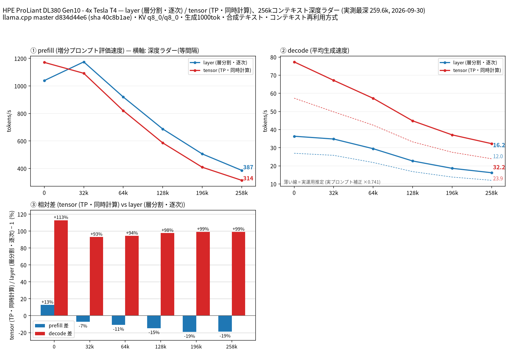

# Tesla T4 4 枚で Ornith 1.5 35B A3B の split-mode を比較

- **作成者**: MG8853
- **作成日**: 2026-09-30

## 概要

HPE ProLiant DL380 Gen10 に Tesla T4 × 4（15 GB / 枚）を載せた構成で、Ornith 1.5 35B A3B（Q4_K_M、総 36.0B / アクティブ 3B の MoE）の `--split-mode layer` と `tensor`（TP=4）を 262k コンテキストまで比較しました。投機的デコードはモデル内蔵の MTP（nextn）層を使っています。
decode は tensor が全深度で約 2 倍速く、258k で layer 16.20 t/s に対して tensor 32.24 t/s でした。prefill は 32k 以上で layer が逆に速く、258k では layer 386.6 t/s / tensor 314.1 t/s（layer が 23% 速い）でした。
なお、このモデルの MTP ヘッドは合成テキストでも採択率 0.44〜0.53 と低く、投機的デコードの上乗せは限定的です（実プロンプトでは 0.14〜0.33、補正係数 0.741）。

## ハードウェア

| 項目 | 内容 |
|------|------|
| コンピュータ / マザーボード | HPE ProLiant DL380 Gen10 |
| GPU | Tesla T4 × 4（VRAM 15,360 MiB / 枚、電力上限 70 W / 枚） |
| GPU 接続 | PCIe 3.0 x16（`nvidia-smi` の current はアイドル時 Gen1 x16、max は Gen3 x16）。NVLink なし。`nvidia-smi topo -m` では GPU0-GPU1 が NODE、GPU2-GPU3 が NODE、この 2 組の間は SYS（NUMA ノードをまたぐ） |
| CPU | Intel Xeon Gold 6254 × 2（18 コア / 36 スレッド × 2。この環境でオンラインなのは 36 論理 CPU） |
| メモリ | 232 GiB |
| 電源 | 不明 |

## ソフトウェア環境

| 項目 | 内容 |
|------|------|
| OS | Ubuntu 26.04.1 LTS / Linux 7.0.14-14-pve |
| GPU ドライバ | 595.91.07（CUDA 13.2） |
| llama.cpp | master d834d44e6（version 0.5.0-dev build 11195、2026-09-26）、CUDA バックエンド（CUDA 13.2、`CMAKE_CUDA_ARCHITECTURES=75`、`GGML_CUDA_FA=ON`、`GGML_CUDA_FA_ALL_QUANTS=ON`、`GGML_CUDA_NCCL=ON`、Release / Ninja / GCC 15.2.0）。NCCL 2.30.4 がリンクされています（`ldd build/bin/libggml-cuda.so` に `libnccl.so.2`） |

## ベンチマーク

### 条件

| 項目 | 内容 |
|------|------|
| ツール | llama-split-bench 7af72d4 |
| モデル | Ornith-1.5-35B-A3B-Q4_K_M.gguf（bartowski/Ornith-1.5-35B-A3B-GGUF、21,864,081,056 バイト、総 36.0B / アクティブ 3B の MoE、アーキテクチャは `qwen35moe`） |
| 測定モード | layer / tensor（いずれも CUDA0〜CUDA3 の 4 枚）。モデルが T4 1 枚（15 GB）に収まらないため、単一 GPU の計測はしていません（図の第 4 パネルも無効化） |
| ctx / stages | 262144 / 0,32000,64000,128000,196000,258000 |
| KV キャッシュ | q8_0 / q8_0 |
| 投機的デコード | モデル内蔵の nextn（MTP）層を使う `--spec-type draft-mtp --spec-draft-n-max 2`（`-md` は不要）。合成テキストの採択率は 0.436〜0.528、実プロンプト 3 本では 0.140〜0.326、その補正係数は 0.741 |
| その他 | `-fa on`、`-ngl all`、`-t 8`、`--parallel 1`、`--jinja`、`--cache-ram 8192 --cache-idle-slots --cache-reuse 256`（`--cache-reuse` はこのビルドでは未対応のため無効化される）、生成 1000 トークン / 段、PORT 18081、`LAUNCH_PREFIX` なし |

### 結果

単位は t/s です。depth 0 の prefill は新規プロンプト（pp2048）の値です。ラダー初段（12 トークン）の prefill は計測上のアーティファクトなので表に載せていません。

| depth | prefill layer | prefill tensor | decode layer | decode tensor |
|------:|------:|------:|------:|------:|
| 0 | 1039.2 | 1171.4 | 36.33 | 77.34 |
| 32k | 1175.0 | 1092.2 | 34.79 | 67.15 |
| 64k | 920.1 | 820.8 | 29.46 | 57.26 |
| 128k | 687.4 | 586.3 | 22.68 | 44.83 |
| 196k | 506.1 | 409.4 | 18.62 | 37.08 |
| 258k | 386.6 | 314.1 | 16.20 | 32.24 |

### 所感

- decode は tensor が全深度で約 2 倍速いという、他の MoE モデルと同じ傾向でした。A3B（アクティブ 3B）の MoE では 1 トークンあたりの計算量が小さいため、層分割のパイプライン待ちが速度差として出ます。
- prefill は 8k 以上のプロンプトで layer が有利です。258k では layer 386.6 / tensor 314.1 と 23% の差が付きました。Gemma 4 26B A4B と同様、アクティブパラメータが小さい MoE では tensor 分割の通信コストが prefill では見合わないという結果です。
- 投機的デコードの採択率が低い（合成 0.44〜0.53、実プロンプト 0.14〜0.33）のがこのモデルの特徴です。MTP ヘッドが下書きとしてあまり当たらず、decode 値はその影響を受けています（layer / tensor の相対比較には影響しません）。
- 実プロンプト補正係数 0.741 を掛けた実運用推定では、tensor の 258k decode は約 23.9 t/s、layer は約 12.0 t/s です。
- 起動時の VRAM は layer で最大 8.7 GiB（8,915 MiB）/ 枚、tensor で 7.4 GiB（7,615 MiB）/ 枚（いずれも 262k 確保時）でした。

## 添付

- [run-info.json](attachment/2026-09-30_105157_comparing_split_modes_of_ornith_1.5_35b_a3b_on_4x_tesla_t4/run-info.json)
- [results-layer.json](attachment/2026-09-30_105157_comparing_split_modes_of_ornith_1.5_35b_a3b_on_4x_tesla_t4/results-layer.json) / [results-layer-pp0.json](attachment/2026-09-30_105157_comparing_split_modes_of_ornith_1.5_35b_a3b_on_4x_tesla_t4/results-layer-pp0.json) / [results-tensor.json](attachment/2026-09-30_105157_comparing_split_modes_of_ornith_1.5_35b_a3b_on_4x_tesla_t4/results-tensor.json) / [results-tensor-pp0.json](attachment/2026-09-30_105157_comparing_split_modes_of_ornith_1.5_35b_a3b_on_4x_tesla_t4/results-tensor-pp0.json) / [results-real.json](attachment/2026-09-30_105157_comparing_split_modes_of_ornith_1.5_35b_a3b_on_4x_tesla_t4/results-real.json)
- [argv-layer.txt](attachment/2026-09-30_105157_comparing_split_modes_of_ornith_1.5_35b_a3b_on_4x_tesla_t4/argv-layer.txt) / [argv-tensor.txt](attachment/2026-09-30_105157_comparing_split_modes_of_ornith_1.5_35b_a3b_on_4x_tesla_t4/argv-tensor.txt)
