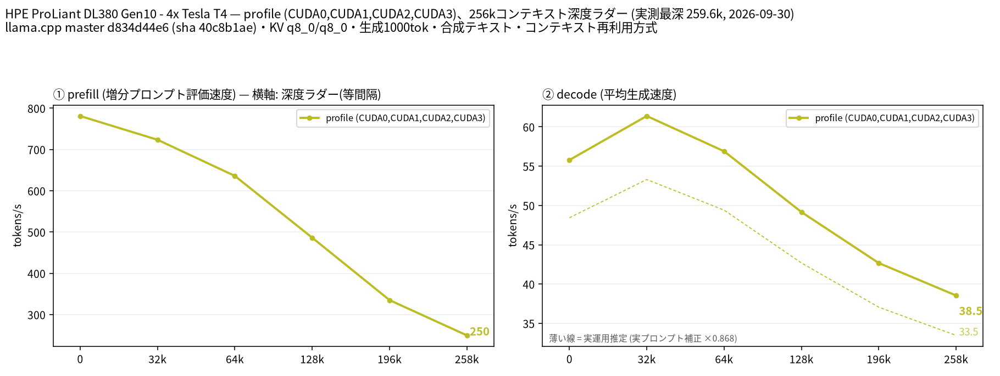

# Tesla T4 4 枚で Nemotron 3.5 Lightning 30B A3B を 262k コンテキストまで計測

- **作成者**: MG8853
- **作成日**: 2026-09-30

## 概要

HPE ProLiant DL380 Gen10 に Tesla T4 × 4（15 GB / 枚）を載せた構成で、Nemotron 3.5 Lightning（Unsloth UD-Q4_K_M、総 32.9B / アクティブ 3B の MoE、アーキテクチャは `nemotron_h_moe`）を CUDA0〜CUDA3 の層分割で 262k コンテキストまで計測しました。投機的デコードはモデル内蔵の MTP（nextn 1 層）を使っています。
llama.cpp build 11195 は `nemotron_h_moe` の `--split-mode tensor` に未対応（`LLAMA_SPLIT_MODE_TENSOR not implemented for architecture 'nemotron_h_moe'`）のため、layer と tensor の比較はできませんでした。単一構成のプロファイル計測（`--profile`）です。
258k で prefill 249.5 t/s、decode 38.54 t/s、実プロンプト 3 本で補正した実運用推定は約 33.4 t/s でした。T4 4 枚でも 262k で 30 t/s 以上出ており、長コンテキストのエージェント用途に向く速度です。

## ハードウェア

| 項目 | 内容 |
|------|------|
| コンピュータ / マザーボード | HPE ProLiant DL380 Gen10 |
| GPU | Tesla T4 × 4（VRAM 15,360 MiB / 枚、電力上限 70 W / 枚） |
| GPU 接続 | PCIe 3.0 x16（`nvidia-smi` の current はアイドル時 Gen1 x16、max は Gen3 x16）。NVLink なし。`nvidia-smi topo -m` では GPU0-GPU1 が NODE、GPU2-GPU3 が NODE、この 2 組の間は SYS（NUMA ノードをまたぐ） |
| CPU | Intel Xeon Gold 6254 × 2（18 コア / 36 スレッド × 2。この環境でオンラインなのは 36 論理 CPU） |
| メモリ | 232 GiB |
| 電源 | 不明 |

## ソフトウェア環境

| 項目 | 内容 |
|------|------|
| OS | Ubuntu 26.04.1 LTS / Linux 7.0.14-14-pve |
| GPU ドライバ | 595.91.07（CUDA 13.2） |
| llama.cpp | master d834d44e6（version 0.5.0-dev build 11195、2026-09-26）、CUDA バックエンド（CUDA 13.2、`CMAKE_CUDA_ARCHITECTURES=75`、`GGML_CUDA_FA=ON`、`GGML_CUDA_FA_ALL_QUANTS=ON`、`GGML_CUDA_NCCL=ON`、Release / Ninja / GCC 15.2.0）。NCCL 2.30.4 がリンクされています（`ldd build/bin/libggml-cuda.so` に `libnccl.so.2`） |

## ベンチマーク

### 条件

| 項目 | 内容 |
|------|------|
| ツール | llama-split-bench 7af72d4 |
| モデル | NVIDIA-Nemotron-3.5-Lightning-30B-A3B-UD-Q4_K_M.gguf（unsloth/NVIDIA-Nemotron-3.5-Lightning-30B-A3B-GGUF、25,266,255,936 バイト、総 32.9B / アクティブ 3B の MoE。`nemotron_h_moe`、53 ブロック、エキスパート 128 / 使用 6） |
| 測定モード | layer（CUDA0〜CUDA3 の 4 枚、`--profile` による単一構成の計測）。llama.cpp build 11195 では `nemotron_h_moe` に tensor 分割が実装されていないため layer / tensor の比較はできず、モデルが T4 1 枚（15 GB）に収まらないため単一 GPU も計測していません |
| ctx / stages | 262144 / 0,32000,64000,128000,196000,258000（GGUF メタデータ上の対応コンテキストは 1,048,576） |
| KV キャッシュ | q8_0 / q8_0 |
| 投機的デコード | モデル内蔵の nextn（MTP）層を使う `--spec-type draft-mtp --spec-draft-n-max 2`（`-md` は不要）。合成テキストの採択率は 0.895〜0.997、実プロンプト 3 本では 0.635〜0.674、その補正係数は 0.868 |
| その他 | `-fa on`、`-ngl all`、`-t 8`、`--parallel 1`、`--jinja`、`--cache-ram 8192 --cache-idle-slots --cache-reuse 256`（`--cache-reuse` はこのビルドでは未対応のため無効化される）、生成 1000 トークン / 段、PORT 18081、`LAUNCH_PREFIX` なし |

### 結果

単位は t/s です。depth 0 の prefill は新規プロンプト（pp2048）の値です。ラダー初段（12 トークン）の prefill は計測上のアーティファクトなので表に載せていません。

| depth | prefill | decode |
|------:|------:|------:|
| 0 | 781.1 | 55.78 |
| 32k | 723.5 | 61.38 |
| 64k | 636.0 | 56.90 |
| 128k | 486.2 | 49.16 |
| 196k | 335.0 | 42.67 |
| 258k | 249.5 | 38.54 |

### 所感

- decode は 32k で最大 61.38 t/s になり、以降は単調に下がって 258k で 38.54 t/s です。depth 0（55.78 t/s）より 32k のほうが速いのは、短いプロンプトでは投機デコードの採択率が 0.895 まで落ちるためで、長いプロンプトでは 0.99 前後になります。
- 実プロンプト 3 本の補正係数 0.868 を掛けた実運用推定では、258k の decode は約 33.4 t/s、128k で約 42.7 t/s です。T4 4 枚・総 32.9B / アクティブ 3B の MoE という条件で、262k でも実用速度が残ります。
- prefill は 32k で 723.5 t/s、258k で 249.5 t/s でした。同じ 4 枚で測った他のモデルと比べると、Gemma 4 26B A4B（258k で 372.4 / 345.6 t/s、layer / tensor）より遅く、Gemma 4 31B dense（109.6 / 167.7 t/s）より速い位置づけです。
- **tensor 分割は使えません。** `--split-mode tensor` で起動すると `LLAMA_SPLIT_MODE_TENSOR not implemented for architecture 'nemotron_h_moe'` でモデルのロードに失敗します（`nemotron_h_moe` 系の 2 モデルで確認）。このアーキテクチャのモデルを複数 GPU で回す場合、llama.cpp build 11195 時点では層分割が唯一の選択肢です。
- 起動時の VRAM は層分割で最大 9.1 GiB（9,361 MiB）/ 枚（262k 確保時）でした。KV キャッシュが小さい（KV ヘッド数の配列が層ごとに指定される hybrid 構成）ため、T4 の 15 GiB に対して余裕があります。

## 添付

- [run-info.json](attachment/2026-09-30_110715_profiling_nemotron_3.5_lightning_30b_a3b_up_to_262k_on_4x_tesla_t4/run-info.json)
- [results-profile.json](attachment/2026-09-30_110715_profiling_nemotron_3.5_lightning_30b_a3b_up_to_262k_on_4x_tesla_t4/results-profile.json) / [results-profile-pp0.json](attachment/2026-09-30_110715_profiling_nemotron_3.5_lightning_30b_a3b_up_to_262k_on_4x_tesla_t4/results-profile-pp0.json) / [results-real.json](attachment/2026-09-30_110715_profiling_nemotron_3.5_lightning_30b_a3b_up_to_262k_on_4x_tesla_t4/results-real.json)
- [argv-profile.txt](attachment/2026-09-30_110715_profiling_nemotron_3.5_lightning_30b_a3b_up_to_262k_on_4x_tesla_t4/argv-profile.txt)
