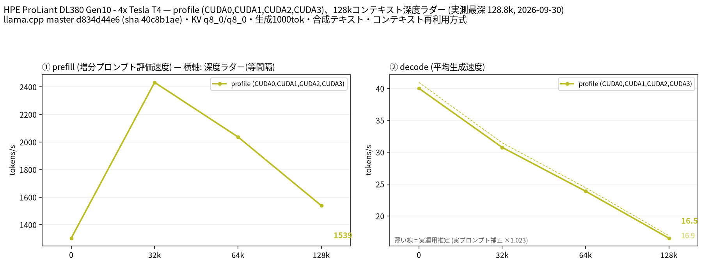

# Tesla T4 4 枚で Nemotron 3 Nano Omni 33B を 128k コンテキストまで計測

- **作成者**: MG8853
- **作成日**: 2026-09-30

## 概要

HPE ProLiant DL380 Gen10 に Tesla T4 × 4（15 GB / 枚）を載せた構成で、Nemotron 3 Nano Omni（Ollama の `nemotron3:33b` 相当、Unsloth UD-Q4_K_M、総 33.0B / アクティブ 3B の MoE、アーキテクチャは `nemotron_h_moe`）を CUDA0〜CUDA3 の層分割で 128k コンテキストまで計測しました。テキスト入力のみ（mmproj なし）で、このモデルは MTP ヘッドを持たないため投機的デコードは使っていません。
llama.cpp build 11195 は `nemotron_h_moe` の `--split-mode tensor` に未対応のため、layer と tensor の比較はできず、単一構成のプロファイル計測（`--profile`）です。
128k で prefill 1538.8 t/s、decode 16.51 t/s でした。投機的デコード無しのため実プロンプト補正係数は 1.023 とほぼ 1 で（実プロンプト 3 本の平均 40.94 t/s 対 合成テキストの depth 0 で 40.01 t/s）、このモデルでは合成ラダーの数値がそのまま実運用の目安になります。

## ハードウェア

| 項目 | 内容 |
|------|------|
| コンピュータ / マザーボード | HPE ProLiant DL380 Gen10 |
| GPU | Tesla T4 × 4（VRAM 15,360 MiB / 枚、電力上限 70 W / 枚） |
| GPU 接続 | PCIe 3.0 x16（`nvidia-smi` の current はアイドル時 Gen1 x16、max は Gen3 x16）。NVLink なし。`nvidia-smi topo -m` では GPU0-GPU1 が NODE、GPU2-GPU3 が NODE、この 2 組の間は SYS（NUMA ノードをまたぐ） |
| CPU | Intel Xeon Gold 6254 × 2（18 コア / 36 スレッド × 2。この環境でオンラインなのは 36 論理 CPU） |
| メモリ | 232 GiB |
| 電源 | 不明 |

## ソフトウェア環境

| 項目 | 内容 |
|------|------|
| OS | Ubuntu 26.04.1 LTS / Linux 7.0.14-14-pve |
| GPU ドライバ | 595.91.07（CUDA 13.2） |
| llama.cpp | master d834d44e6（version 0.5.0-dev build 11195、2026-09-26）、CUDA バックエンド（CUDA 13.2、`CMAKE_CUDA_ARCHITECTURES=75`、`GGML_CUDA_FA=ON`、`GGML_CUDA_FA_ALL_QUANTS=ON`、`GGML_CUDA_NCCL=ON`、Release / Ninja / GCC 15.2.0）。NCCL 2.30.4 がリンクされています（`ldd build/bin/libggml-cuda.so` に `libnccl.so.2`） |

## ベンチマーク

### 条件

| 項目 | 内容 |
|------|------|
| ツール | llama-split-bench 7af72d4 |
| モデル | NVIDIA-Nemotron-3-Nano-Omni-30B-A3B-Reasoning-UD-Q4_K_M.gguf（unsloth/NVIDIA-Nemotron-3-Nano-Omni-30B-A3B-Reasoning-GGUF、23,887,023,552 バイト、総 33.0B / アクティブ 3B の MoE。`nemotron_h_moe`、52 ブロック、エキスパート 128 / 使用 6。HF 上の名前は 30B-A3B ですが総パラメータは 33.0B で、Ollama の `nemotron3:33b` はこのモデルに相当します） |
| 測定モード | layer（CUDA0〜CUDA3 の 4 枚、`--profile` による単一構成の計測）。llama.cpp build 11195 では `nemotron_h_moe` に tensor 分割が実装されていないため layer / tensor の比較はできず、モデルが T4 1 枚（15 GB）に収まらないため単一 GPU も計測していません |
| ctx / stages | 131072 / 0,32000,64000,128000（GGUF メタデータ上の対応コンテキストは 1,048,576。配布元のタグ（Ollama の `nemotron3:33b`）は 128K を表示しているため 128k までを計測） |
| KV キャッシュ | q8_0 / q8_0 |
| 投機的デコード | なし（このモデルの GGUF は nextn / MTP 層を含まないため） |
| その他 | テキストのみ（`--mmproj` なし。画像・音声入力は未計測）、`-fa on`、`-ngl all`、`-t 8`、`--parallel 1`、`--jinja`、`--cache-ram 8192 --cache-idle-slots --cache-reuse 256`（`--cache-reuse` はこのビルドでは未対応のため無効化される）、生成 1000 トークン / 段、PORT 18081、`LAUNCH_PREFIX` なし |

### 結果

単位は t/s です。depth 0 の prefill は新規プロンプト（pp2048）の値です。ラダー初段（12 トークン）の prefill は計測上のアーティファクトなので表に載せていません。

| depth | prefill | decode |
|------:|------:|------:|
| 0 | 1302.6 | 40.01 |
| 32k | 2432.2 | 30.74 |
| 64k | 2037.0 | 23.87 |
| 128k | 1538.8 | 16.51 |

### 所感

- prefill が非常に速く、32k で 2432.2 t/s、128k でも 1538.8 t/s でした。同じ `nemotron_h_moe`・同じ 4 枚で測った Nemotron 3.5 Lightning（32k で 723.5、128k で 486.2 t/s）の 3 倍以上です。アクティブ 3B で attention 層が少ない構成に加え、投機的デコードのためのドラフト計算が無いことも効いていると考えられます。
- decode は 128k で 16.51 t/s です。depth 0 の 40.01 t/s から単調に落ちます。投機的デコードを使っていないため、実プロンプト 3 本の平均（40.94 t/s）との補正係数は 1.023 で、合成ラダーの値がそのまま実運用の目安になります。
- MTP ヘッドが無いので decode の伸びは Lightning（258k で 38.54 t/s）には劣ります。同じ 33B 級 MoE でも、投機的デコードの有無で decode の絶対値は大きく変わります。
- **tensor 分割は使えません。** `--split-mode tensor` で起動すると `LLAMA_SPLIT_MODE_TENSOR not implemented for architecture 'nemotron_h_moe'` でモデルのロードに失敗します。
- 起動時の VRAM は層分割で最大 7.1 GiB（7,237 MiB）/ 枚（128k 確保時）でした。128k コンテキストの MoE としては余裕があり、T4 4 枚でさらに長いコンテキストも載せられる余地があります。

## 添付

- [run-info.json](attachment/2026-09-30_111720_profiling_nemotron_3_nano_omni_33b_up_to_128k_on_4x_tesla_t4/run-info.json)
- [results-profile.json](attachment/2026-09-30_111720_profiling_nemotron_3_nano_omni_33b_up_to_128k_on_4x_tesla_t4/results-profile.json) / [results-profile-pp0.json](attachment/2026-09-30_111720_profiling_nemotron_3_nano_omni_33b_up_to_128k_on_4x_tesla_t4/results-profile-pp0.json) / [results-real.json](attachment/2026-09-30_111720_profiling_nemotron_3_nano_omni_33b_up_to_128k_on_4x_tesla_t4/results-real.json)
- [argv-profile.txt](attachment/2026-09-30_111720_profiling_nemotron_3_nano_omni_33b_up_to_128k_on_4x_tesla_t4/argv-profile.txt)
