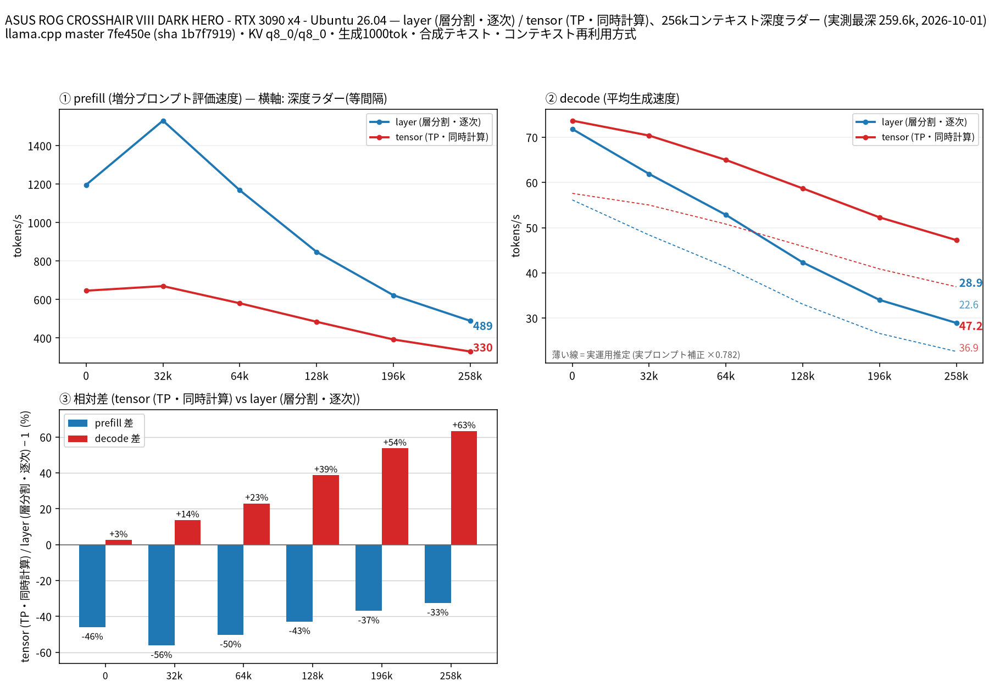

# RTX 3090 4 枚で Qwen3.8 27B の split-mode を比較（Ubuntu・NCCL）

- **作成者**: 錦幸佳
- **作成日**: 2026-10-01

## 概要

RTX 3090 × 4 で、Windowsでの[同一モデル・同一深度ラダーの測定](2026-09-27_130914_comparing_qwen3.8_27b_split_modes_on_4x_rtx3090_at_1395mhz_on_windows.md)をUbuntu上で実施しました。
GPUコアクロックは両モードで1395 MHz固定設定、電力上限は250 W／枚、MTPは最大2です。UbuntuではNCCLを有効にしたtensor分割が全深度でdecodeを上回り、最深259,601トークンでlayerより約63%速くなりました。prefillは全深度でlayerが速い結果です。

## ハードウェア

| 項目 | 内容 |
|------|------|
| コンピュータ / マザーボード | ASUS ROG CROSSHAIR VIII DARK HERO |
| GPU | NVIDIA GeForce RTX 3090 × 4（VRAM 24 GB / 枚）。HP OEM × 1、DELL OEM × 1、MSI Gaming X Trio × 2 |
| GPU 接続 | 全4枚とも負荷中PCIe Gen3 x4。NVLinkなし。Ubuntuの`nvidia-smi topo -p2p p`は全GPU間でNS（P2P不可）。物理的な接続経路は[Windowsレポート](2026-09-27_130914_comparing_qwen3.8_27b_split_modes_on_4x_rtx3090_at_1395mhz_on_windows.md)を参照 |
| CPU | AMD Ryzen 9 5950X（16 コア / 32 スレッド） |
| メモリ | 128 GiB DDR4（32 GiB × 4） |
| 電源 | Cooler Master V1200 Platinum 1200 W（中古）＋ ENERMAX Platimax EPM750AWT 750 W。ADD2PSUで同期し、別分岐回路から給電 |

## ソフトウェア環境

| 項目 | 内容 |
|------|------|
| OS | Ubuntu 26.04.1 LTS / kernel 7.0.0-34-generic |
| GPUドライバ | NVIDIA 595.91.07 |
| llama.cpp | b11146（0.5.0-dev、commit 7fe450e19）。Ubuntu用にGNU 13.4.0でRelease / CUDA 12.4.131 / NCCL 2.22.3+cuda12.4を有効にしてビルド |

## ベンチマーク

### 条件

| 項目 | 内容 |
|------|------|
| ツール | llama-split-bench 7af72d4 |
| モデル | Qwen3.8-27B UD-Q4_K_XL（unsloth、17,559,178,144バイト、SHA256 `3f227079003add2511437e5b1e94812e363385225bf6a9b47b0054a72bc8b01e`）。Windows測定と同一ファイル |
| 測定モード | layer / tensor（いずれもRTX 3090 × 4、本測定は各1回） |
| GPU動作条件 | 両モードともコアクロック1395 MHz固定設定、電力上限250 W／枚。メモリクロックは固定なし |
| ctx / stages | 262144 / 0,32000,64000,128000,196000,258000 |
| KVキャッシュ | q8_0 / q8_0 |
| 生成 | 各深度で1,000トークン、合成テキスト |
| 投機的デコード | MTP有効（`--spec-type draft-mtp --spec-draft-n-max 2`、draft KVもq8_0） |
| 主な共通引数 | `-b 2048 -ub 512 -t 8 -fa on --fit off` |
| AllReduce | `GGML_CUDA_ALLREDUCE=nccl`。tensorのログでNCCL 4ランクの初期化完了とP2Pなしの共有メモリ経路を確認。layerの分割方式にはNCCL AllReduceを使用しない |

Windows測定と、モデルのSHA256・llama.cppのコミット・GPU・クロック設定・電力上限・ctx・stages・KV型・MTP・サーバーの測定引数は一致しています。変更されたのはOS（Windows 11 Pro → Ubuntu）、GPUドライバ（610.88 → 595.91.07）、CUDAバイナリ（Windows公式配布 → Ubuntuでの同一コミットのソースビルド）、およびUbuntuでのNCCL利用です。NCCL 2.22.3はCUDA 12.4の共有ランタイムを使うようローカルでビルドしたものです。P2PはUbuntuでも利用できません。

今回はLinux版の`run-bench.sh`で実行しました。Windows測定ではWindows用ランチャーを使用していますが、測定を行うPythonスクリプトの深度ラダー・prefill・実プロンプト補正の手順は同じです。UbuntuのGPU0を使用するデスクトップ常駐プロセスに対応するため、`measure_ladder.py`の開始時ガードのみ既存プロセスを許容し、測定開始後に加わるGPUプロセスの検出は維持しました。また、`curl`が未導入だったため、サーバーのヘルスチェックだけを`wget`のラッパーで代替しました。速度の算出処理は変更していません。日本語図は元ツールの`plot_bench.py`で作成し、英語図は見出しの文字切れだけを表示調整して再描画しました。Windowsレポートの図も当時のWindows表示用調整版で作成しています。

1395 MHzは設定値です。測定中の目視確認では一時的に1380 MHzも観測されました。したがって全測定時間にわたり実クロックが常に1395 MHzだったとは扱いません。

### 結果

速度の単位はtok/sです。表はUbuntuでの実測値です。

| 目標深度 | 実測深度（両モード共通） | layer prefill | layer decode | tensor prefill | tensor decode |
|---:|---:|---:|---:|---:|---:|
| 0 | 11 | 1196.24 | 71.83 | 646.04 | 73.68 |
| 32,000 | 32,093 | 1529.95 | 61.90 | 669.97 | 70.38 |
| 64,000 | 64,806 | 1168.25 | 52.83 | 580.80 | 64.98 |
| 128,000 | 128,788 | 847.95 | 42.31 | 484.52 | 58.69 |
| 196,000 | 196,429 | 622.55 | 34.02 | 392.49 | 52.28 |
| 258,000 | 259,601 | 489.40 | 28.92 | 330.08 | 47.25 |

目標深度0のprefillには別途測定した`pp2048`（実入力1,978トークン）を使用し、11トークンの初期プロンプトによるprefill値は使っていません。同じ行のdecodeは11トークン入力から1,000トークンを生成した値です。その他のprefillは各段で追加評価された入力の速度です。図の破線は実プロンプト補正（×0.782）による推定値で、表の実測値とは区別しています。図③の棒は同じ深度のlayerを0%基準とした`(tensor / layer − 1) × 100`です。

Windowsレポートとのdecode速度比較は以下のとおりです。同一モデル・同一測定引数ですが、OS・ドライバ・ビルド・AllReduce経路が同時に異なるため、差のすべてをNCCL単独の効果とは解釈できません。

| 目標深度 | Windows layer | Ubuntu layer | Windows tensor | Ubuntu tensor | tensor Ubuntu / Windows |
|---:|---:|---:|---:|---:|---:|
| 0 | 51.34 | 71.83 | 29.52 | 73.68 | 2.50× |
| 32,000 | 44.16 | 61.90 | 29.23 | 70.38 | 2.41× |
| 64,000 | 39.62 | 52.83 | 28.35 | 64.98 | 2.29× |
| 128,000 | 28.76 | 42.31 | 26.60 | 58.69 | 2.21× |
| 196,000 | 24.95 | 34.02 | 25.70 | 52.28 | 2.03× |
| 258,000 | 21.47 | 28.92 | 23.97 | 47.25 | 1.97× |

### 所感

Ubuntuではprefillは全測定点でlayerが速く、decodeは全測定点でtensorが速い結果でした。最深259,601トークンのdecodeはtensorが47.25 tok/s、layerが28.92 tok/sで、tensorが約63%速くなりました。Windowsでは同じ段のtensor優位は約12%でした。

NCCLのログではP2Pが無効のまま共有メモリ経路を使用しました。この構成でも4枚tensorのdecodeはWindows測定より約2倍速く、P2P不可だけでWindowsの速度が決まっていたわけではありません。一方、layerもWindowsより速くなったため、OS・ドライバ等の差も含む比較です。各モード1回の測定で、反復間のばらつきは評価していません。

## 添付

- [日本語の図](attachment/2026-10-01_203001_comparing_qwen3.8_27b_split_modes_on_4x_rtx3090_with_nccl_on_ubuntu/split-bench-ja.png)
- [英語の図](attachment/2026-10-01_203001_comparing_qwen3.8_27b_split_modes_on_4x_rtx3090_with_nccl_on_ubuntu/split-bench-en.png)
- [run-info.json](attachment/2026-10-01_203001_comparing_qwen3.8_27b_split_modes_on_4x_rtx3090_with_nccl_on_ubuntu/run-info.json)
- [layerの深度別結果](attachment/2026-10-01_203001_comparing_qwen3.8_27b_split_modes_on_4x_rtx3090_with_nccl_on_ubuntu/results-layer.json)
- [tensorの深度別結果](attachment/2026-10-01_203001_comparing_qwen3.8_27b_split_modes_on_4x_rtx3090_with_nccl_on_ubuntu/results-tensor.json)
- [layerのdepth 0 prefill](attachment/2026-10-01_203001_comparing_qwen3.8_27b_split_modes_on_4x_rtx3090_with_nccl_on_ubuntu/results-layer-pp0.json)
- [tensorのdepth 0 prefill](attachment/2026-10-01_203001_comparing_qwen3.8_27b_split_modes_on_4x_rtx3090_with_nccl_on_ubuntu/results-tensor-pp0.json)
- [実プロンプト補正用の測定結果](attachment/2026-10-01_203001_comparing_qwen3.8_27b_split_modes_on_4x_rtx3090_with_nccl_on_ubuntu/results-real.json)
- [layerの起動引数](attachment/2026-10-01_203001_comparing_qwen3.8_27b_split_modes_on_4x_rtx3090_with_nccl_on_ubuntu/argv-layer.txt)
- [tensorの起動引数](attachment/2026-10-01_203001_comparing_qwen3.8_27b_split_modes_on_4x_rtx3090_with_nccl_on_ubuntu/argv-tensor.txt)
